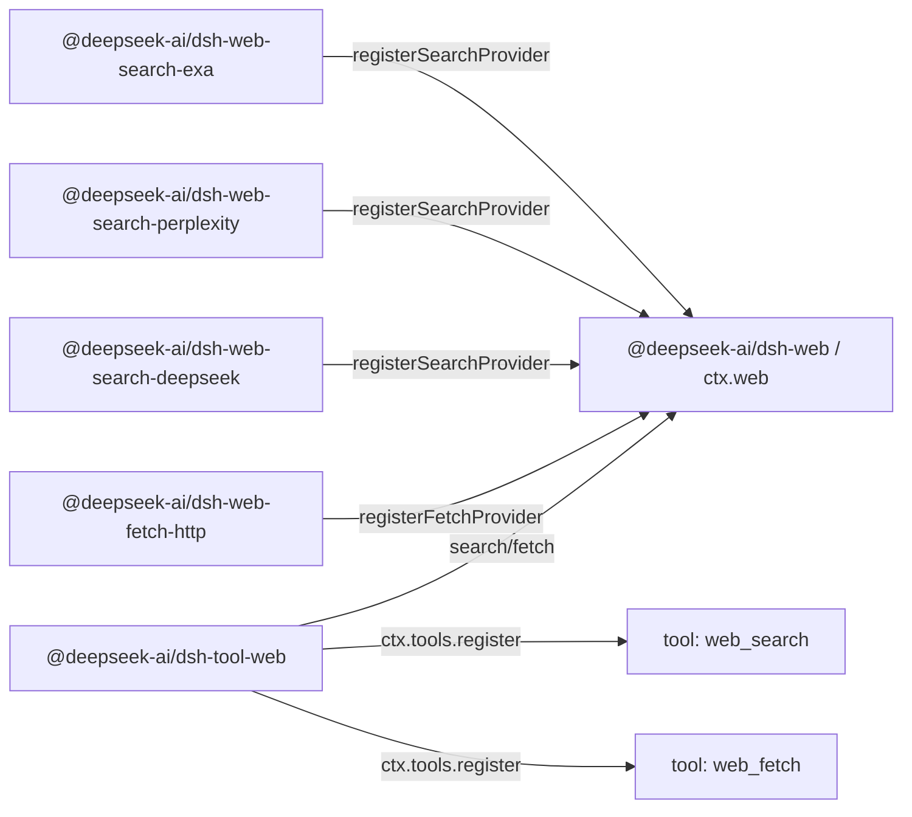

# Agent Note: Web قدرة seam——مستقر أداة تغطية كثير عدد مزود

Status: implemented

[English](2026-06-24-web-capability-seam.md) | العربية

## مشكلة

harness حاجة موجه إلى نموذج web أداة، لكن لا يستطيع سوف نموذج اتفاق ربط إلى بعض واحد بيت مصنع تجارة API شكل حالة فوق. بحث هو حالي ضغط قوة نقطة: من واحد بدء حينئذ معا دعم حمل Exa بحث و Perplexity بحث——اثنان نوع لحظة معنى مختلف مزود شكل حالة (Exa إرجاع مسطح مستو `results[]`، كل بند يتضمن `{title, url, highlights, publishedDate}`؛Perplexity إرجاع واحد مقطع توليد صيغة عودة جواب إضافة مرجع قائمة)——صحيح هو استخدام قدوم إثبات عودة واحد تحويل web اتفاق و غير فقط هو مرآة مثل بعض واحد بيت مصنع تجارة.Fetch هو آخر بند مستقل عملية: مجهول اسم عام HTTP(S) fetch خلفية تعلق و نقل، أمان، إعادة تحديد نحو، حل رمز و كبير صغير حد انتظار صلة ملاحظة نقطة، و مزود دعم دعم بحث و لا نفسه.

موجه إلى نموذج API يجب إبقاء مستقر، بينما خلفية يمكن أكثر تبديل. أكثر تبديل بحث مزود لا ينبغي تغيير نموذج إرسال بدء استعلام طريقة؛ أكثر تبديل fetch تنفيذ لا ينبغي تغيير نموذج طلب URL طريقة. عكس مرور قدوم، مزود حزمة أيضا لا ينبغي فقط فقط لأن ذاتي ذات لديه مقدار خارج مزود خاص لديه دوران زر حينئذ كشف ذاتي ذات موجه إلى نموذج أداة schema.

إذا يأخذ بحث و fetch مباشر وضع دخول `dsh-tool-web`، موجه إلى نموذج أداة حينئذ يلزم معا تحمل تحمل مزود اختيار، خلفية طلب خريطة، نقل سياسة، نتيجة عودة واحد تحويل، نص التوجيه جذب توجيه، عرض و schema تسجيل. يجعل كل مزود تسجيل ذاتي ذات أداة فإن لديه متبادل عكس مشكلة: أداة متاح صفة، اسم، وصف و معامل سوف أخذ قرار في تماما جيد تحميل أي بعض مزود حزمة، مزود خاص لديه حقل سوف تسرب تسرب إلى نموذج اتفاق في.

أيضا لديه واحد مزود اختيار مشكلة. قائم `tool-bash` و `tool-fs` يمكن اعتماد Cordis `inject`، لأن فقط لديه واحد خلفية خدمة مفتاح.Web لديه اثنان بند مستقل قدرة (`search` و `fetch`) ، كل بند قدرة ممكن لديه كثير عدد مزود.`inject: ['web']` قدرة إثبات seam وجود، لكن لا يستطيع إثبات وجود متاح بحث أو fetch مزود، أيضا لا يمكن تعريف كثير عدد مزود تسجيل وقت من فوز خروج.

## قرار

Web وصول هو واحد واحد انتظار قدرة seam، التزام دوران[قدرة seam Agent Note](2026-06-13-capability-seams.ar.md):

1. `@deepseek-ai/dsh-web`(`packages/web/web`) يملك `ctx.web`، مزود تسجيل، مزود اختيار، مشترك طلب/نتيجة مفردات، و web خاص لديه خطأ.
2. مزود حزمة تنفيذ أداة جسم خلفية و نحو `ctx.web` تسجيل قدرة، مثال مثل `@deepseek-ai/dsh-web-search-exa`،`@deepseek-ai/dsh-web-search-perplexity`،`@deepseek-ai/dsh-web-search-deepseek` و `@deepseek-ai/dsh-web-fetch-http`.
3. `@deepseek-ai/dsh-tool-web`(`packages/web/tool-web`) يملك موجه إلى نموذج `web_search` و `web_fetch` أداة schema، نص التوجيه مقطع سقوط، معامل تحقق، نتيجة صيغة تحويل، و عبر `ctx.web` تنفيذ أداة عرض.

مزود لا تسجيل أداة. مزود تسجيل قدرة.`dsh-tool-web` هو موجه إلى نموذج اسم، وصف، نص التوجيه جذب توجيه،JSON Schema، عرض وحيد كل من.

بحث و fetch هو اثنان عدد مستقل أداة، لكن يخص نفس عدد web وصول seam.`ctx.web` لـ اثنان عدد و سطر سجل التسجيل موحد واحد يملك مزود اختيار،abort/خطأ مفردات و نشر إعداد. هو جمع طلب schema و مزود منطق إبقاء مستقل؛ مشترك خدمة هو لمس بلوغ web منتج حد.

`dsh-tool-web` في منتج تفعيل متبادل ينبغي أداة كما `ctx.web` seam وجود وقت تسجيل موجه إلى نموذج web أداة. خلفية متاح صفة هو تنفيذ وقت صلة ملاحظة نقطة، بينما غير schema تسجيل وقت صلة ملاحظة نقطة:

- `web_search` في منتج/تطبيق تفعيل web بحث وقت تسجيل،`web_fetch` في تفعيل web fetch وقت تسجيل.
- أداة أبدا سوف فقط فقط لأن ذلك اختيار تحديد مزود ناقص، إعداد خطأ، نقص قليل سند إثبات، وجود اختلاف معنى أو مؤقت وقت غير ممكن استخدام حينئذ يتم ملاحظة إلغاء.
- مزود في تنفيذ وقت تحليل، عند اختيار تحديد قدرة لا يمكن وقت التشغيل إرجاع بنية تحويل `WebError`.

هذا جعل نموذج schema إبقاء مستقر، بينما لا سوف إضافة تحميل ترتيب، سند إثبات حالة أو HMR(حار وحدة استبدال) وقت ترتيب قبول دخول موجه إلى نموذج اتفاق. إذا web بحث قد تفعيل لكن لا وجود متاح بحث مزود،`web_search` ما زال مرئي، تنفيذ وقت بـ بنية تحويل `WebError`(مثل `WEB_PROVIDER_UNAVAILABLE` أو `WEB_PROVIDER_CONFIGURED_UNAVAILABLE`) فشل. إذا بعض عدد مزود في `dsh-tool-web` بعد ظهور، تحت مرة تنفيذ يكفي استخدام هو بينما بلا حاجة أكثر تعديل schema. إذا بعض عدد مزود في استدعاء مرور مسار في إزالة فقد، تنفيذ بـ بنية تحويل `WebError` فشل، بينما لا هو ساكن صامت اختيار آخر عدد مزود أو رجوع إلى `UNKNOWN_TOOL`.

هذا seam لحظة معنى لا كشف أي مراقبة وجه——لا يوجد سجل التسجيل تغيير حدث، أيضا لا يوجد تجمع دمج قدرة حالة استعلام. غير ممكن استخدام صفة هو استدعاء جهة عبر تنفيذ مراقبة إلى واقع:`search()`/`fetch()` في استدعاء وقت تحليل مزود، و رمي خروج تسمية فشل سبب بنية تحويل `WebError`.[مراقبة وجه Agent Note](../../archived/simplification/2026-07-04-drop-unconsumed-web-observation-surface.md) سجل هذا واحد حكم قطع: أساس في استدعاء إرسال توليد اختيار و أساس في تفعيل تسجيل جعل نيل لا يوجد مستهلك حاجة تغيير إشارة أو مستقل في تنفيذ و خطأ توجيه متاح صفة استكشاف قياس؛ لم قدوم مزود حالة وجه لوح سوف إعادة جذب دخول هو فعلي إزالة استهلاك الأكثر صغير إشارة أو استعلام.

## حزمة توسيع اندفاع

من ثلاثة عدد حزمة بنية صار Service Definition / Service Provider / Consumer تفكيك قسم امتداد استخدام bash و filesystem نمط، لكن*واجهة*حزمة أكثر وصل قريب LLM(كبير لغة نموذج) seam.`LlmRuntime`(`packages/llm/llm/src/index.ts`) هو واحد حسب اسم مفتاح تحكم مزود سجل التسجيل:`registerAdapter(models, adapter)` سوف مهايئ تخزين دخول `Map`، إرجاع disposer، مقابل تكرار مفتاح رمي خروج `DUPLICATE_ADAPTER`، في تحليل وقت رمي خروج `NO_ADAPTER`.`ctx.web` امتداد استخدام هذا سجل التسجيل شكل حالة، لكن لديه اثنان نوع قدرة صنف آخر و أكثر وفير غني اختيار سياسة (إعداد مزود id، أو في تماما جيد فقط لديه واحد متاح مزود تسجيل وقت تلقائي اختيار) ، لذلك تنفيذ وقت رمي خروج `WebError` قدرة حل تفسير بحث أو fetch قدرة لـ أي لا يمكن تشغيل.

اعتماد جهة نحو و bash و filesystem متسق:

```text
@deepseek-ai/dsh-tool-web  --depends on-->  @deepseek-ai/dsh-web  <--depends on--  @deepseek-ai/dsh-web-search-exa
        consumer                                 interface                       implementation
                                                                 <--depends on--  @deepseek-ai/dsh-web-search-perplexity
                                                                                  implementation
                                                                 <--depends on--  @deepseek-ai/dsh-web-search-deepseek
                                                                                  implementation
                                                                 <--depends on--  @deepseek-ai/dsh-web-fetch-http
                                                                                  implementation
```

وقت التشغيل، مزود حزمة نحو `ctx.web` تسجيل قدرة؛`tool-web` نحو `ctx.tools` تسجيل مستقر أداة و عبر seam تنفيذ:



`@deepseek-ai/dsh-web` فقط اعتماد Cordis و قاع طبقة harness دعم حمل. هو إعلان `ctx.web`، مزود واجهة، طلب/نتيجة نوع، مزود متاح صفة اتفاق و رمز خطأ. هو لا استيراد أداة،agent(ذكي جسم) ، جلسة،LLM أو مزود حزمة.

مزود حزمة فقط اعتماد `dsh-web` و Cordis. هو جمع يملك سند إثبات، طرف نقطة، بروتوكول صيغة خريطة، تحليل و `WebError` تحويل، استخدام منصة `fetch`. كل مزود حقن مشترك خدمة و تسجيل خلفية؛ فقط لديه `dsh-web` يملك `ctx.web` مفتاح. مزود خاص بروتوكول شكل حالة لن إنتاج مقابل `ctx.llm` أو Cordis HTTP خدمة اعتماد.

`@deepseek-ai/dsh-tool-web` اعتماد `@deepseek-ai/dsh-web`،`@deepseek-ai/dsh-tools`،`@deepseek-ai/dsh-system-prompt` و Cordis. هو من لا استيراد أداة جسم مزود حزمة.

## `ctx.web` اتفاق

`ctx.web` هو واحد مزود سجل التسجيل إضافة فوق واحد حمل مزود اختيار تنفيذ API. سجل التسجيل جزء و `LlmRuntime` إبقاء وصل قريب: كل نوع قدرة صنف آخر واحد `Map<id, provider>`،`registerSearchProvider`/`registerFetchProvider` طريقة إرجاع disposer، تكرار id رمي خروج `WebError`، تنفيذ وقت تحليل في اختيار تحديد مزود ناقص أو غير ممكن استخدام وقت رمي خروج استثناء. مرجعي توقيع رؤية `packages/web/web/src/types.ts`؛seam شكل حالة:

```ts
import type { WebFetchRequest, WebFetchResult, WebSearchRequest, WebSearchResult } from '@deepseek-ai/dsh-web'

interface WebSearchProvider {
  readonly id: string
  available(): boolean
  search(request: WebSearchRequest, signal?: AbortSignal): Promise<WebSearchResult>
}

interface WebFetchProvider {
  readonly id: string
  available(): boolean
  fetch(request: WebFetchRequest, signal?: AbortSignal): Promise<WebFetchResult>
}

interface WebRuntime {
  registerSearchProvider(provider: WebSearchProvider): () => void
  registerFetchProvider(provider: WebFetchProvider): () => void

  search(request: WebSearchRequest, signal?: AbortSignal): Promise<WebSearchResult>
  fetch(request: WebFetchRequest, signal?: AbortSignal): Promise<WebFetchResult>
}
```

اختياري signal هو تنفيذ تحكم، بينما غير عمل خدمة إدخال:`tool-web` مباشر نقل تمرير `exec.signal`، جعل جولة إلغاء، أداة مهلة و agent dispose(مورد تحرير) قدرة وصول مزود شبكة شبكة طلب، تدفق قراءة جهاز و عال فتح إلغاء حل رمز.seam لا نقل تمرير `ToolExecution`——لا فإن `dsh-web` حينئذ يلزم اعتماد `dsh-tools`.

مزود id هو مستقر نص، في كل منها قدرة صنف آخر داخل وحيد. تسجيل تكرار بحث مزود id أو تكرار fetch مزود id سوف فشل، بينما غير ساكن صامت استبدال قديم مزود. مزود تسجيل إرجاع disposer، امتداد استخدام قائم `ctx.tools.register()`/`ctx.systemPrompt.section()` نمط: تغيير حزمة لف في `ctx.effect()` في، تسجيل مع مساهمة هو fiber واحد بدء تفكيك حذف.

## مزود متاح صفة و اختيار

مزود متاح صفة و قدرة اختيار هو اثنان عدد مستقل عام فكرة، لكن كل إبقاء الأكثر صغير تحويل. مزود فقط تقرير إبلاغ هذا أداة جسم تنفيذ هل متاح، عبر نزيه قيمة محلي فحص (مثل سند إثبات هل وجود، طرف نقطة إعداد هل يمكن تحليل). مزود `available()` منع توقف إرسال بدء شبكة شبكة استدعاء.

`LlmRuntime` تماما لا يوجد حالة نوع: متاح صفة عبر سجل التسجيل عضو مورد إطار إضافة تحليل وقت رمي خروج قدوم جدول بلوغ.`ctx.web` التزام دوران نفس مثال سجل قاعدة.seam لا كشف تجمع دمج قدرة حالة استعلام——`search()`/`fetch()` في كل مرة استدعاء وقت أصل حسب إعداد مزود id، قد تسجيل مزود و كل مزود نزيه قيمة محلي `available()` قيمة منطقية إرسال توليد اختيار نتيجة، اختيار فشل حينئذ هو تنفيذ وقت رمي خروج بنية تحويل `WebError`. حاجة معرفة طريق بعض بند قدرة قدرة لا تشغيل استدعاء جهة عبر تنفيذ و توجيه هذا خطأ قدوم نيل معرفة؛ لا يوجد أي شرق غرب بصفة متغير خدمة حالة تخزين.

هذا قيمة منطقية هو اختيار إدخال، بينما غير سليم سليم نظام.`tool-web` من لا مباشر استدعاء مزود `available()`——هو دخول seam وحيد مسار هو `search()`/`fetch()`——لذلك اختيار سياسة فقط لديه واحد كل من.

اختيار لا نيل اعتماد تسجيل ترتيب.Cordis تحميل ترتيب، إعداد ترتيب صف و HMR وقت ترتيب لا هو منتج دلالة.

| حال حال | تنفيذ سلوك |
|---|---|
| إعداد مزود id قد تسجيل كما `available() === true` | تشغيل هذا مزود |
| إعداد مزود id لم تسجيل | بـ `WEB_PROVIDER_CONFIGURED_MISSING` فشل |
| إعداد مزود id قد تسجيل لكن غير ممكن استخدام | بـ `WEB_PROVIDER_CONFIGURED_UNAVAILABLE` فشل |
| لم إعداد مزود id، كما هذا صنف آخر تماما جيد لديه واحد قد تسجيل كما متاح مزود | تشغيل هذا وحيد مزود |
| لم إعداد مزود id، كما هذا صنف آخر بلا قد تسجيل مزود | بـ `WEB_PROVIDER_UNAVAILABLE` فشل |
| لم إعداد مزود id، كما هذا صنف آخر لديه كثير عدد متاح مزود قد تسجيل | بـ `WEB_PROVIDER_AMBIGUOUS` فشل، بينما غير حسب تسجيل ترتيب اختيار |
| لم إعداد مزود id، كما لديه مزود وجود لكن متساو غير ممكن استخدام | بـ `WEB_PROVIDER_UNAVAILABLE` فشل |

«وحيد مزود تلقائي اختيار» قاعدة موجه إلى اختبار، عرض عرض و بسيط مفرد نشر. منتج إعداد ضبط صريح مزود id:

```yaml
- id: web
  name: '@deepseek-ai/dsh-web'
  config:
    searchProvider: exa
    fetchProvider: http

- id: web-search-exa
  name: '@deepseek-ai/dsh-web-search-exa'

- id: web-search-perplexity
  name: '@deepseek-ai/dsh-web-search-perplexity'

- id: web-search-deepseek
  name: '@deepseek-ai/dsh-web-search-deepseek'

- id: web-fetch-http
  name: '@deepseek-ai/dsh-web-fetch-http'

- id: tool-web
  name: '@deepseek-ai/dsh-tool-web'
```

تشغيل صيانة تغطية مشي نفس بند صريح اختيار مسار:`DSH_WEB_SEARCH_PROVIDER=perplexity` انتظار نفس في إعداد `searchProvider: perplexity`، بينما غير `dsh-tool-web` داخلي خفي صيغة أولوية درجة سلسلة.

`ctx.web.search()` و `ctx.web.fetch()` في تنفيذ وقت حسب فوق وصف اختيار قاعدة تحليل مزود. إذا اختيار تحديد قدرة غير ممكن استخدام، هو جمع رمي خروج حمل لديه بنية تحويل شفرة `WebError`، مثل `WEB_PROVIDER_UNAVAILABLE`،`WEB_PROVIDER_CONFIGURED_MISSING`،`WEB_PROVIDER_CONFIGURED_UNAVAILABLE` أو `WEB_PROVIDER_AMBIGUOUS`. إذا لم صريح إعداد مزود كما لا وجود متاح مزود، تنفيذ خطأ هو عام `WEB_PROVIDER_UNAVAILABLE` حال حال؛ لحظة معنى لا توفير مقابل كل غير ممكن استخدام مزود تشخيص تجميع مجموع.

## بحث طلب و نتيجة schema

موجه إلى نموذج `web_search` أداة جدا صغير. وحيد موجه إلى نموذج معامل هو:

- `query`: لا بد ملء نص.

`max_results` لا كشف إعطاء نموذج. هو هو `dsh-tool-web` طبقة قرار: أداة ضبط تحديد نتيجة حد أعلى——`searchMaxResults` إضافة إعداد، افتراضي `8`(و OpenCode Exa قيمة افتراضية مقابل متساو) ، صنف يشبه `dsh-tool-fs` `readLimit`——و بصفة `WebSearchRequest` فوق `maxResults` نقل إعطاء seam. سوف ذلك ترتيب حذف في نموذج schema خارج معنى طعم حال نموذج فقط يحتاج رفع سؤال، منتج تحكم إرجاع كثير قليل سياق؛ هذا حقل يوم بعد يمكن رفع رفع لـ موجه إلى نموذج معامل بينما لا كسر تالف seam.

`maxResults` امتداد أداة → seam → مزود تدفق حركة، حد أعلى في إرجاع مسار فوق قوي صنع تنفيذ:

- `dsh-tool-web` يملك هذا قيمة و سوف ذلك وضع في `WebSearchRequest.maxResults` فوق.
- `ctx.web` سوف طلب أصل مثال نقل تمرير إعطاء اختيار تحديد مزود.
- عند مزود API دعم حمل نتيجة عدد كمية تحكم وقت (Exa `numResults`) ، مزود في طلب طبقة تطبيق `maxResults`، بصفة صار هذا/تأخير متأخر أفضل تحويل.
- `ctx.web` في نتيجة فوق قوي صنع تنفيذ حد أعلى: إذا مزود إرجاع source عدد كمية تجاوز مرور `maxResults`——لأن ذلك API لا يوجد نتيجة عدد كمية تحكم (Perplexity) أو تجاهل اختصار تلميح——seam سوف `sources[]` قطع قطع إلى `maxResults` و في إرجاع قبل سوف `WebSearchResult.truncated` ضبط لـ `true`. هذا جعل حد أعلى يصبح موجه إلى نموذج طبقة يمكن اعتماد مفرد واحد عبر مزود حفظ إثبات، بينما غير كل مزود كل يجب تسجيل نيل التزام حراسة شرق غرب.

seam طلب لا يحمل مزود خاص لديه تحكم——لا يوجد Perplexity نموذج اختيار، بحث وقت فاعلية صفة، مجال اسم مرور ترشيح جهاز،Exa `livecrawl`،Exa `type`، منطقة مجال تلميح، توليد صيغة عودة جواب ميزانية أو بحث عميق درجة. فقط لديه عند بعض عدد حقل أداة لديه مزود غير متصل دلالة، كما أداة schema و اختيار تحديد مزود كل قدرة صدق فعلي أرض التزام حراسة وقت، عندئذ سوف إضافة.

```ts
interface WebSearchRequest {
  readonly query: string
  /** Upper bound on returned sources; the seam truncates to it. Omitted = no bound. `dsh-tool-web` always sets it. */
  readonly maxResults?: number
}

interface WebSearchResult {
  readonly content?: string
  readonly sources: readonly WebSearchSource[]
  readonly truncated: boolean
}

interface WebSearchSource {
  readonly url: string
  readonly title?: string
  readonly snippet?: string
  readonly publishedAt?: string
}
```

`content` هو اختياري مزود توليد عودة جواب نص، بحث سياق أو ملخص.`sources[]` هو يمكن نقل غرس مرجع بنية.source لا بد لديه URL؛title،snippet و `publishedAt` اختياري، لأن و غير كل مزود كل إرجاع هو جمع.`title` لا هو لا بد ملء:Perplexity ريح إطار مرجع ممكن فقط توفير URL، قوي صنع مهايئ تحرير صنع عنوان سوف يجعل seam قول كذب.`dsh-tool-web` تصيير `title ?? hostname(url)` ريح إطار رجوع وسم لأجل عرض.`publishedAt` هو اختياري إصدار/إمساك أخذ ختم الوقت، لـ ISO-8601 نص——Exa في كل بند نتيجة فوق بـ `publishedDate` إرجاع هو،Perplexity في بحث نتيجة فوق إرجاع `date`، لذلك هو هو حقيقي مزود بيانات بينما غير إرسال توليد قيمة؛seam بـ نص شكل صيغة نقل تمرير، يوم مدة تحليل إبقاء إعطاء مستهلك.

Exa بحث سوف مزود مسطح مستو `results[]` كل واحد بند خريطة لـ `WebSearchSource`:`url` ← `url`،`title` ← `title`،`snippet` ← رقم واحد `highlights[]` بند (لا يوجد highlight بند لا يوجد يمكن نقل غرس snippet، يتم إسقاط) ،`publishedAt` ← `publishedDate`.Exa لا إرجاع مزود توليد عودة جواب، لذلك `content` حذف.Perplexity بحث سوف `choices[0].message.content` خريطة لـ `content`، و أولوية استخدام بنية تحويل قمة طبقة `search_results[]` بصفة `sources[]`——`url` ← `url`،`title` ← `title`،`snippet` ← `snippet`(معتاد لـ فارغ) ،`publishedAt` ← `date`——فقط في `search_results` ناقص وقت رجوع إلى صاف URL `citations[]` عدد مجموعة (هذه source فقط لديه `url`). إذا مزود إرجاع بنية تحويل حقل قليل في seam دعم حمل، مهايئ حذف ذلك بعض اختياري حقل.

كامل صفحة نيل أخذ ما زال هو `web_fetch(url)` مسؤولية. بحث snippet هو اكتشاف سياق، لا هو نيل أخذ إلى صفحة متن.

## Fetch طلب و نتيجة schema

`web_fetch` تنفيذ هو واحد مجهول اسم عام HTTP(S) fetch مزود `http`. هو من أداة جسم URL نيل أخذ بايت، تحليل و ثابت عام هدف عنوان، تطبيق تحت وصف نقل حماية توليد إجراء تطبيق، حل رمز نص محتوى، و فقط إرجاع الأكثر صغير نموذج متاح نتيجة: نهائي URL، حالة رمز، متن و قطع قطع علامة سجل. هو لا يحمل متصفح cookie، تحرير جهاز سند إثبات،git سند إثبات، داخلي إقرار إثبات أمر لوحة، أيضا لا خفي صيغة وصول خاص خدمة.

seam طلب مقارنة OpenCode موجه إلى نموذج أداة أكثر صغير:

- `url`: لا بد ملء HTTP(S) URL.

seam طلب لحظة معنى لا يتضمن تدريجي استدعاء مهلة،`format`،`prompt` أو مزود خاص لديه رفع أخذ تحكم. إلغاء عبر مباشر اختياري تنفيذ إشارة تنفيذ،fetch مزود يملك واحد نشر إعداد مهلة التقاط قاع.`format` هو مقابل قد نيل أخذ مورد عرض قرار؛`prompt` هو أكثر عال طبقة LLM ملخص إشارة أمر؛Firecrawl،Exa،Tavily أو Parallel انتظار رفع أخذ API ممكن لا كشف أداة جسم HTTP استجابة. إذا منتج يوم بعد حاجة مزود دعم دعم صفحة رفع أخذ، ذلك هو واحد مستقل `web_extract` قدرة أو مقابل هذا seam لحظة معنى توسيع——رفع أخذ دلالة أبدا عبر سوف كل HTTP حقل ضبط لـ اختياري قدوم سرقة عبور دخول `web_fetch`.

HTTP حالة رمز هو قد نيل أخذ مورد حالة واحد جزء، لا تلقائي بنية صار أداة فشل. عبر شبكة شبكة نجاح نيل أخذ إلى `404` أو `500` استجابة وقت، سوف إرجاع حمل لديه حالة رمز و محدود حل رمز متن (عند محتوى نوع تلقي دعم حمل وقت) `WebFetchResult`.`WebError` لأجل لا يمكن أمان نيل أخذ أو يمثل مورد فشل: بلا فاعلية أو يتم منع قطع URL، إعادة تحديد نحو سياسة مخالفة قاعدة، مهلة،abort، استجابة مرور كبير، لا دعم حمل محتوى نوع، مزود فشل أو شبكة شبكة فشل.

```ts
export interface WebFetchRequest {
  readonly url: string
}

export interface WebFetchResult {
  readonly url: string
  readonly statusCode: number
  readonly body: WebFetchBody
  readonly truncated: boolean
}

export type WebFetchBody =
  | { readonly kind: 'html'; readonly content: string }
  | { readonly kind: 'text'; readonly content: string }
```

`WebFetchResult.url` هو سماح إعادة تحديد نحو بعد نهائي URL. طلب URL قد في `WebFetchRequest` في، لذلك لا يوجد مفرد وحيد `requestedUrl`/`finalUrl` مقابل.

`WebFetchBody` هو غلاف إغلاق يمكن تمييز تعرف ربط دمج نوع، لأن متن صنف آخر حاجة seam، مزود و أداة ثلاثة جهة تنسيق ضبط تغيير، بينما غير مستقل إضافة توسيع. نفاد رفع switch جعل جديد صنف آخر في كل مصير موضع تحرير ترجمة فشل، مباشر إلى يتم معالجة. مستقل كائن فرع لـ صنف آخر خاص لديه حقل إبقاء خروج فضاء.

مزود مسؤول أمان مورد نيل أخذ:URL تحقق،HTTP نقل، إعادة تحديد نحو سياسة، مهلة،abort نقل بث، بايت حد أعلى، محرف تجميع حل رمز، محتوى نوع تصنيف و اثنان دخول صنع رفض.`dsh-tool-web` مسؤول عرض:HTML تحويل Markdown،HTML تحويل صاف نص، موجه إلى نموذج قطع قطع صيغة تحويل، و لم قدوم ملخص.

fetch مزود مورد تحكم:

- فقط قبول `http:` و `https:` URL؛ رفض URL في سند إثبات.
- حرف وجه IP عنوان أو hostname مرة تحليل نيل إلى كامل نتيجة فقط قدرة يتضمن كل كرة يمكن بلوغ مفرد بث IPv4 أو IPv6 هدف عنوان.IPv6 تحليل أيضا سوف اكتشاف حالي DNS64 بادئة، و رفض تحويل إلى غير عام IPv4 NAT64 عنوان.loopback، خاص،link-local، تشغيل تشغيل تجارة درجة NAT، كثير بث، إبقاء، مرور عبور، تحويل و خريطة إلى خاص IPv4 IPv6 عنوان كل سوف يتم رفض.
- طلب عبر Undici lookup عودة ضبط إبقاء هذا واحد مجموعة قد تحقق عنوان، لن مجددا مرة تحليل hostname. أصل hostname ما زال بصفة HTTP Host و TLS SNI قيمة، بينما DNS rebinding لا يمكن في تحقق بعد استبدال اتصال هدف عنوان.
- قوي صنع تنفيذ الأكثر كبير URL طويل درجة، استجابة بايت حد أعلى، حل رمز متن محرف حد أعلى، مهلة و إعادة تحديد نحو قفز عدد حد أعلى.
- Abort إشارة نقل بث إلى شبكة شبكة نيل أخذ و عال فتح إلغاء حل رمز.
- فقط تلقائي تتبع مع نفس مصدر إعادة تحديد نحو؛ كل تتبع مع قفز تحويل كل سوف إعادة تحليل عام عنوان، و يأخذ ذاتي ذات اتصال ثابت إلى تحليل نتيجة. عبر مصدر إعادة تحديد نحو بـ `WEB_REDIRECT_BLOCKED` فشل، اشتراط مرة جديد أداة استدعاء و جديد عام عنوان تحقق.(Claude Code WebFetch استخدام نفس مثال نموذج——هو لا تلقائي تتبع مع عبر رئيسي آلة إعادة تحديد نحو، بينما هو سوف إعادة تحديد نحو هدف إرجاع إعطاء نموذج بـ إرسال بدء جديد استدعاء.)
- طلب يحمل صريح منتج User-Agent، بينما غير ساكن صامت زائف تركيب متصفح.

فقط يلزم DNS كامل تحليل نتيجة في وجود مهمة واحد غير عام عنوان، مزود حينئذ سوف رفض كامل نتيجة، بينما لا هو ساكن صامت مرور ترشيح لا أمان عضو. هذا fail-closed قاعدة يمكن منع توقف اتصال عنوان عائلة اختيار أو رجوع لمس و لم ممتلئ كاف عام شبكة شبكة سياسة عنوان.

## أداة مستهلك سلوك

`dsh-tool-web` يملك اثنان عدد `ToolDefinition`:`web_search` و `web_fetch`. هو يملك موجه إلى نموذج JSON Schema،snake_case معامل اسم، نص التوجيه مقطع سقوط، نتيجة تصيير لـ `ContentBlock[]`،`presentCall` و `presentResult`.

`dsh-tool-web` منع توقف قطعة رفع مزود أو مباشر استدعاء مزود `available()`. هو دخول seam وحيد مسار هو `ctx.web.search()`/`ctx.web.fetch()`. هذا سوف مزود اختيار إبقاء في مفرد واحد طبقة؛ لا فإن أداة حزمة ممكن حكم تحديد بعض عدد مزود متاح، بينما تنفيذ وقت تحليل خروج مختلف حالة.

أداة تسجيل هو الأكثر صغير تحويل مستقر تزامن: إضافة بدء وقت،`dsh-tool-web` `Config`(`search?: boolean`،`fetch?: boolean`، متساو افتراضي `true`) تفعيل أو منع استخدام كل web أداة؛ قد تفعيل أداة عبر أساس في effect سجل التسجيل بـ fiber أثر مجال disposer تسجيل؛ أي أداة كل لن فقط بسبب ذلك اختيار تحديد مزود ناقص، غير ممكن استخدام أو وجود اختلاف معنى بينما يتم dispose؛dispose `tool-web` fiber وقت تلقائي تفكيك حذف ذلك تسجيل.

مزود متاح صفة تغير أثر تنفيذ نتيجة و تشخيص معلومة، بينما غير موجه إلى نموذج schema هل وجود. إذا منتج تماما لا حاجة web أداة، في إعداد في منع استخدام `dsh-tool-web` أو مفرد عدد web أداة يكفي؛ إذا حاجة web أداة لكن خلفية إعداد لديه خطأ، نموذج في تنفيذ وقت يرى بنية تحويل أداة خطأ.

نص التوجيه جذب توجيه حل تفسير دلالة قسم عمل——`web_search` لأجل اكتشاف و نيل أخذ حالي معلومة،`web_fetch` لأجل نموذج حاجة خاص تحديد URL محتوى مشهد——نص التوجيه و أداة نتيجة إبلاغ إبلاغ نموذج استخدام Markdown رابط مرجع متبادل صلة URL. كل نجاح نتيجة كل سوف يأخذ مزود تحكم نص علامة لـ خارجي غير ممكن معلومة بيانات. إمساك أخذ تحويل سوف إزالة رئيسي حركة محتوى و إخفاء HTML محتوى؛ لا يمكن أمان تحويل وقت إرجاع ثابت حذف علامة، بينما غير أصلي HTML.

موجه إلى نموذج إخراج بـ نص لـ أولا، لأن أداة نتيجة هو `ContentBlock[]`، لكن seam إنتاج خروج إبقاء بنية تحويل، بـ سهل UI عرض و لم قدوم مهايئ بلا حاجة تحليل تصيير بعد نص.

## خطأ

`dsh-web` تعريف `WebError extends HarnessError`، حمل لديه مستقر رمز خطأ، فقط تغطية استدعاء جهة ممكن دمج إدارة فرع حالة:

- `WEB_PROVIDER_UNAVAILABLE`
- `WEB_PROVIDER_CONFIGURED_MISSING`
- `WEB_PROVIDER_CONFIGURED_UNAVAILABLE`
- `WEB_PROVIDER_AMBIGUOUS`
- `WEB_DUPLICATE_PROVIDER`
- `WEB_INVALID_URL`
- `WEB_BLOCKED_URL`
- `WEB_REDIRECT_BLOCKED`
- `WEB_FETCH_TOO_LARGE`
- `WEB_FETCH_TIMEOUT`
- `WEB_ABORTED`
- `WEB_UNSUPPORTED_CONTENT_TYPE`
- `WEB_PROVIDER_ERROR`

`WEB_DUPLICATE_PROVIDER` في `registerSearchProvider`/`registerFetchProvider` اكتشاف هذا قدرة صنف آخر في قد لديه نفسه id وقت تزامن رمي خروج (صنف يشبه `LlmRuntime` `DUPLICATE_ADAPTER`) ؛ هو هو تسجيل وقت تحرير مسار خطأ بينما غير تنفيذ نتيجة، لكن مشترك `WebError` رمز فضاء، جعل استدعاء جهة يرى موحد واحد تصنيف جسم نظام.`WEB_PROVIDER_ERROR` هو مزود ذاته فشل عبر seam طفو خروج التقاط قاع رمز، يشمل `web-fetch-http` في شبكة شبكة/نقل فشل (DNS، اتصال رفض،TLS) ؛ لحظة معنى لا ضبط مفرد وحيد `WEB_NETWORK` رمز——مزود ضبط وصف صفة رسالة، جعل نموذج و سجل قدرة منطقة قسم شبكة شبكة فشل و مزود API فشل.

أداة تنفيذ يجعل هذه خطأ تدفق مرور `ToolRuntime.execute()`، بعد من قد سوف `HarnessError` تحويل لـ حمل بنية تحويل بيانات وصفية خطأ أداة نتيجة. نموذج نيل إلى يمكن قراءة خطأ رسالة؛ خطاف، اختبار و UI شفرة يمكن أصل حسب مستقر رمز خطأ توجيه.

## اختبار

كل واحد طبقة في ذاتي ذات حد موضع ثابت:`dsh-web` في تسجيل/اختيار/قطع قطع/abort اتفاق و `WebError` رمز؛ كل مزود أساس في تسجيل صنع fixture(اختبار قبل وضع بيانات) طلب/استجابة خريطة (Perplexity fixture يتضمن صاف URL مرجع، بـ إبقاء اختياري source حقل صدق فعلي صفة) ، إضافة فوق كل حقيقي مزود ذاتي قفز مرور حمل مفتاح خطر دخان اختبار؛`web-fetch-http` في حقيقي محلي HTTP سلوك؛`dsh-tool-web` في عبر حقيقي أداة سجل التسجيل تفعيل قيادة تسجيل، بنية تحويل تنفيذ خطأ و نتيجة صيغة تحويل. واحد حقيقي Loader خطر دخان اختبار حراسة حماية اثنان نوع توجيه خروج شكل حالة ([أمر لذا تكرار قرص (postmortem) 0001](../../../../docs/postmortem/0001-acp-default-export-drops-inject.ar.md)):`dsh-web` هو افتراضي توجيه خروج خدمة، بينما مزود و `tool-web` هو نطاق الأسماء إضافة، خطأ إضافة `export default` سوف فقد فقد `inject`.

## سبق اعتبار بديل خطة

### يجعل كل مزود تسجيل ذاتي ذات موجه إلى نموذج أداة

هذا و الأكثر مرن نشط مزود إضافة نظام متسق: كل مزود يمكن كشف ذلك كامل أصلي schema. في harness في يتم مرفوض، لأن هو سوف موجه إلى نموذج اسم، وصف، نص التوجيه جذب توجيه و نتيجة صيغة تحويل كل حق تسليم إعطاء مزود حزمة. كثير عدد بحث مزود سوف إنتاج تكرار أداة اسم أو مزود خاص لديه أداة اسم، نموذج سوف تعلم إلى خلفية دقيق عقدة بينما غير مستقر منتج قدرة.

### سوف مزود ضبط درجة مباشر وضع في `dsh-tool-web` في

هذا صنف يشبه OpenCode محلي web بحث: واحد مستقر `websearch` أداة في داخلي ضبط درجة إلى Exa أو Parallel. مقابل في صغير نوع منتج مسار يمكن قبول، لكن بصفة harness أساس أساس هو خطأ. أداة حزمة سوف يملك مزود اختيار، سند إثبات، طلب خريطة، نقل، استجابة تحليل و عرض، جعل نيل في لا سوف Exa و Perplexity فرق مختلف تجفيف خبز دخول أداة schema حال حال تحت صعب بـ إضافة هو جمع.

### سوف بحث و fetch تفكيك لـ اثنان عدد seam(`dsh-search`،`dsh-fetch`)

جدا لديه امتصاص جذب قوة، لأن اثنان نصف لا مشترك طلب schema و عمل خدمة منطق، كل منها قدرة جاف صاف أرض خريطة إلى shell/fs ثلاثة حزمة نموذج لوح فوق، كما `WebRuntime` فوق `Search`/`Fetch` طريقة مقابل تكرار أيضا سوف إزالة فقد. مرفوض، لأن مشترك آلية——مزود id سجل التسجيل، لا اعتماد تسجيل ترتيب اختيار سياسة،abort نقل بث،`WebError` تصنيف جسم نظام، و موجه إلى منتج «هذا عدد harness مثل أي لمس بلوغ web» إعداد API——هو حقيقي وجود، لا فإن سوف في اثنان عدد بضعة نحو نفسه seam بين تكرار. واحد `ctx.web` في بين طبقة إعطاء منتج واحد موحد واحد حقن و إعداد كائن، إعطاء مزود اختيار واحد وحيد كل من. بديل قيمة هو و سطر `searchX`/`fetchX` طريقة مقابل، هذا هو متعمد قبول.

### اختيار رقم واحد تسجيل مزود

مرفوض. تسجيل ترتيب لا هو منتج سياسة. هو ممكن مع إعداد ترتيب، إضافة تحميل،HMR أو إعادة بنية بينما تغير. مزود اختيار يجب هو صريح، أو فقط في تماما جيد فقط لديه واحد متاح مزود وقت تلقائي اختيار.

### سوف Firecrawl/Exa/Tavily/Parallel رفع أخذ نظر لـ fetch

في رقم واحد إصدار في مرفوض. هذه مزود عبر معتاد إرجاع رفع أخذ أو ملخص بعد محتوى، بينما غير أداة جسم HTTP استجابة. إذا منتج حاجة رفع أخذ، يوم بعد تصميم `web_extract` أو لحظة معنى توسيع fetch عملية.

### مرآة مثل Claude Code `url + prompt` WebFetch شكل حالة

في seam طبقة وجه مرفوض.`prompt` سوف fetch تغيير صار LLM ملخص، و سوف عام web نيل أخذ اقتران دمج إلى نموذج مزود.harness seam ينبغي عند تحديد صفة أرض نيل أخذ و حل رمز؛`dsh-tool-web` يوم بعد يمكن سوف ملخص بصفة عرض نمط توفير، بينما بلا حاجة يجعل `ctx.web` اعتماد `ctx.llm`.

### تحقق DNS بعد استدعاء عادي fetch

مرفوض، لأن عادي fetch في فتح اتصال وقت سوف مجددا مرة تحليل hostname. هجوم ضرب من يمكن في تحقق وقت إرجاع عام عنوان، في ثاني مرة تحليل وقت إرجاع خاص عنوان. يأخذ قد تحقق تحليل نتيجة عبر اتصال lookup عودة ضبط نقل دخول، يمكن في إبقاء أساس في hostname HTTP و TLS سلوك معا إغلاق هذا واحد rebinding وقت نافذة.

### فقط منع قطع نظر بدء قدوم مثل خاص شبكة hostname نص، لا ثابت تحليل عنوان

مرفوض، لأن hostname لغة قاعدة لا يمكن تحديد اتصال هدف عنوان: مهمة معنى نظر يشبه عام اسم كل ممكن تحليل إلى loopback، خاص شبكة مقطع أو سحابة metadata عنوان. عنوان تصنيف يجب في تحليل بعد تنفيذ، اتصال رجوع يمكن استخدام كل عنوان كل يجب عبر تحقق.

### في عام إمساك أخذ قبل اشتراط تدريجي مرة مراجعة دفعة

قد تسليم preset لا اعتماد هذا واحد خطة. عام عنوان تحقق سوف منع قطع SSRF هدف عنوان، بينما تدريجي مرة تأكيد سوف ضرب قطع عادي تصفح تصفح، لكن لا يستطيع يمكن اعتماد تحكم عام بيانات خروج محطة: نموذج يمكن عبر قد تركيب shell أداة وصول نفس عام شبكة شبكة. اشتراط مخصص باب تأكيد خطوة نشر يمكن إضافة `tools/pre-execute` سياسة أو منع استخدام `web_fetch`.

## عاقبة

**بحث schema لحظة معنى دقيق بسيط.** Exa و Perplexity كل كشف لديه استخدام مزود خاص لديه تحكم؛ فقط لديه عند بعض عدد تحكم قدرة بـ مزود غير متصل طريقة تعريف، كما أداة تسجيل و مزود تنفيذ كل قدرة صدق فعلي التزام حراسة وقت، عندئذ سوف إضافة.

**Perplexity مرجع ممكن نادر متباعد.** واحد بند مرجع ممكن فقط لديه URL. سوف `title` و `snippet` ضبط لـ اختياري جعل seam إبقاء صدق فعلي، لكن معنى طعم حال `tool-web` حاجة تصيير رجوع وسم.

**مستقر أداة تسجيل سوف إعداد خطأ دفع متأخر إلى تنفيذ وقت.** عند منتج تفعيل web وصول وقت، إبقاء أداة مرئي هو صحيح تأكيد؛ لكن مدة نظر web بحث متاح منتج تطبيق ينبغي عند واضح كشف بنية تحويل `WEB_PROVIDER_CONFIGURED_MISSING`/`WEB_PROVIDER_CONFIGURED_UNAVAILABLE`/`WEB_PROVIDER_AMBIGUOUS` فشل، تجنب تجنب مستخدم مباشر إلى نموذج استدعاء أداة بعد عندئذ اكتشاف إعداد مشكلة.

**مزود حالة ممكن في بدء بعد تغير.** واحد أداة ممكن في خطوة بدء وقت تجميع طلب في مرئي، لكن في تنفيذ قبل فقد ذهاب ذلك مزود. تنفيذ مسار إعادة تحليل و بـ بنية تحويل خطأ فشل.

**Fetch هو شبكة شبكة حد، لا فقط فقط هو فقط قراءة أداة.** عام عنوان تحقق و اتصال ثابت يمكن منع توقف `web_fetch` لمس بلوغ غير عام هدف عنوان، لكن نموذج ما زال يمكن عبر عام URL تسرب كشف بيانات، إمساك أخذ نص أيضا ما زال هو لا تلقي معلومة مهمة نموذج إدخال. قد تسليم `cordis`،`code` و `standard` preset سوف في كل sandbox و مراجعة دفعة نمط تحت كشف `web_fetch`، بلا حاجة تدريجي مرة تأكيد.

**كبير كمية web محتوى ممكن ضرر ضرر سياق جودة كمية.** مزود قوي صنع تنفيذ بايت/محرف حد أعلى و تقرير إبلاغ `truncated`؛`tool-web` صيغة تحويل محدود نموذج إخراج، مرفق حمل صاف واضح متابعة أو لاحق جذب توجيه.

<a id="deferred-work"></a>

## دفع متأخر عمل

- `pdf` `WebFetchBody` صنف آخر:`http` مزود سوف يمكن نص رفع أخذ PDF حل رمز (كل قوة بينما لـ، لديه حد أعلى،`truncated`) لـ `{ kind: 'pdf'; content; pageCount? }` فرع،`tool-web` تصيير هو. هذا هو fetch بينما غير `web_extract`——PDF نيل أخذ هو أداة جسم HTTP 200 إضافة تحديد صفة محلي حل رمز، لا هو مزود جانب مقابل غير HTTP مورد رفع أخذ. إضافة هو هو عبر `dsh-web`(إعلان فرع) ، مزود (حل رمز + سوف «اثنان دخول صنع رفض» استلام ضيق لـ «رفض اثنان دخول صنع، لكن يمكن نص رفع أخذ PDF حذف خارج» ؛ حاجة OCR مسح/صورة PDF لا في نطاق داخل) و `tool-web`(تصيير) تنسيق ضبط تغيير. غلاف إغلاق `WebFetchBody` ربط دمج نوع جعل مستهلك في جديد فرع يتم معالجة قبل تحرير ترجمة فشل.
- مزود دعم دعم رفع أخذ بصفة مستقل `web_extract` قدرة، بينما غير ساكن صامت توسيع `web_fetch`.
- `query` و `maxResults` خارج مزود غير متصل بحث تحكم، انتظار Exa و Perplexity كل قدرة صدق فعلي التزام حراسة وقت مجددا إضافة.

## فتح وضع مشكلة

- منتج تطبيق حزمة هل ينبغي في بدء وقت استكشاف قياس web إعداد (عند web يتم صريح إعداد وقت سوف `WEB_PROVIDER_CONFIGURED_MISSING`،`WEB_PROVIDER_CONFIGURED_UNAVAILABLE` و `WEB_PROVIDER_AMBIGUOUS` نظر لـ يؤدي أمر خطأ) ، أيضا هو سوف إعداد خطأ إبقاء إلى أول مرة تنفيذ وقت طفو خروج؟
