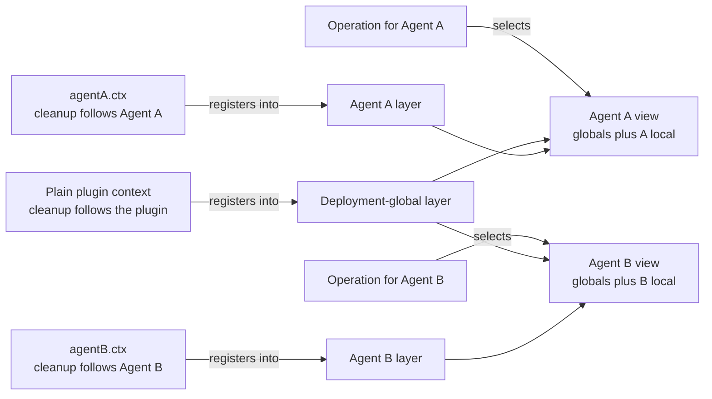
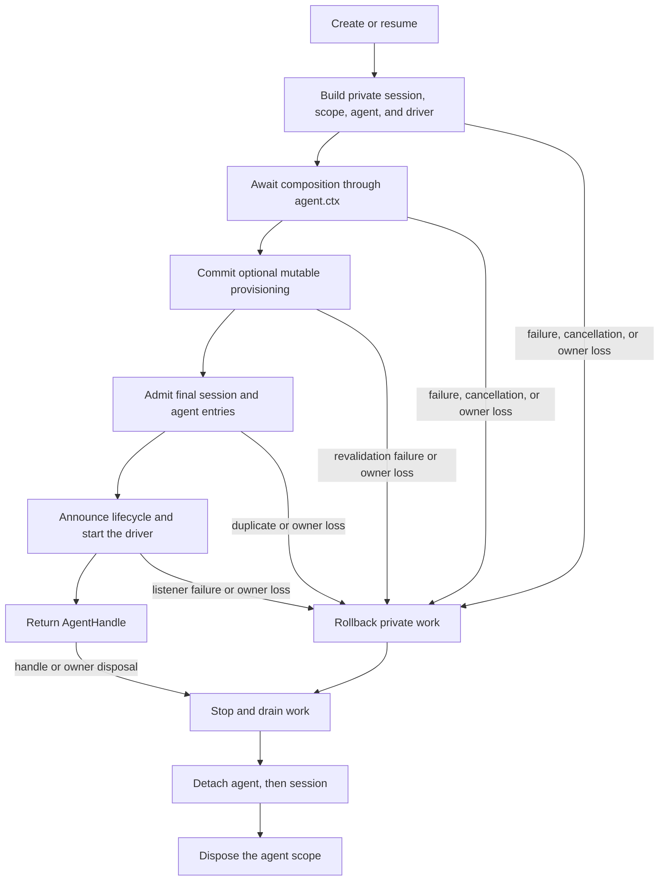

# Agent Note: agent أي تسجيل أثر مجال

Status: implemented

[English](2026-07-08-agent-scope-contexts.md) | العربية

## مشكلة

واحد تطبيق حاجة في كثير عدد agent(ذكي جسم) بين مشترك أساس أساس ضبط تطبيق، معا يجعل كل agent يملك ذاتي ذات أداة، نص التوجيه مساهمة، سياسة و مستمع. مشترك مهايئ، حفظ دائم و مستخدم واجهة يخص نشر طبقة وجه؛ بينما persona، أداة تغيير جسم أو مستمع نحو نحو فقط يخص بعض واحد agent.

لـ كل agent بناء قيام مستقل خدمة رسم سوف تكرار مشترك أساس أساس ضبط تطبيق. استخدام واحد عام تسجيل رسم فإن لديه متبادل عكس مشكلة: بعض عدد agent خاص لديه مساهمة ممكن تسرب تسرب إلى غير متصل agent في. مساهمة من حاجة واحد نوع عادي تسجيل آلية، حيث قدرة قرار من يمكن يرى بعض بند مساهمة، أيضا قدرة قرار أي وقت تنظيف هو.

هذا آلية أيضا حاجة واحد إصدار حد.agent في ذلك محلي عالم حد بناء إتمام قبل لا نيل تغيير لـ مرئي، تفكيك حذف وقت أيضا يجب إبقاء هذا محلي عالم حد مباشر إلى نهائي عمل إيقاف.

## قرار

كل تخزين نشط agent يملك واحد مسطح مستو تسجيل طبقة، عبر `agent.ctx` كشف. شفرة عبر يملك بعض بند مساهمة سياق إجراء تسجيل؛ أداة تجهيز أثر مجال شعور معرفة خدمة سوف نشر عام تسجيل و تماما جيد واحد مطابقة agent طبقة دمج؛ عملية من ذلك حقيقي agent اختيار هذا طبقة؛ هذا طبقة في agent كامل إصدار دورة الحياة داخل وجود.

`agent.ctx` يحمل تسجيل كل حق و أثر مجال مفتاح، لا كشف عكس نحو `agent` خاصية. حاجة مجال رئيسي جسم شفرة سوف صريح استقبال هو:`AgentSetup` استقبال `(agentCtx, agent)`، أثر مجال حدث فإن في payload في يحمل رئيسي جسم.

Cordis هو SDK قاع طبقة إضافة إطار هيكل.Cordis **سياق**هو إضافة استخدام قدوم وصول خدمة و تسجيل فاعلية نتيجة كائن، فاعلية نتيجة تنظيف تتبع مع هذا سياق.[Cordis دخول باب](../../../../docs/cordis-primer.ar.md) مقابل هذا إطار هيكل لديه أكثر تفصيل دقيق شرح.

مقابل كبير كثير عدد مساهمة من بينما قول، كامل اتفاق هو أربعة بند قاعدة:

| مشكلة | قاعدة |
|---|---|
| في أي داخل لـ بعض عدد agent تسجيل سلوك؟ | عبر `agent.ctx` استدعاء عادي تسجيل API |
| بعض عدد agent عملية قدرة يرى ماذا؟ | نشر عام إضافة فوق هذا agent طبقة، حسب الذي تابع خدمة دمج قاعدة |
| أي بعض أثر مجال مستمع سوف تشغيل؟ | بلا أثر مجال مستمع إضافة فوق لـ هذا عملية الذي تابع agent تسجيل مستمع |
| هذا طبقة وجود كثير دائم؟ | setup في إصدار قبل إتمام؛dispose(مورد تحرير) إبقاء هذا طبقة مباشر إلى عمل تماما توقف مستقر |

أثر مجال هو مسطح مستو. تحليل دائم بعيد لن مرة تاريخ أب درجة أو أخ أخ أثر مجال، دورة الحياة كل حق أيضا لا معنى طعم حال تسجيل وراثة.



ناقص تسليم تقاطع حافة أي عزل قاعدة:Agent A محلي تسجيل لن دخول Agent B عرض، أب درجة تسجيل أيضا لن فقط بسبب أب درجة يملك فرعي درجة دورة الحياة حينئذ دخول فرعي درجة.

إعداد طقم[وقت التشغيل تصميم Agent Note](2026-07-12-agent-scope-runtime-design.ar.md) توضيح وصف تنفيذ و صحيح تأكيد صفة دفع إدارة.[صريح وقت التشغيل هوية Agent Note](2026-08-31-explicit-agent-runtime-identity.ar.md) شرح دورة الحياة، حدث و نقل واجهة لـ أي صريح نقل تمرير Agent هوية، بينما لا عبر Context كشف هذا هوية.[subagent تركيب تحكم Agent Note](../feature/2026-07-12-subagent-persona-tool-filter-and-depth.ar.md) مسؤول مستقل `persona`،`toolFilter` و `maxDepth` وظيفة.

### تسجيل مصدر قرار مرئي صفة و تنظيف

عبر عادي إضافة سياق إجراء تسجيل هو نشر عام، مع هذا إضافة واحد بدء dispose. نفس طريقة عبر `agent.ctx` استدعاء فإن مساهمة إعطاء واحد agent، مع هذا agent أثر مجال واحد بدء dispose.

| تسجيل مصدر | افتراضي مرئي صفة | مع من dispose |
|---|---|---|
| عادي إضافة سياق | كل رمز دمج شرط agent عرض | تسجيل إضافة |
| `agent.ctx` | فقط هذا agent عرض | agent أثر مجال |

أداة، نص التوجيه مقطع سقوط و متغير، أداة حد، حراسة حماية و أثر مجال حدث مستمع كل التزام دوران هذا اتفاق. تسمية محلي قيمة عبر معتاد مقابل هذا agent حجب حجب نفس اسم عام قيمة؛ كل الذي تابع خدمة وثيقة سوف شرح مثال خارج و دمج سلوك.

عادي مساهمة من نمط هو في agent setup خلال تسجيل كامل محلي عالم حد:

```js
const handle = await ctx.agents.create({
  sessionId: SessionId('reviewer'),
  agentOptions: { model: 'model-name' },
  setup(agentCtx) {
    agentCtx.systemPrompt.section({
      name: 'deployment:persona-prefix',
      order: 0,
      text: 'Review code, but do not modify files.',
    })
    agentCtx.tools.register({
      name: 'review_summary',
      description: 'Return the review summary.',
      parameters: { type: 'object', properties: {} },
      async execute() {
        return [{ type: 'text', text: 'review complete' }]
      },
    })
  },
})

ctx.tools.get('review_summary')                // undefined: not global
ctx.tools.get('review_summary', handle.agent)  // the reviewer-local tool

await handle.dispose()
ctx.tools.get('review_summary', handle.agent)  // undefined: scope is gone
```

setup استقبال كامل تلقي معلومة Cordis سياق و لم إصدار Agent، لذلك حيث يمكن تركيب عادي إضافة و خدمة، أيضا قدرة في حاجة وقت قراءة تأكيد قطع فرعي Session. ذلك اتفاق فقط حد تركيب: لا دعم حمل عبر cast أو داخلي سجل التسجيل استدعاء قدوم قيادة أو إصدار صحيح في بناء في agent.

### عملية اختيار عرض

تسجيل مصدر و عملية رئيسي جسم هو اثنان عدد مستقل واقع. عبر `agent.ctx` استدعاء خدمة قرار هو جديد تسجيل ملكية أي موضع، و لا سوف لاحق قراءة ربط إلى هذا agent.

أداة فحص بحث و تنفيذ استقبال ذلك الذي خدمة agent. نص التوجيه تجميع استقبال صحيح في بناء طلب agent تجميع سياق. حدث توزيع استقبال ذلك مجال رئيسي جسم. هذا جعل مشترك خدمة نسخة يمكن في كثير عدد agent بين إعادة استخدام، معا يجعل كل عملية عرض إبقاء صريح.

فقط لديه قبول أثر مجال اتفاق خدمة عندئذ سوف تحليل agent طبقة.`agent.ctx` لن تلقائي تغيير مهمة معنى Cordis خدمة استدعاء سلوك.

### أثر مجال حدث سوف توجيه و حدث بيانات قسم مغادرة

صلة في Agent A حدث عبر معتاد وصول بلا أثر مجال مستمع و A أثر مجال مستمع، بينما لا وصول B أثر مجال مستمع. لا يوجد agent رئيسي جسم حدث فقط وصول بلا أثر مجال مستمع.

في Cordis طبقة وجه،`Scoped<T>` هو واحد لا نفاذ واضح توجيه استقبال جهاز. هو يحمل لأجل اختيار مستمع مرور ترشيح جهاز، لكن ذاته لا هو مجال كائن. لذلك حدث توقيع سوف حقيقي `Agent`، أداة تنفيذ، مراجعة دفعة طلب أو أخرى رئيسي جسم بصفة صريح معامل إبقاء، توفير مستمع فحص.

بـ `{ global: true }` تسجيل مستمع متعمد التفاف مرور سياق تلقي جمهور مرور ترشيح، لكن ذلك تنظيف ما زال تتبع مع تسجيل سياق. سجل التسجيل عضو تغيير إشعار إبقاء لا مرور ترشيح، لأن هو جمع وصف هو مشترك سجل التسجيل حالة بينما غير بعض عدد agent عملية. تفصيل كل حدث مشاركة اعتبار هو كل[فرعي نظام صفحة](../../../../docs/subsystems/core.ar.md) فوق توليد `cordis-surface` منطقة كتلة تجميع دمج——كل حدث أثر مجال في ذلك الذي تابع صفحة فوق (`agent/*` و `agent-loop/*` في core.md هذا صفحة).

### إنشاء الأكثر بعد إصدار،dispose الأكثر بعد سحب إلغاء

`ctx.agents.create()` و `resume()` بناء لم إصدار جلسة، أثر مجال،agent و مشغل. هو جمع انتظار `setup`، تزامن استدعاء ذلك اختياري `AgentSetupCommit`، دقيق دخول نهائي جلسة و agent بند، حسب ترتيب عام إبلاغ، بدء حلقة، لكن بعد عندئذ إرجاع handle. هذا إيداع عملية يجعل متغير إعداد حالة في كل setup await متساو تسوية بعد، في تأكيد قطع إصدار حد إعادة تحقق؛ إذا ذلك رمي خروج استثناء، فإن سوف في عام إبلاغ أي واحد هوية قبل تراجع خاص أمر خدمة، بينما نجاح إيداع بعد سحب إلغاء يخص عادي تخزين نشط مدة تفكيك حذف.

اختياري إنشاء إشارة فقط في إنشاء أو استعادة تعليق بدء خلال إلغاء عمل.promise resolve بعد، إرجاع `AgentHandle` يملك صريح dispose حق.

إذا تحميل،setup، اختياري setup إيداع، دقيق دخول أو إصدار فشل، خاص أمر خدمة تراجع ذلك دقيق تجهيز واحد قطع. استخدام نفس عدد استدعاء جهة توفير تخزين نشط ID تزامن عملية ممكن كل وصول setup، لكن نهائي سجل التسجيل بند فقط دقيق دخول واحد؛ كل فشل من رفض و تنظيف ذلك خاص مورد. في انتظار dispose إتمام بعد ترتيب إعادة استخدام ما زال صالح.

`AgentHandle.dispose()` عكس تحويل حد. هو توقف استخدام إنشاء أو قيادة، انتظار تزامن إصدار إتمام تراجع مكدس، إيقاف و ترتيب فارغ مشغل و نهائي جلسة تحديث كتابة، قسم مغادرة agent و جلسة، الأكثر بعد dispose أثر مجال. تكرار أو تنافس تنازع dispose طلب دمج لـ واحد إتمام promise.

استدعاء جهة Cordis سياق و أداة جسم AgentLoop عمل مصنع هو بنية صفة مشترك نفس كل من. إزالة مهمة واحد جهة كل سوف dispose أمر خدمة أو تخزين نشط agent.



<a id="security-and-authority-are-non-goals"></a>

## أمان و إذن هو غير هدف

agent أثر مجال تركيب هو تلقي معلومة نفس عملية تسجيل. هو لا صندوق رملي تحويل إضافة، لا تعريف أب إلى فرعي إذن إطار، لا في إنشاء وقت تجميد ربط تخويل، أيضا لا حفظ إثبات فرعي درجة لا يستطيع فعل تجاوز خروج أب درجة أمر.

أب درجة يمكن يملك واحد مرئي أداة مقارنة ذاته أكثر واسع فرعي درجة، لأن دورة الحياة كل حق لا إهداء إعطاء أيضا لا حد تسجيل. يحتفظ Cordis سياق إضافة نفس مثال تشغيل في نفس عملية في، يمكن مباشر استدعاء متاح خدمة.

حاجة غير رفع حق حفظ إثبات نشر حاجة مستقل إذن يمثل، نقل بث قاعدة و تنفيذ فحص. أب درجة فرعي تجميع تخويل، إنشاء وقت تخويل لقطة، صريح لم قدوم تخويل API، و عام قدرة/إخراج/إنهاء وسم متساو لا في هذا قرار نطاق داخل.

<a id="alternatives-considered"></a>

## سبق اعتبار بديل خطة

يتم مرفوض تصميم يلزم ما سوف مرئي صفة و تنظيف قسم مغادرة، يلزم ما فقط تغطية واحد صنف تسجيل، يلزم ما تكرار مشترك أساس أساس ضبط تطبيق، يلزم ما سوف دورة الحياة كل حق و وراثة خلط لـ واحد حديث.

### نحو كل تسجيل نقل تمرير agent خيار

صنف يشبه `tools.register(definition, { agent })` API في كل سجل التسجيل في تكرار أثر مجال نقل تمرير منطق، كما سماح مرئي صفة كل حق و تنظيف كل حق عائم نقل. عبر `agent.ctx` تسجيل جعل اثنان عدد واقع تتبع مع نفس عدد Cordis effect owner.

### مرور ترشيح حدث لكن إبقاء سجل التسجيل عام

مستمع مرور ترشيح يمكن منع توقف خطأ خطاف تشغيل، لكن لا يمكن حد تحديد أداة schema، يمكن تنفيذ فحص بحث، نص التوجيه مقطع سقوط، متغير أو أخرى قد تسجيل بيانات أثر مجال.agent محلي تركيب ما زال يحتاج مؤقت عام تغيير.

### لـ كل agent إنشاء مستقل خدمة رسم

الذي يحتاج عرض هو مشترك نشر خدمة إضافة فوق واحد محلي تسجيل طبقة. كل agent واحد خدمة رسم سوف تكرار مهايئ، و جعل مشترك حفظ دائم، مزود سجل التسجيل و تطبيق بدء تكرار مختلط تحويل.

### وراثة أب درجة تسجيل أثر مجال

أب فرعي علاقة وصف هو دورة الحياة و محادثة جدول نظام، بينما غير عام دمج سياسة. طبقة درجة فحص بحث سوف يجعل غير متصل خدمة معنى خارج وراثة، كما في لا يوجد مستقل إذن نموذج حال حال تحت لا يمكن تعريف أمان صفة.

## عاقبة

مساهمة من استخدام واحد نوع ناضج معرفة نمط: عبر إضافة سياق تسجيل مشترك سلوك، عبر `agent.ctx` تسجيل محلي سلوك، في عملية في اختيار حقيقي agent،dispose إرجاع handle. من مراقبة من زاوية درجة نظر،setup و ذلك اختياري إصدار إيداع هو أصل فرعي، تفكيك حذف فإن إبقاء محلي سلوك مباشر إلى عمل إيقاف.

بديل قيمة هو صريح رئيسي جسم اختيار، مختلف خطوة تحرير مسار صيغة إنشاء، و خدمة حاجة تدريجي عدد قبول أثر مجال. مسطح مستو تسجيل أثر مجال متعمد لا انتظار نفس في إذن،subagent تركيب تحكم بصفة مستقل وظيفة وجود، بينما غير إخفاء أثر مجال دلالة.
