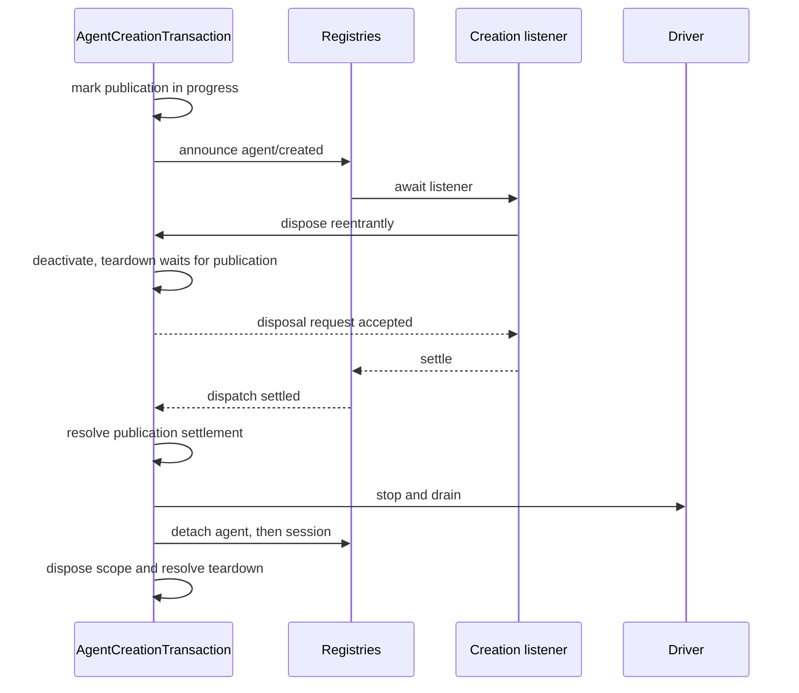

# Agent Note: Agent أثر مجال وقت التشغيل تصميم و صحيح تأكيد صفة

Status: implemented

[English](2026-07-12-agent-scope-runtime-design.md) | العربية

## مشكلة

[agent(ذكي جسم) أثر مجال اتفاق](2026-07-08-agent-scope-contexts.ar.md) مقابل مساهمة من بينما قول جدا بسيط مفرد: عبر `agent.ctx` تسجيل، تحليل خروج واحد عام إضافة مفرد agent عرض، فقط في setup إتمام بعد إصدار، و إبقاء أثر مجال مباشر إلى عمل إيقاف. وقت التشغيل يجب في تنسيق عمل صيغة إضافة إطار هيكل، مختلف خطوة إنشاء، يمكن إعادة دخول مستمع، حفظ دائم جلسة إيداع و worker أو عملية لذا عائق انتظار مشهد تحت صيانة هذا نسخة اتفاق.

رئيسي يلزم تصميم ريح خطر هو لـ كل تنافس حالة شرط جذب دخول ثاني طقم آلية. مستقل مسبق إبقاء، حينئذ خيط مراقبة جندي، إلغاء في استمرار، لقطة طبقة و حفظ حماية سجل التسجيل ممكن مرآة مثل نفس عدد واقع، مباشر إلى لا يوجد قراءة من قدرة قسم تمييز أي عدد عندئذ هو مرجعي. هذه آلية أيضا سوف إغراء جعل وقت التشغيل يأخذ يمكن معلومة نوع تحويل استدعاء عند عمل عدو مقابل تسلسل تحويل حد قدوم معالجة.

تنفيذ حاجة كاف كاف حالة قدوم صيانة حقيقي كل حق و تسوية حد، لكن لا يستطيع أكثر كثير. صحيح تأكيد صفة مراجعة فحص من يجب قدرة كاف من قبول، إصدار إلى تفكيك حذف، امتداد حال واحد بند واقع سلسلة تتبع أثر تحت ذهاب، بينما بلا حاجة في و سطر يمثل بين فعل ضبط و.

## قرار

وقت التشغيل مقابل كل مستقل واقع استخدام واحد نوع آلية. أثر مجال توجيه لديه واحد لا نفاذ واضح تحميل جسم و مشترك layer store؛ كل نشط وثب سجل التسجيل كائن لديه واحد بند سجل التسجيل بند؛ كل إنشاء أو استعادة عملية لديه واحد أمر خدمة؛ نوع تحويل نفس عملية استدعاء استعارة استخدام readonly قيمة؛ حقيقي بيانات حد فقط شيء تحويل مرة؛ تنسيق عمل صيغة نص التوجيه تجميع نتيجة أي لـ مرجعي؛worker/عملية شفرة فقط في مختلف كل من تأكيد فعلي ممكن تنافس تنازع وقت عندئذ إبقاء مستقل إنهاء حالة و تماما توقف مستقر حالة.

هذا تصميم يمكن عام تضمين لـ سبعة بند اختيار:

| مشكلة | مرجعي آلية |
|---|---|
| اختيار عام إضافة بعض عدد agent تسجيل | لا نفاذ واضح أثر مجال مفتاح، توجيه تحميل جسم و مشترك layer store |
| يملك واحد نشط وثب agent أو جلسة | من ذلك disposer التقاط مفرد بند سجل التسجيل بند |
| تنسيق ضبط إنشاء/استعادة | مفرد عدد `AgentCreationTransaction` |
| حفظ حماية حفظ دائم، طابور صف، نموذج أو بروتوكول صيغة بيانات | في هذا حد موضع مرة صفة شيء تحويل |
| في نفس عملية داخل نقل تمرير نوع تحويل قيمة | Readonly استعارة استخدام اتفاق |
| تركيب نموذج مرئي نص التوجيه و أداة تجميع | مفرد عدد مشترك أداة عرض إضافة مرجعي assembly-waterfall(شلال نشر صيغة حدث) نتيجة |
| تنسيق ضبط subagent،worker و عملية إغلاق | مفرد عدد إلغاء إشارة إضافة هذا حد مستقل إنهاء حالة/تماما توقف مستقر حالة واقع |

هذا Agent Note بقية تحت جزء حسب اعتماد ترتيب توسيع هذه اختيار:Cordis آلية، أثر مجال توجيه، إنشاء و جلسة إيداع، أداة و نص التوجيه،subagent و سير العمل، الأكثر بعد هو يمكن تنفيذ فحص.

[7 شهر 8 يوم Agent Note](2026-07-08-agent-scope-contexts.ar.md) ما زال هو مساهمة من اتفاق. مستقل [subagent تركيب تحكم Agent Note](../feature/2026-07-12-subagent-persona-tool-filter-and-depth.ar.md) يملك `persona`،`toolFilter` و `maxDepth`؛ هذا نص فقط نقاش نقاش هو جمع setup مثل أي دمج دخول دورة الحياة.

## Cordis نموذج: سياق،fiber،effect،receiver و waterfall

فهم التنفيذ حاجة خمسة عدد Cordis عام فكرة. سياق اختيار خدمة و تسجيل كل حق؛fiber هو واحد نشط وثب إضافة أو فرعي دورة الحياة؛effect سوف تنظيف منطق مرفق إضافة إلى fiber؛ حدث استقبال جهاز اختيار مستمع؛waterfall يجعل مستمع حسب ترتيب تغيير تبديل أو قصير مسار واحد عملية.

### سياق هو اختراق اختراق مفرد عدد خدمة رسم كل حق مسار

كل agent مشترك واحد Cordis خدمة رسم. إرسال توليد سياق لن تغلب ضخم `ToolRuntime`،`SystemPrompt`، حفظ دائم أو نموذج مهايئ؛ هو تغيير هو: عبر هذا سياق إجراء تسجيل مثل أي يتم علامة، و أي بعض effect يملك ذلك تنظيف منطق.

`agent.ctx` حينئذ هو هذا مثال واحد إرسال توليد سياق. خدمة استدعاء ما زال وصول مشترك نسخة، بينما تسجيل عملية يمكن فحص ذلك استدعاء سياق و سوف مساهمة تخزين في الأكثر قريب أثر مجال مفتاح تحت. عادي إضافة سياق لا يحمل أثر مجال مفتاح، لذلك تسجيل إلى عام.

Agent سياق حينئذ هو `createScope` إرجاع سياق، لا يحمل ثاني نسخة إشارة عودة Agent صلة ربط. حاجة رئيسي جسم API صريح نقل تمرير Agent، لذلك تسجيل كل حق و توجيه فقط اعتماد واحد نوع صحيح صيغة أثر مجال آلية.

### Fiber و effect جعل تنظيف يصبح بنية صفة

Cordis fiber هو إضافة أو فرعي سياق يتم تنشيط وقت إنشاء نشط وثب نسخة. ذلك حالة سجل هذا دورة الحياة هو active،unloading،failed أيضا هو disposed.`ctx.effect()` و `ctx.on()` إرجاع disposer، معا سوف هذه disposer مرفق إضافة إلى تسجيل الذي في fiber، لذلك إزالة واحد إضافة أو agent أثر مجال سوف إزالة عبر هذا سياق تسجيل واحد قطع، بلا حاجة مفرد وحيد بيان.

vendor في Cordis fiber تنفيذ في مهمة معنى setup أو `internal/plugin` مراقبة من تشغيل قبل حينئذ بناء قيام كل حق. يمكن إعادة دخول إزالة يمكن يرى قد بدء فرعي fiber أو effect، رفض إزالة بدء بعد إضافة effect، و عبر واحد عام مرة صفة disposer إضافة دخول قد بدء تنظيف. تفكيك حذف مراقبة من يتم تدريجي عدد عزل، لذلك واحد عودة ضبط لا يمكن منع توقف بنية صفة تنظيف.

هذه هو إطار هيكل دورة الحياة حفظ إثبات، بينما غير agent خاص لديه سياسة.Agent إنشاء اعتماد هو جمع، لأن setup يمكن تنشيط مهمة معنى إضافة و تزامن إعادة دخول كل من dispose(مورد تحرير).

### Receiver توجيه مستمع؛waterfall تركيب قرار

Cordis استخدام dispatch receiver(`this`) مرور ترشيح مستمع، بينما harness مستمع حاجة واحد صريح agent،execution،request أو أخرى رئيسي جسم.`Scoped<T>` علامة أثر مجال حدث إعلان الذي مدة نظر receiver، لكن وقت التشغيل تحميل جسم لحظة معنى لا كشف رئيسي جسم API.

لذلك، منتج مساعد مساعدة دالة بنية صنع تحميل جسم و مفرد وحيد نقل تمرير مجال رئيسي جسم. هذا منع توقف مستمع توجيه تغيير صار آخر طقم كائن نموذج، و جعل حدث توقيع في لا حل تحميل جسم داخلي حال حال تحت أيضا يمكن إدارة حل.

Cordis waterfall هو في بين عنصر ريح إطار dispatch. كل مستمع استقبال `next()`: استدعاء هو فإن تفويض حمل إعطاء باق بقية مستمع و أساس أساس عملية، لا استدعاء فإن قصير مسار أو استبدال تحت تنقل نتيجة.Waterfall قيادة نص التوجيه تجميع و أداة سياسة؛ عادي emit حدث تزامن إشعار،parallel حدث انتظار كل مستمع لكن لا يوجد مرفوض نتيجة.

## أثر مجال توجيه: واحد لا نفاذ واضح مفتاح اختيار واحد طبقة

scope حزمة تنفيذ Cordis توجيه الذي يحتاج الأكثر صغير كائن. ذلك تحميل جسم فقط يحتفظ واحد تركيب خدمة مرور ترشيح جهاز و أثر مجال يسمى كلمة، بينما حزمة خاص أرض سجل لا نفاذ واضح مفتاح، و مفرد وحيد كشف سوف انتظار أثر مجال fiber تماما توقف مستقر disposer.

### أثر مجال معرف استخدام كائن معرف

`ScopeKey` هو واحد حسب معرف مقارنة مقارنة لا نفاذ واضح كائن.harness استخدام نشط وثب `Agent` بصفة ذاته مفتاح، لكن هذا أصل لغة و مجال غير متصل، دعم حمل أخرى أثر مجال كل من.

`createScope(parent, key)` إرجاع واحد أثر مجال، ذلك `ctx` مشترك أب درجة خدمة، ذلك effect يتم علامة لـ هذا مفتاح.`scopeOf(ctx)` قراءة الأكثر قريب تسجيل مفتاح.`scopeTarget(base, key)` إنشاء حدث استقبال جهاز، ذلك مرور ترشيح جهاز إبقاء base receiver Cordis خدمة مرور ترشيح جهاز، لكن بعد وصل قبول بلا أثر مجال مستمع و أداة لديه هذا تأكيد قطع مفتاح مستمع.

Receiver هو واحد صغير نوع تحميل جسم بينما غير مجال كائن نفاذ واضح بديل إدارة. حاجة agent شفرة استقبال صريح setup معامل أو حدث معامل؛ حاجة تسجيل كل حق شفرة استقبال `agent.ctx`.

### سجل التسجيل قراءة تراكم إضافة واحد دقيق layer

أثر مجال شعور معرفة سجل التسجيل استخدام `ScopedLayers`، يملك واحد أي وقت إنشاء عام aggregate و حسب معرف مفتاح كسول صفة إنشاء aggregate. قراءة تحليل عام layer و حتى كثير واحد دقيق نطاق جزء layer؛ هو لا إنشاء حالة، أيضا من لا مرة تاريخ أب درجة سلسلة. تسجيل مرئي صفة و Cordis effect كل حق كل من نفس عدد سياق إرسال توليد، بينما عودة استلام سوف انتظار أداة جسم layer كامل aggregate تغيير فارغ (رؤية[قرار](../../archived/architecture/2026-07-12-scoped-layers-store.md)).

كل خدمة إبقاء ذلك مجال قاعدة. تسمية command و نص التوجيه عرض استخدام مشترك، إبقاء إدراج دخول ترتيب shadow دمج؛ أداة إبقاء أكثر وفير غني resolver، لأن حد سوف في إضافة دخول نطاق جزء أداة قبل مرور ترشيح عام أداة، إبقاء PTC mode transport فإن مفرد وحيد إدراج دخول. نص التوجيه متغير و أداة guard إبقاء فوري تكرار بديل، بينما أداة مزود عضو علاقة حسب كل مرة assembly شيء تحويل.Scope توفير تخزين دورة الحياة و تسمية حجب حجب، بينما غير عام سجل التسجيل عرض.

### دمج دمج dispatch مساعد مساعدة دالة منع توقف رئيسي جسم عائم نقل

`agentEvents(context, agent)` بنية صنع agent تحميل جسم و حقن نفس عدد agent بصفة حدث رئيسي جسم. جلسة، أداة،approval، نص التوجيه و subagent خدمة نفس مثال من هو جمع قد يملك كائن إرسال توليد توجيه، بينما غير قبول واحد غير متصل مفتاح.

نوع علامة رفض عادي عار receiver خطأ استخدام، تطوير بيئة ثابت صيغة تغطية مباشر JavaScript أو قوي صنع تحويل dispatch. رئيسي جسم إبقاء صريح، لأن توجيه صحيح تأكيد صفة و لديه استخدام حدث بيانات هو مختلف صلة ملاحظة نقطة.

## Agent إنشاء: واحد أمر خدمة يملك كامل عملية

إنشاء و استعادة هو واحد أداة لديه كثير عدد مرحلة مقطع مختلف خطوة دورة الحياة، بينما غير كثير عدد دورة الحياة.`AgentCreationTransaction` يملك استدعاء جهة و عمل مصنع نشط وثب صفة، اختياري إلغاء، خاص مورد، إصدار، تراجع، و كل كل من مراقبة إلى تسجيل ذاكرة تحويل تفكيك حذف.

### سجل التسجيل بند هو وحيد نشط وثب معرف سجل

AgentRegistry و SessionStore كل لـ كل نشط وثب كائن إبقاء واحد بند سجل التسجيل بند. سجل التسجيل بند يحتفظ مستقر ID، كائن، أثر مجال تحميل جسم، و يخص هذا كائن قليل كمية إصدار أو إلحاق حالة.

detach إغلاق حزمة التقاط ذلك تأكيد قطع سجل التسجيل بند. هو فقط في خريطة ما زال إشارة نحو هذا سجل التسجيل بند وقت عندئذ حذف، لذلك قديم disposer لا يمكن حذف واحد إعادة استخدام نفسه ID لاحق كائن. سجل التسجيل لن إعادة قراءة متغير استدعاء جهة كائن قدوم قرار معرف.

لا يوجد مسبق إبقاء API. استدعاء جهة توفير ID في نهائي كتابة سجل التسجيل وقت يتم وصل قبول. تزامن نفس ID عملية ممكن كل إتمام خاص setup؛ تماما جيد واحد نهائي `enter()` نجاح، كل فشل من تراجع ذلك خاص مورد. قبل واحد disposer بلوغ إلى تماما توقف مستقر حالة بعد، ترتيب إعادة استخدام أي لـ صالح.

### أمر خدمة في انتظار قبل حينئذ يملك دقيق تجهيز عمل

أمر خدمة في حفظ دائم تحميل أو setup ممكن تعليق بدء قبل، حينئذ يتم تثبيت إلى استدعاء جهة Cordis سياق و أداة جسم AgentLoop عمل مصنع تحت. هو أيضا في عام عملية تسوية قبل مراقبة اختياري إنشاء/استعادة إشارة.

إنشاء دقيق تجهيز واحد جديد Session. استعادة تحميل و تحقق حفظ دائم Session، لكن بعد دقيق تجهيز نفسه نشط وثب جلسة معرف. اثنان بند مسار مع بعد بناء أثر مجال،agent و driver، و استدعاء نفسه setup/إصدار حساب قاعدة.

عمل مصنع تخزين أداة جسم trace هدف، لكن عبر استدعاء جهة ربط Cordis trace استدعاء هو جمع. وقت التشغيل فرعي Agent إنشاء جهة في create أو resume options في ضبط `parentAgent`،AgentRegistry تحويل تسليم هذه options، لا من استدعاء جهة Context دفع توجيه أب درجة. هذا حيث إبقاء اعتماد مصدر و اثنان نوع كل حق واقع، أيضا لا كومة تراكم trace بديل إدارة، أيضا لا يأخذ مجال كائن مرفق حال إلى Context. أثر مجال Remote حدث مهايئ نفس مثال من request استقبال Agent، تحقق هو حينئذ هو carrier key، مجددا مباشر إسقاط ذلك Context و wire identity. نظام لن عبر أثر مجال بحث جذب من Context إعادة بناء Agent.[صريح وقت التشغيل هوية قرار](2026-08-31-explicit-agent-runtime-identity.ar.md) يملك هذا بند قسم مغادرة أصل فإن و من هذا تحديد يمكن متابعة ركض فرعي درجة ملكية قاعدة.

### Setup هو خاص عالم حد داخل يمكن معلومة تركيب

Setup استقبال كامل فرعي سياق و تأكيد قطع لم إصدار Agent، يمكن انتظار إضافة تنشيط. هو يمكن تسجيل أداة، نص التوجيه مقطع، حد، مستمع و أخرى effect؛ حاجة فرعي Session إزالة استهلاك من من Agent معامل قراءة هو. عام اتفاق لا دعم حمل عبر قوي صنع تحويل أو داخلي سجل التسجيل استدعاء قدوم قيادة أو إصدار صحيح في إنشاء في agent.

أمر خدمة سوف مختلف خطوة تحميل و setup و توقف استخدام إجراء تنافس تنازع، بينما غير بلا حد انتظار خارجي شفرة يملك promise. إذا إلغاء أو كل من إزالة نيل فوز، أي جعل خارجي promise دائم لا تسوية، عام إنشاء أيضا سوف في أمر خدمة يملك تنظيف بعد رفض.

### إصدار لديه واحد بند لديه ترتيب إيداع مسار

إصدار حسب مراقبة من الذي يحتاج ترتيب وصل قبول و إعلان إبلاغ مورد:

1. سوف جلسة كتابة سجل التسجيل.
2. سوف agent كتابة سجل التسجيل.
3. إعلان إبلاغ `session/created`.
4. انتظار سلسلة سطر `agent/created` مستمع.
5. نحو مشغل تحرير قد ترتيب طابور إدخال.

Agent في اثنان عدد سجل التسجيل و إنشاء مستمع كل إتمام قبل أبدا قيادة. مستمع يمكن رفض أو dispose واحد كل من؛ أمر خدمة إبقاء أثر مجال و جلسة، انتظار توزيع تسوية بعد مجددا متابعة تفكيك حذف. كل قد بدء إنشاء إعلان إبلاغ في تراجع خلال كل لديه مطابقة إلغاء تدمير إعلان إبلاغ.[يمكن انتظار إنشاء قرار](2026-09-09-awaited-agent-creation.ar.md) يملك مختلف خطوة ابتدائي تحويل جهاز وقت ترتيب.

إنشاء مستمع يمكن في إصدار ما زال يملك اثنان عدد سجل التسجيل بند وقت طلب dispose.Teardown سوف قيام أي توقف استخدام، و انتظار الذي استدعاء مختلف خطوة توزيع إتمام بعد عندئذ إيقاف و قسم مغادرة مورد.

### تفكيك حذف في سحب إلغاء تسجيل قبل إبقاء عمل

كل تفكيك حذف طلب إضافة دخول واحد بند تسجيل ذاكرة تحويل مسار. ترتيب لـ:

1. توقف استخدام إنشاء أو قيادة، و انتظار إنشاء توزيع.
2. إيقاف و ترتيب فارغ driver، إسقاط ما زال موضع في انتظار معالجة حالة حقن.
3. قسم مغادرة agent.
4. قسم مغادرة جلسة.
5. dispose agent أثر مجال.
6. تراجع دور أمر خدمة كل حق تتبع أثر.

هذا ترتيب يجعل نهائي agent و جلسة حدث قدرة استخدام مطابقة أثر مجال مستمع، و جعل حفظ دائم مراقبة من في نهائي تحديث جديد إتمام قبل إبقاء مرفق إضافة. أثر مجال dispose وضع في الأكثر بعد، لأن تسجيل سحب إلغاء هو خارجي مرئي توليد أمر مدة حد.

## جلسة إلحاق: شيء تحويل، تحقق، إيداع، إشعار

جلسة حدث عبر تجاوز حفظ دائم حد، لذلك إلحاق عملية يملك ذلك بيانات. حساب قاعدة ذلك بقية جزء استخدام واحد بند قد مرفق إضافة سجل التسجيل بند و واحد إيداع نقطة.

### حفظ دائم بيانات مرة صفة شيء تحويل

Session رأس جزء، نوع فرعي و إلحاق حدث هو بلا ضرر JSON بيانات.Session بنية صنع دالة أو إلحاق مسار في تخزين قبل شيء تحويل و تحقق هو جمع، و كشف تجميد ربط لقطة، لذلك لاحق استدعاء جهة تعديل لا يمكن تغيير حفظ دائم، إعادة تشغيل أو نموذج إعادة بناء.

هذا هو واحد حقيقي كل حق حد: قيمة مغادرة فتح استدعاء جهة، ممكن يتم حفظ دائم، كما يجب في بعد إعادة بناء نفسه طلب. هذا مقارنة نوع تحويل نفس عملية عودة ضبط أو سجل التسجيل تعريف متعمد أكثر صارم إطار.

### إيداع قبل مستمع يمكن مرفوض؛ إيداع بعد مراقبة من لا يستطيع

إلحاق التزام دوران واحد تسلسل:

1. شيء تحويل حفظ دائم حدث و جدول طبقة معنى رسم.
2. أخذ نيل SessionEntry وحيد احتلال كل حق، و رفض هذا سجل التسجيل بند فوق إعادة دخول إلحاق.
3. تحليل أثر مجال عودة ضبط و تشغيل داخلي ثابت صيغة تحقق.
4. تماما جيد دفع إرسال مرة؛ هذا هو إيداع نقطة.
5. تدريجي عدد إشعار كل مراقبة من، عزل تزامن و مختلف خطوة فشل.
6. تحرير إلحاق حالة و صرف الآن إصدار خلال طلب detach.

لا يوجد مراقبة من خطأ قدرة يجعل قد إيداع حدث نظر بدء قدوم لم إيداع، واحد تالف مستمع أيضا لا يمكن جوع ميت لاحق مستمع.Session ثابت صيغة في إيداع قبل مؤقت تخزين ذلك تحويل، فقط عند نفس حدث وصول يتم عزل إيداع بعد مراقبة من وقت عندئذ تطبيق.

`flush()` بدء كل حفظ دائم مستمع و انتظار كل نتيجة بعد مجددا تقرير إبلاغ فشل. هذا نوع متعمد all-settled سلوك منع توقف تزامن فشل جوع ميت آخر عدد خلفية أو نهائي تحديث جديد.

## معلومة مهمة حد: فقط في كل حق حق صحيح تغيير وقت نسخ

وقت التشغيل منطقة تصنيف نوع تحويل عملية داخل اتفاق و تسلسل تحويل و حفظ دائم حد. هذا هو قيمة و عودة ضبط رئيسي يلزم بسيط تحويل قاعدة.

| حد | كل حق قاعدة |
|---|---|
| نفس عملية داخل نوع تحويل خدمة/إضافة استدعاء | استعارة استخدام readonly قيمة و عودة ضبط |
| تحليل إضافة إعداد أو خارجي ملف | تحقق دلالة و بنية إدخال |
| طابور صف في استلام عنصر صندوق رسالة | في مختلف خطوة إزالة استهلاك قبل شيء تحويل |
| نموذج/أداة JSON إدخال أو إخراج | في نموذج/أداة حد موضع شيء تحويل |
| حفظ دائم جلسة أو حفظ دائم بيانات | في إيداع قبل شيء تحويل و تحقق |
| Worker، عملية أو بروتوكول صيغة رسالة | تسلسل تحويل، تحقق و يملك حل رمز بعد قيمة |

اختبار في بنية صنع سيئ معنى getter، في تسليم وصل بعد استبدال نوع تحويل عودة ضبط، أو قوي صنع تحويل زائف صنع خدمة كائن فعل قاعدة ذاته لا تعريف إنتاج اتفاق. وقت التشغيل في بيانات عبر تجاوز محلل، طابور صف، نموذج، حفظ دائم، ملف،worker، عملية أو بروتوكول صيغة (wire format) حد وقت إبقاء فحص، و في يمكن معلومة عملية داخل اعتماد readonly نوع إضافة إضافة سجل قاعدة.

عودة ضبط عزل و بيانات كل حق هو قسم فتح. مستمع هو مهمة معنى توسيع شفرة، أي جعل ذلك معامل هو يمكن معلومة أيضا ممكن رمي خروج استثناء؛ إصدار و إيداع بعد مسار ما زال حسب ذلك حدث اتفاق عزل فشل.

## أداة و نص التوجيه: مفرد واحد عرض، مرجعي تجميع، قد إيداع نتيجة

أداة عرض و تنفيذ مشترك واحد خاص محلل. نص التوجيه تجميع ما زال هو يمكن معلومة تنسيق عمل صيغة تركيب: سجل التسجيل توفير لديه ترتيب إدخال،assembly waterfall قيمة راجعة حينئذ هو agent loop(ذكي جسم حلقة) سجل و إرسال محتوى. تنفيذ فقط في سياسة أو نتيجة تسوية يجب مفرد ضبط وقت عندئذ استخدام مستقل مفرد نحو حد.

### واحد محلل تعريف أداة عرض

خاص محلل تطبيق حالي عرض نمط، نشط وثب عام حد، دقيق نطاق جزء تراكم إضافة و نطاق جزء حجب حجب.Schema، فحص بحث، تنفيذ،PTC mode SDK توليد و حد تحقق كل استخدام هذا محلل أو ذلك حد قبل عام اسم عرض.

[subagent تركيب تحكم Agent Note](../feature/2026-07-12-subagent-persona-tool-filter-and-depth.ar.md#tool-filtering-is-one-live-global-view-rule) يملك مستخدم مرئي allow/deny دلالة. تنفيذ اشتراط هو متسق صفة: يتم مرور ترشيح إسقاط عام أداة لا يستطيع عبر آخر بند فحص بحث مسار ما زال يمكن تنفيذ، نطاق جزء حجب حجب تعريف حينئذ هو يتم عرض و تنفيذ نفس عدد تعريف.

`ToolRestriction` قبول readonly allow/deny اسم و سوف ذلك تحرير ترجمة لـ داخلي تجميع دمج. كثير عدد حد أخذ تسليم تجميع. عام `visible()` و `knownNames()` طريقة هو لا لا بد يلزم، لأن فقط لديه سجل التسجيل حاجة في بين عرض.

### أداة تنفيذ يملك معرف و حد شيء تحويل

سجل التسجيل لـ كل مرة تنفيذ قسم إعداد واحد جديد حمل صنف لوحة `Symbol` token. تضمين طقم PTC mode استدعاء سوف خارج طبقة token بصفة `parent` يحمل، لذلك بنية تحويل إخراج يمكن عبر معرف سوف داخل طبقة التقاط و ذلك خارج طبقة `run_code` نتيجة صلة ربط.

سجل التسجيل قسم إعداد جديد Symbol توفير بلا اصطدام اصطدام تنفيذ معرف، بلا حاجة WeakSet عضو سجل التسجيل. استدعاء جهة لا يمكن عبر `ToolExecutionInput` توفير تنفيذ ذاته token؛ هو جمع فقط في سجل التسجيل إنشاء بعد استقبال خط الإنتاج يملك `ToolExecution`. هذا هو واحد يمكن معلومة نوع تحويل اتفاق، بينما غير إبرة مقابل مهمة معنى قوي صنع تحويل أو JavaScript استدعاء جهة وقت التشغيل منع صد.

معامل في نموذج/أداة JSON دخول خط الإنتاج وقت مرة صفة شيء تحويل.Pre-،around- و post-execute مستمع عملية نوع تحويل execution و قرار.Call ID صلة ربط، مراجعة دفعة، مفرد ضبط حراسة حماية و PTC mode تضمين طقم ما زال هو صريح علاقة فحص.

في post-execute أو خارج طبقة خط الإنتاج إتمام مواصفة تحويل بعد، سجل التسجيل أولا لـ مرشح نتيجة إنشاء بلا ضرر لقطة، و سوف لقطة فشل تحويل لـ عادي خطأ؛ مع بعد استدعاء في هذا مرة استدعاء إنشاء وقت قد لقطة اختياري `ToolDefinition.finalizeContent` عودة ضبط، الأكثر بعد مرة صفة شيء تحويل و تجميد ربط يتم قبول نهائي نتيجة. هذا عودة ضبط فقط قدرة استبدال محتوى، لذلك أي جعل أداة قوي صنع الأكثر بعد واحد طريق نتيجة حد أعلى، بنية تحويل خطأ معرف، سياق و بيانات وصفية ما زال من سجل التسجيل يملك. كل تزامن `tools/result` مراقبة من استقبال هذا تأكيد قطع قد إيداع كائن، مراقبة من فشل يتم تدريجي عدد عزل. خارج طبقة خط الإنتاج فشل أو مرشح لقطة فشل سوف في نهائي محتوى معالجة قبل يتم مواصفة تحويل، لذلك مراقبة من يمكن إسقاط إبرة مقابل نفس مرجعي حد مؤقت تخزين عمل.

### Assembly waterfall يملك نهائي نموذج مرئي تركيب

SystemPrompt أول أولا سوف عام إضافة agent مقطع، متغير و أداة مزود تحليل لـ تحديد صفة سجل التسجيل مساهمة. أثر مجال مرور ترشيح `system-prompt/assemble` waterfall مع بعد يمكن إعادة ترتيب، استبدال، إضافة أو إزالة أي مقطع، متغير أو schema. ذلك إرجاع تجميع نتيجة أي لـ مرجعي؛ لا يوجد لاحق استعادة خطوة، عادي نص التوجيه مقطع، أداة تعريف أو مزود نتيجة فوق أيضا لا يوجد نهاية حالة بيانات وصفية.

هذا هو واحد يمكن معلومة نفس عملية نقطة توسيع، بينما غير إذن حد. تعديل PTC mode `run_code` schema أو `tools:sdk` إشارة أمر، أو بنية تحويل فرعي درجة التقاط schema أو إشارة أمر مستمع، لديه مسؤولية مهمة في ذلك إرجاع تجميع في إبقاء بروتوكول متسق صفة.ToolRuntime ما زال إبقاء `run_code` لا تلقي عادي أداة تسجيل و حد أثر، لأن ذلك بعض هو سجل التسجيل ثابت صيغة، لكن assembly في بين عنصر ما زال يمكن ذاتي من تغيير تبديل نهائي نموذج مرئي جدول وجه.

Scope مباشر حل قرار حق صحيح عزل مشكلة. بنية تحويل إخراج مساهمة تسجيل في فرعي درجة دقيق أثر مجال في، بينما PTC mode من نفس عدد قد تحليل أداة عرض إرسال توليد ذلك نقل و SDK. ثاني طقم تسمية حفظ حماية نظام حاجة آخر طقم كل حق و اصطدام اصطدام قاعدة قدوم تغطية مهمة معنى schema مزود (يشمل متعمد مساهمة تكرار اسم مزود) ، لكن لا إنشاء جديد معلومة مهمة حد.

### بنية تحويل إخراج فقط إيداع مرجعي نتيجة

بنية تحويل إخراج سوف فرعي أثر مجال تركيب و اثنان مرحلة مقطع تنفيذ إيداع متبادل ربط دمج. فرعي درجة في إصدار قبل تسجيل ذلك `structured_output` أداة و إشارة أمر؛ يمكن معلومة assembly مستمع يمكن تغيير تبديل هذه عادي مساهمة، و لديه مسؤولية مهمة في مدة نظر فرعي درجة إتمام وقت إبقاء بروتوكول. أداة تجربة إثبات مرشح قيمة و حسب حالي `ToolExecution` مؤقت تخزين، لكن نجاح التقاط فقط من غير ممكن تغيير `tools/result` مراقبة قرار.

مقابل في أصلي استدعاء، مراقبة من فقط في هذا تأكيد قطع تنفيذ نهائي نتيجة نجاح وقت عندئذ حذف مؤقت تخزين و إيداع ذلك قيمة. لذلك post-execute منع توقف أو خارج طبقة خط الإنتاج فشل لن إبقاء تحت قد التقاط قيمة.

مقابل في PTC mode SDK استدعاء، داخل طبقة نجاح نتيجة سجل `{ parentToken, value }` بينما غير إيداع. مراقبة من انتظار token مطابقة `parentToken` `run_code` تنفيذ، فقط في هذا خارج طبقة نهائي نتيجة أيضا نجاح وقت عندئذ إيداع. برنامج فشل، وقت التشغيل في توقف أو خارج طبقة post-policy رفض سوف إسقاط انتظار تحديد قيمة.

واحد حالما قيمة موضع في انتظار تحديد أو قد إيداع حالة، أثر مجال مفرد ضبط حراسة حماية رفض لاحق أداة استدعاء. نجاح بنية تحويل إخراج تنفيذ سوف استدعاء `exec.concludeTurn()`، لذلك ذلك ذاته غير ممكن تغيير نتيجة يحمل `concludesTurn: true`، حلقة في هذا خطوة انتهاء أداة حلقة.Schema تحقق فشل ما زال هو عادي `INVALID_ARGS` أداة خطأ، فرعي درجة يمكن في نفس جولة داخل إعادة محاولة.

صاف PTC mode سجل التسجيل مساهمة من أصلي wire schema في حذف `structured_output`، و عبر توليد SDK كشف هو.Assembly waterfall يمكن متعمد تغيير هذا عرض؛ تنفيذ ما زال إبرة مقابل فرعي أثر مجال تعريف إجراء تحقق، مستمع يملك ذلك إنشاء أي بديل نموذج مرئي توجيه متسق صفة.

### ثلاثة عدد تنفيذ حد متعمد ضبط لـ مفرد نحو

نص التوجيه تجميع متعمد هو تنسيق عمل صيغة، لكن ثلاثة عدد تنفيذ واقع في ذلك يمكن توسيع مرحلة مقطع بعد حاجة مفرد نحو تسوية:

| حد | نهائي حق قوة | لـ أي عادي مستمع ترتيب لا كاف |
|---|---|---|
| أداة pre-policy | مفرد ضبط رفض | لاحق مستمع لا نيل إعادة سماح قد يتم رفض استدعاء |
| أداة نتيجة | مراقبة غير ممكن تغيير قد إيداع نتيجة | بنية تحويل إخراج يجب فقط إيداع فعلي هروب خروج خط الإنتاج نتيجة |
| جولة continuation | عبر قد إيداع أداة نتيجة إنهاء | قد إيداع طرفية إخراج يجب انتهاء جولة |

`ToolGuard` هو مفرد ضبط سياسة سجل التسجيل. قد إيداع أداة مراقبة هو فوق وصف يتم عزل `tools/result` نقطة. طرفية بنية تحويل إخراج في ذاته تنفيذ فوق علامة `concludesTurn`، لذلك إنهاء صفة يصبح مرجعي نتيجة فوق بيانات، بينما لا هو مستقل hook قرار.

### skill(تقنية قدرة) و approval خدمة معلومة مهمة نوع تحويل استدعاء جهة

Skill سجل التسجيل تعريف و approval سياسة هو readonly نفس عملية اتفاق. هو جمع خدمة لا تغلب ضخم عودة ضبط كائن، أيضا لا منع صد تسليم وصل بعد عودة ضبط استبدال.

Skill ما زال تحقق خارجي skill ملف و تحليل مزود إخراج، عبر استدعاء agent أداة عرض توجيه دليل، و دقيق dispose تسجيل.Approval ما زال تحليل سياسة، مراقبة إلغاء، حسب `request.agent` توجيه `approval/request`، سجل حفظ دائم مراجعة حساب مقابل، و عزل ينبغي جواب من و إيداع بعد مراقبة من فشل.

## subagent: إصدار أي start promise

subagent بدء لديه مرة كل حق تحويل نقل. مزود يملك لم إصدار مورد، مباشر إلى ذلك start promise بـ واحد قد إصدار run صرف الآن؛ استدعاء جهة يملك إرجاع run و يجب dispose هو.

### خدمة اتفاق لديه واحد إلغاء عبر طريق

`SubagentProvider.start()` و `SubagentRuntime.start()` إرجاع `Promise<SubagentRun>`.Promise سوف في خلفية عبر مرور إصدار حد بعد صرف الآن، لذلك استدعاء جهة و `subagent/start` مراقبة من من لا حاجة ثاني عدد `run.started` promise. مزود عمل إذا في إصدار قبل فشل،`start()` حينئذ سوف يتم رفض؛ إصدار بعد نص التوجيه، جولة، إلغاء و أساس أساس ضبط تطبيق نتيجة سوف عبر `SubagentRun.result` تسوية، كما لن إخفاء child id، هذا أيضا هو[حفظ دائم دليل قرار](../../archived/feature/2026-07-22-durable-subagent-catalog-and-list-agents.md) الذي اشتراط اتفاق.

`SubagentStartRequest.signal` هو مطلوب. في توقف هو سوف في بدء خلال، و قد إصدار run باق بقية حينئذ خيط أو جولة عمل في طلب إلغاء.`SubagentRun.dispose()` أيضا طلب إلغاء و انتظار تماما توقف مستقر. لا يوجد مفرد وحيد عام `run.cancel()` عبر طريق.

يمكن متابعة محادثة استخدام كل منها مستقل إنشاء و لاحق عملية، و كما لا يوجد `SubagentRun`؛ ذلك إدارة جهاز يملك كل إقامة إبقاء في `AgentHandle`.

خدمة في استدعاء مزود قبل تحقق مزود قدرة و طلب دلالة. مزود rejection في هروب خروج قبل تنظيف لم إصدار مورد، كما لا إرسال إطلاق `subagent/start`/`subagent/end` مقابل. صرف الآن بعد، خدمة مرفق إضافة نتيجة مراقبة، إرسال إطلاق أثر مجال start و إرجاع run؛ إصدار بعد نتيجة rejection سوف انتهاء هذا حدث مقابل. مزود إزالة سوف منع توقف لاحق start، لكن لا سحب إلغاء مزود قد قبول run.

### عملية داخل مزود إعادة استخدام نواة قلب أمر خدمة

spawn و fork مشترك واحد عملية داخل driver. هو عبر `parent.ctx` إنشاء فرعي درجة، سوف مطلوب signal نقل دخول نواة قلب إنشاء أمر خدمة، و في لم إصدار setup خلال تثبيت persona، أداة حد و بنية تحويل إخراج مساهمة.

مزود انتظار إنشاء و فقط إرجاع قد إصدار run. في تسليم وصل وقت، نواة قلب إنشاء قسم مغادرة ذلك فقط لأجل إنشاء abort مستمع؛ مزود في تثبيت نشط وثب run مستمع قبل قيام أي إعادة فحص signal، لذلك في ذلك عدد ضيق نافذة في abort سوف dispose جديد جملة مقبض بينما غير هروب انفصال إلغاء. أب درجة تفكيك حذف سوف واحد و تفكيك حذف فرعي درجة، لأن عملية يخص `parent.ctx`؛ مزود إزالة منع توقف جديد start لكن لا يصبح قد قبول run ثاني عدد سحب إلغاء كل من.Run disposer إلغاء فرعي درجة و انتظار AgentHandle لديه ترتيب تفكيك حذف.

spawn استخدام فارغ جلسة نوع فرعي.fork استخدام مرور تحقق قد إتمام جولة بادئة. محادثة نوع فرعي فقط تغيير تاريخ، لا استيراد أثر مجال، أداة، خدمة أو إذن.

### ACP(Agent Client Protocol) مزود يملك عملية مباشر إلى حينئذ خيط أو تنظيف

ACP مزود عبر تجاوز حقيقي عملية و بروتوكول صيغة حد، لذلك هو إبقاء تحقق، بيئة صاف غسل، رسالة تسلسل تحويل،abort/عملية تنافس تنازع، و من kill إلى عملية خروج و تماما توقف مستقر مرور مسار.

Start فقط في `initialize` و `newSession` نجاح بعد عندئذ resolve.Abort،spawn فشل،RPC فشل أو بلا فاعلية بدء استجابة في رفض قبل عودة استلام عملية. حينئذ خيط بعد،result خريطة ACP نص التوجيه نتيجة و تدفق صيغة إخراج؛dispose طلب إلغاء، إغلاق اتصال و عبر واحد بند تسجيل ذاكرة تحويل مسار انتظار عملية خروج.

## سير العمل و ACP عملية: فقط إبقاء مستقل مختلف خطوة واقع

Worker و عملية فرعية جسر وصل مقارنة نفس عملية سجل التسجيل حاجة أكثر كثير حالة، لأن رسالة، عملية ميت هلاك و تنظيف يمكن مستقل تسوية. هو جمع حالة محيط التفاف هذه حقيقي واقع مجموعة نسج، بينما غير تكرار إلغاء بروتوكول.

### سير العمل فرعي درجة هو انتظار تحديد start أو قد إصدار سجل

سير العمل مضيف إبقاء انتظار تحديد مزود start promise و قد إصدار فرعي درجة سجل. فرعي درجة فقط في مختلف خطوة `SubagentRuntime.start()` صرف الآن وقت عندئذ من انتظار تحديد تغيير لـ قد إصدار؛ يتم رفض start تنظيف ذلك جزء مزود عمل كما لا إنتاج فرعي درجة دورة الحياة مقابل.

واحد مضيف يملك AbortController نحو انتظار تحديد و نشط وثب فرعي درجة توفير مطلوب signal. إغلاق سير العمل دقيق دخول في توقف هذا signal؛ تماما توقف مستقر حاجة انتظار انتظار تحديد start و قد إصدار فرعي درجة dispose اثنان من.[سير العمل صندوق رملي إعادة استخدام](2026-09-13-workflow-ptc-sandbox-reuse.ar.md) مسؤول PTC عملية إلغاء و لا آخر ضبط سير العمل تنظيف تحديد وقت جهاز قاعدة.

PTC تسلسل تحويل طلب و نتيجة و مسؤول عملية إنهاء. سير العمل مهايئ إبقاء نهاية حالة نتيجة وسيط قطع و فرعي درجة ملكية، لأن برنامج تسوية، عملية خروج و فرعي درجة تماما توقف مستقر ما زال هو مستقل واقع.

### طرفية نتيجة و شيء إدارة تنظيف إبقاء قسم مغادرة

سير العمل نتيجة حسب عام أولوية درجة قاعدة سجل أول عدد يتم قبول طرفية نتيجة. اختيار تحديد نتيجة لن تحرير مورد:PTC عملية و نشط وثب فرعي درجة ما زال يحتاج تنظيف، فرعي درجة مورد تحرير يجب تنفيذ سطر ذلك مزود اتفاق.

عام dispose تجميع دخول نفس عدد تنظيف عملية. تشغيل تسوية إغلاق فرعي درجة دقيق دخول، دمج صار ناقص دورة الحياة انتهاء و تنظيف فرعي درجة، لا إعادة كتابة قد إقرار قيادة نتيجة.

### ACP نص التوجيه تسوية لا اعتماد تحديث إلقاء تمرير

[فقط موجه إلى تلقائي تحويل ACP جسر وصل طبقة](../simplification/2026-07-23-acp-automation-only-protocol.ar.md) مباشر سوف واحد إجراء في نص التوجيه و ذلك مراقبة إلى مستخدم رسالة جولة صلة ربط. هو لا من سجل ماء موضع خط مسح، أيضا لا استخدام جلسة حالة بصفة ثاني عدد ضبط و مسبق قول آلة.

أي جعل قد إيداع رسالة تحديث لا يمكن إرسال بلوغ عميل، جلسة حدث مستمع أيضا سوف من مطابقة `turn/end` تسوية صلة ربط. لذلك تحديث إلقاء تمرير لا يستطيع يجعل جلسة دائم دائم موضع في إجراء في حالة.ACP إنشاء من خادم قسم إعداد id كل جديد جلسة، و يملك من هذا إنتاج كل agent جملة مقبض، مباشر إلى اتصال تفكيك حذف.

## صحيح تأكيد صفة قوي صنع

هذا تصميم عبر نوع، وقت التشغيل هروب هروب نقطة، توليد اتفاق و سلوك اختبار قدوم قوي صنع تنفيذ. لا يوجد أي واحد طبقة يتم اشتراط إثبات هو لا يمكن مراقبة إلى شرق غرب.

### نوع جعل معتاد قاعدة مسار صعب بـ خطأ استخدام

Readonly اتفاق وصف استعارة استخدام نفس عملية قيمة.`Scoped<T>` علامة حدث استقبال جهاز،`agentEvents()` دمج دمج تحميل جسم و رئيسي جسم، أداة إدخال حذف سجل التسجيل يملك token،subagent مختلف خطوة إرجاع نوع مباشر كشف إصدار و تسوية.

TypeScript لا يمكن إدارة تحكم JavaScript قوي صنع تحويل، مباشر Cordis dispatch، عملية رسالة أو حفظ دائم ملف، لذلك وقت التشغيل قوي صنع إبقاء في هذه هروب هروب نقطة.

### وقت التشغيل ثابت صيغة تغطية عبر خدمة واقع

`dsh-scope/invariant` إعداد طقم إضافة في يتم اختيار استخدام وقت تحقق كل إعلان أثر مجال حدث استخدام حمل علامة تحميل جسم، و كشف رئيسي جسم حدث عائلة استخدام مطابقة مفتاح. مستقل `dsh-session/invariant` مساهمة في إلحاق إيداع قبل مؤقت تخزين trace تحقق، و في نفس حدث إيداع بعد دفع دخول؛ اثنان من كل عبر `ctx.invariants` تسجيل.

هذا إضافة لا عبر مسح سجل التسجيل قدوم إدارة تحكم يمكن معلومة setup، أيضا لا رفض عبر قوي صنع تحويل بنية صنع نص التوجيه assembly كائن. هذه فحص سوف سوف تركيب اتفاق تغيير صار دفع قياس صفة وقت التشغيل آلية، لكن لا حفظ حماية حقيقي خارجي حد.

### توليد ناتج جعل عام اتفاق إبقاء مقابل متساو

حدث دليل، خدمة دليل، إنتاج من/مستهلك مستطيل دفعة، إعداد دليل، وحدة رسم، أداة دليل،type-equiv كتلة و أثر مجال حدث محلل خريطة كل هو من شفرة المصدر توليد أو تلقي جديد طازج درجة بوابة قيد.[TypeScript دلالة بوابة Agent Note](../../archived/process/2026-07-14-typescript-program-backed-semantic-gates.md) يملك Program بنية صنع، دلالة حدث اكتشاف و محلل توليد قاعدة.

سلوك اختبار ثابت أثر مجال توجيه و dispose، نهائي كتابة سجل التسجيل وقت اصطدام اصطدام تنظيف، إصدار تراجع، لديه ترتيب تماما توقف مستقر، حفظ دائم قبل/بعد إيداع سلوك، عبر عرض و تنفيذ نشط وثب أداة مرور ترشيح، تنسيق عمل صيغة نص التوجيه تجميع، أصلي و PTC mode في بنية تحويل إخراج إيداع، مختلف خطوة subagent بدء و إشارة إلغاء، سير العمل نهاية حالة وسيط قطع،ACP تسوية و عملية تفكيك حذف.

## سبق اعتبار بديل خطة

[7 شهر 8 يوم Agent Note](2026-07-08-agent-scope-contexts.ar.md#alternatives-considered) يملك عام مسطح مستو أثر مجال اتفاق بديل خطة. هذا موضع بديل خطة صلة ملاحظة تنفيذ شكل.

### استخدام نفاذ واضح بديل إدارة بصفة أثر مجال تحميل جسم

نموذج محاكاة رئيسي جسم بديل إدارة يجب إبقاء خاصية، يمكن استدعاء، يمكن بنية صنع، خاص حقل، وصف رمز و بديل إدارة ثابت صيغة سلوك، بينما مستمع توجيه من لا حاجة هذه. واحد صغير نوع لا نفاذ واضح تحميل جسم إبقاء مرور ترشيح جهاز و مفتاح، بينما صريح حدث معامل يحمل رئيسي جسم.

### في setup قبل مسبق إبقاء agent و جلسة ID

مسبق إبقاء منع توقف تكرار خاص setup عمل، لكن حاجة عبر خدمة قدرة، تحرير ترتيب ترتيب، ملغى ترك مسبق إبقاء تنظيف و قد دقيق تجهيز كائن ربط.ID من استدعاء جهة توفير، تزامن إعادة استخدام هو استدعاء جهة خطأ؛ نهائي كتابة سجل التسجيل وقت يمكن اختيار فوز بيت، بينما فشل أمر خدمة جاف صاف أرض تراجع.

### مقابل كل نوع تحويل نفس عملية معامل فعل لقطة

عام نسخ منع صد لديه حالة getter و مخالفة عكس readonly اتفاق استدعاء جهة، لكن زيادة قسم إعداد، تكرار تحقق جهاز و ممكن متروك نسيان نسخ مسار. شيء تحويل يخص محلل، طابور صف، نموذج، حفظ دائم،worker، عملية و بروتوكول صيغة حد——أي كل حق حق صحيح تغيير أرض جهة.

### لـ حينئذ خيط، إلغاء و dispose توفير مستقل تحكم جهاز

و سطر مراقبة جندي ممكن كل مرآة مثل واحد عملية هل نشط وثب. واحد أمر خدمة أو start promise يملك عملية؛ مستقل promise فقط في إصدار توسيع، خارجي عمل، طرفية نتيجة و شيء إدارة طبقة وجه تماما توقف مستقر يمكن مستقل تسوية وقت عندئذ إبقاء.

### إبقاء تزامن subagent start إضافة `run.started`

هذا سوف مزود قبول و إصدار قسم مغادرة، إجبار جعل كل مستهلك تسجيل جزء run، مرفق إضافة نتيجة مراقبة، انتظار إصدار و تنظيف إصدار فشل. مختلف خطوة start promise سوف مزود إلى استدعاء جهة كل حق تحويل نقل إبقاء في إصدار حد؛ قائم نتيجة promise مسؤول كل باق بقية حينئذ خيط عمل، بلا حاجة زيادة آخر عدد دورة الحياة promise.

### في assembly بعد استعادة اختيار تحديد نص التوجيه أو أداة مساهمة

Waterfall بعد استعادة خطوة سوف في وثيقة تحويل تنسيق عمل صيغة waterfall بعد إنشاء ثاني طقم تركيب قاعدة. صحيح تأكيد قسم إعداد مواصفة وجود أو ناقص أيضا حاجة لـ مهمة معنى أداة schema مزود صنع تحديد كل حق و اصطدام اصطدام قاعدة، بينما هذه مزود عادي إخراج ممكن يتضمن تكرار اسم. أثر مجال تسجيل قد توفير الذي يحتاج حسب agent عزل، يمكن معلومة assembly مستمع يملك ذلك إرجاع محتوى بروتوكول متسق صفة، لذلك تسمية استعادة زيادة آلية لكن لا بناء قيام مستقل حد.

### استخدام نفس عملية إضافة ثابت بديل worker/عملية دورة الحياة حراسة حماية

Worker رسالة، عملية ميت هلاك و حفظ دائم إدخال تأكيد فعلي عبر تجاوز كل حق و تسلسل تحويل حد. أول عدد نتيجة وسيط قطع، تحقق، بيئة صاف غسل و جعل عملية تماما توقف مستقر تنظيف أي جعل في عدو مقابل نفس عملية عودة ضبط آلية لا وجود وقت ما زال لا بد يلزم.

## عاقبة

تنفيذ أكثر صغير، ذلك إثبات و كل حق رسم أداة لديه نفسه شكل حالة. واحد مفتاح اختيار واحد طبقة، واحد بند سجل التسجيل بند يملك واحد نشط وثب سجل التسجيل كائن، واحد أمر خدمة يملك إنشاء، واحد محلل يملك أداة عرض، واحد مختلف خطوة promise تحويل نقل subagent كل حق.

### تصميم حفظ إثبات محتوى

- أثر مجال مساهمة فقط في ذلك دقيق agent عرض في مرئي، و مع هذا أثر مجال واحد بدء dispose.
- إنشاء و استعادة لا كشف جزء إعداد جملة مقبض؛ نهائي كتابة سجل التسجيل وقت فشل من و إصدار فشل تنظيف كل قد دقيق تجهيز مورد.
- dispose في driver ترتيب فارغ و نهائي جلسة عمل خلال إبقاء أثر مجال مستمع و حفظ دائم، لكن بعد سحب إلغاء أثر مجال.
- حفظ دائم، طابور صف، نموذج،worker، عملية و بروتوكول صيغة قيمة في ذلك حقيقي حد موضع يتم يملك؛ نوع تحويل نفس عملية قيمة التزام دوران readonly اتفاق.
- ToolRuntime عرض، فحص بحث و تنفيذ في مخصص بيت assembly تغيير تبديل قبل تحليل نفسه نشط وثب عرض، قد إيداع نتيجة لديه واحد غير ممكن تغيير مراقبة نقطة.
- سجل التسجيل مساهمة هو تحديد صفة إدخال، بينما يمكن معلومة assembly waterfall يملك نهائي نموذج مرئي تركيب.
- subagent start فقط إرجاع قد إصدار run، مطلوب signal إلغاء انتظار تحديد أو نشط وثب عمل،dispose وصول خلفية تماما توقف مستقر اتفاق.
- Worker/عملية نتيجة أولوية درجة و تنظيف في ميت هلاك، متأخر إلى رسالة و محدود تفكيك حذف تحت إبقاء صحيح تأكيد.

### بديل قيمة و نطاق حد

أثر مجال شعور معرفة خدمة ما زال صيانة عام و حسب معرف مفتاح بحث جذب خريطة، عملية يجب صريح يحمل ذلك حقيقي agent. مختلف خطوة إنشاء/استعادة و subagent start اشتراط استدعاء جهة انتظار كل حق تحويل نقل و dispose إرجاع جملة مقبض.

يمكن معلومة `system-prompt/assemble` مستمع يمكن إزالة أو استبدال PTC mode و بنية تحويل إخراج بروتوكول قطعة مقطع. هذا هو متعمد لـ لـ: مستمع يملك نهائي تركيب، يجب إبقاء نشر مدة نظر ما زال متاح أي بروتوكول.

هذا تصميم معلومة مهمة نفس عملية في نوع تحويل إضافة. هو لا منع صد مهمة معنى قوي صنع تحويل، لديه حالة getter، مخالفة عكس readonly اتفاق تعديل، أو إضافة متعمد في دعم حمل تركيب API خارج استخدام بيئة خدمة وصول.

[أمان و إذن غير هدف](2026-07-08-agent-scope-contexts.ar.md#security-and-authority-are-non-goals) ما زال هو أصل هذا صفة. هذه آلية إثبات تسجيل تركيب، إصدار و توليد أمر مدة كل حق؛ هو جمع لا إثبات عزل أو أب إلى فرعي غير رفع حق.
