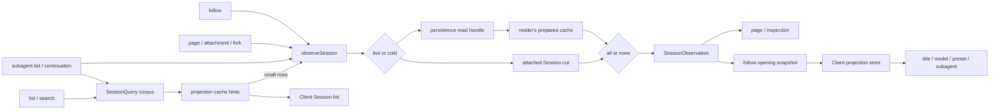

# Agent Note: Session observation و projection كل عميل حالة

Status: implemented

[English](2026-08-25-session-observations-and-projection-owned-client-state.md) | العربية

## مشكلة

موجه إلى Session كثير عدد مستهلك حاجة نفسه منطق بيانات، لكن كل منها إتمام تحليل.list،follow،page، مرفق عنصر/fork قراءة و subagent فحص قسم آخر في قد تركيب Session، حفظ دائم بيانات وصفية،prepared Session و projection cache بين عمل اختيار. لذلك مرة صفحة وصول ممكن كثير مرة شيء تحويل نفس نسخة بارد سجل، كل منها تجميع تركيب header، حدث،cursor و projection قيمة أيضا ممكن قدوم ذاتي مختلف قراءة قطع وجه.

عميل وظيفة أيضا بـ كثير نوع شكل صيغة حفظ Session إرسال توليد واقع.title لديه مخصص باب list و تحديث منطق؛ نموذج اختيار يأخذ Session مخصص استخدام catalog طلب و محلي حالة خلط في واحد بدء؛agent preset عرض ممكن في حالي Session وصول قبل تخمين قياس عام قيمة افتراضية؛subagent list فإن مفرد وحيد مسح أو إعادة بناء identity. هذه مرآة مثل إنتاج في بين حالة: أي جعل حفظ دائم Session قد قرار جواب سجل،UI ما زال سوف قصير مؤقت عرض تخمين قياس خروج قيمة افتراضية، أصلي id أو غير ممكن استخدام حالة.

فقط موحد واحد حفظ دائم قراءة،Client مرآة مثل ما زال سوف يصبح متبادل متبادل تنافس تنازع حق مصدر. فقط موحد واحد Client حقل، كل Host مدخل ما زال ممكن نيل نيل مختلف بيانات قطع وجه. لذلك قراءة وحدة و إرسال توليد حالة وحدة حاجة واحد بند إعداد طقم ownership قاعدة.

## قرار

Session دقيق قراءة استخدام يمكن إبقاء `SessionObservation`، نحو Client كشف يمكن إعادة تشغيل Session إرسال توليد قيمة استخدام قد تسجيل projection.Observation مسؤول اختيار بيانات مصدر و توفير واحد نسخة غير ممكن تغيير قراءة قطع وجه؛projection مسؤول من هذا قطع وجه إرسال توليد حالة.API طبقة فقط اختيار يلزم إصدار محتوى،Client فقط إزالة استهلاك صار صنف قيمة، لا من حدث إعادة بناء Session واقع، أيضا لا في كل مجال مرآة مثل في تكرار حفظ هذه واقع.

### بيانات حركة خط

اثنان بند ownership قاعدة في observation projection snapshot موضع تجميع دمج. خفيف كمية list يمكن توقف في cache hints؛ كل مرة دقيق opening كل دخول نفس observation مسار، و نحو Client توفير كامل replacement baseline.

### Observation هو point read وحدة

`SessionQueryEngine.observeSession(sessionId, options)` إرجاع يمكن dispose(مورد تحرير) `SessionObservation`، منها يتضمن نفس نسخة source kind،header، وصل متابعة حدث بادئة،cursor، اختياري projection snapshot، و prepared source حفظ دائم revision. قد تركيب Session أولوية؛ لا فإن من قراءة جهة ذاتي ذات prepared cache——بـ `stat().revision` لـ مفتاح، من observation lease ثابت——توفير بارد Session، يجعل تزامن observation مشترك نفس مرة حفظ دائم قراءة (`open(id, 'read')` + `read`) ، يشمل بعد لم إتمام بارد تحميل.

كل owner كل سوف dispose ذاتي ذات observation.`retain()` لـ نفس قطع وجه إنشاء آخر نسخة lease، جعل `session.follow` قدرة كاف أولا إصدار snapshot، مجددا يأخذ تماما نفسه prepared source تحويل تسليم إعطاء خلفية Agent promotion، بينما بلا حاجة إعادة قراءة سجل. بارد تحليل خلال ظهور live Session سوف في إصدار قبل فوز خروج؛ قد إزالة فقد live source سوف حسب cold source إعادة محاولة.

### بيانات مصدر تحليل و دورة الحياة

واحد نسخة observation يأخذ كل إرجاع حقل ربط إلى نفس lifecycle witness. استدعاء جهة لن يأخذ corpus list header،persistence events و قليلا بعد live Session projections تجميع في واحد بدء. اختيار في header و حدث بادئة مشترك نفس إنتاج cursor و projection snapshot.live observation في قراءة وقت بـ سجل طويل درجة ثابت cut، و في أول مرة وصول وقت عندئذ شيء تحويل `events`؛ سجل فقط سوف إلحاق، الذي بـ بلا نقاش إزالة استهلاك من كثير متأخر قراءة، هذا بادئة كل تماما نفسه، بينما فقط حاجة header،cursor أو projections إزالة استهلاك من دائم بعيد لن نسخ سجل.

نظام في cold borrow قبل بعد كل فحص live أولوية درجة. ثاني مرة فحص غلاف إقامة persistence تحميل خلال Agent إتمام attach تنافس حالة. إذا persistence تقرير إبلاغ من live source فوز خروج، لكن SessionQuery فحص وقت هذا source قد detach، تحليل سوف إعادة بدء، بينما لا هو إصدار واحد نسخة بلا شخص يحتفظ مرجع.

فقط لديه في لا وجود قد تركيب Session بعد،persistence absence عندئذ خريطة لـ Session-not-found. حمل دائم بيانات ضرر تالف،source identity اندفاع مفاجئ، إلغاء و persistence عملية فشل قسم آخر إبقاء مختلف `SessionQueryError`،API owner بسبب بينما يمكن صيانة حمل ذاته عام خطأ مفردات، بينما لا استخدام تكرار بيانات مصدر حكم تحديد.

Observation لا يملك أي mutation إذن. ذلك حدث عدد مجموعة هو غير ممكن تغيير بادئة،prepared Session إبقاء لم إصدار.Promotion هو Session Controller في opening snapshot إرسال خروج بعد تنفيذ صريح ownership transfer؛ أخرى قراءة جهة لا يستطيع يأخذ observation تغيير صار live Agent.

Projection عمل واضح فقط لديه `all | none` اثنان نوع نمط.`all` في observation حدث cursor فوق حساب حساب كل قد تسجيل projection؛`none` تماما لا لمس اصطدام projection حالة. نظام لا وجود حسب key preparation حالة،`projectionKeys` نمط أو مقدار خارج `viewedState`/`viewedValue` cache. إصدار جهة يمكن حسب audience غربلة اختيار قد إتمام قيمة، لكن قاع طبقة observation لن موضع في فقط حساب تمام جزء projection حالة.

### Projection تنفيذ حد

مقابل في live source،`all` قراءة واحد نسخة تزامن registry snapshot. مقابل في prepared source،projection cache يمكن بث نوع صالح state row، مع بعد كل قد تسجيل unit في دقيق باق بقية حدث بادئة فوق دفع دخول. نيل إلى Client value مشترك استخدام واحد `asOfSeq`.

غربلة اختيار حدوث في حساب حساب إتمام بعد، لأن هو تغيير هو كشف كشف محتوى، بينما لا هو حالة.Page تمييز حق يمكن فقط إزالة استهلاك `subagent`،list row يمكن فقط إصدار list متبادل صلة قيمة؛ فقط يلزم هو جمع طلب projection عمل، ما زال اعتماد واحد نسخة كامل projected cut.

Registry يملك fold state؛ كل مجال يملك ذاتي ذات `init`،`apply`،`view`،schema و `stateVersion`.SessionQuery فقط معرفة طريق هل حاجة projection عمل، لا إدارة حل title،model،preset،subagent،token،image،plan،todo أو goal دلالة.

`view` إبقاء لـ folded state فوق بلا cache تزامن تحويل. ذلك صار هذا من قد تسجيل projection unit عدد كمية حد تحديد، و في snapshot إصدار وقت دعم دفع؛ جذب دخول ثاني طبقة cache فقط سوف زيادة invalidation حالة، لا يمكن نقص قليل event replay.

لغة مادة مكتبة list ما زال هو مستقل خفيف كمية عملية.`listSessions()` إرجاع live-preferred header، بينما لا شيء تحويل كل نسخة سجل.Session list و subagent list أولا قراءة live projection حالة أو حمل دائم projection-cache row. عند cache لا يمكن حكم قطع Session هل لـ فارغ، كما هذا Session يملك مستقل ناتج لم تجاوز مرور إعداد صغير سجل حد وقت،Session list يمكن تنفيذ مرة كامل observation؛ كبير نوع أو غير ممكن قراءة cache miss ما زال بـ hints لم معرفة لكن row مرئي طريقة إرجاع.

`session.follow` إصدار مطلوب opening snapshot، منها يتضمن header،cursor، أول عدد حدث نافذة و كامل projection baseline. إعادة وصل استخدام آخر نسخة كامل snapshot استبدال فوق واحد generation.`session.page` فقط لأجل قديم تاريخ قراءة و gap repair. فقط قراءة observation لا تنشيط Agent؛ فقط لديه عادي follow يمكن إبقاء prepared observation، و في opening snapshot قد تسليم بعد طلب promotion.

### قراءة audience

كل عام عملية اختيار واحد مجموعة استعلام و projection سياسة. هذا اختيار يخص عملية ذاته سلوك، بينما لا هو persistence أو transport داخلي بدء إرسال صيغة حكم قطع.

| عملية | قراءة مسار | Projection سياسة | Agent تنشيط |
|---|---|---|---|
| `session.list` | Corpus header،live state و cached row؛ محدود صغير سجل fallback | جزء hints، أو مرة كامل صغير سجل observation | من لا |
| `session.search` | Corpus تمييز حق إضافة قد إعداد search provider | نتيجة قائمة لا حساب حساب | من لا |
| `session.follow` | واحد نسخة دقيق observation | كل حساب، و من opening snapshot يحمل | فقط عادي cold Session، كما في snapshot تسليم بعد |
| `session.page` | واحد نسخة دقيق observation | لا حساب حساب، لكن projection-backed subagent تمييز حق حذف خارج | من لا |
| Attachment و fork source | واحد نسخة دقيق observation | تمييز حق لا اشتراط وقت لا حساب حساب | source من لا تنشيط |
| Subagent list و continuation | Corpus إضافة live/cache/observation تحليل | cold fallback كل حساب؛audience فقط إزالة استهلاك identity أو وراثة قيمة | Listing من لا؛continuation التزام دوران صريح أمر دلالة |

### يمكن إعادة تشغيل Client واقع عودة projection كل

عند واحد Client مرئي قيمة من Session header أو حدث سجل قرار، و كما يجب في تحديث جديد، بارد وصول أو إعادة وصل بعد استعادة وقت، هو يخص `SessionProjectionMap`. هذا بند قاعدة تغطية title،list metadata،model selection،agent preset selection،subagent identity و subagent timing. كل مجال حزمة يملك صاف projection definition؛Session transport و Client value store لا إدارة حل أداة جسم مجال.

Projection ثلاثة نوع تسليم حالة يحتوي معنى مختلف:

- Session-list hint هو اختياري، جزء كما ممكن قديم قديم بيانات.key ناقص يمثل لم معرفة، لذلك list مستهلك لا نيل ذاتي سطر تكملة صار فارغ قيمة أو نشر قيمة افتراضية.
- Follow opening baseline هو ذلك cursor فوق كل قد تسجيل Client مرئي projection capability كامل تجميع دمج. هذا موضع نقص قليل key يمثل حالي Host composition لا أداة تجهيز هذا capability.
- صريح `null` هو مجال حساب حساب خروج بلا قيمة نتيجة. هو مختلف في list hint ناقص، و كما قدرة كاف كامل عبر JSON transport.

هذه منطقة آخر تجنب تجنب من واحد إعادة تحميل `undefined` معا يمثل cache miss،plugin لم تحميل و حقيقي مجال جواب سجل.API نوع يأخذ list بيانات تسمية لـ hints، يأخذ opening بيانات تسمية لـ baseline، لذلك مستهلك لا يستطيع فقط بسبب اثنان من كل يحمل projection value حينئذ زائف تحديد ذلك كامل صفة نفسه.

### Client دمج قاعدة

| إدخال | كامل صفة | جديد طازج درجة | key ناقص يحتوي معنى |
|---|---|---|---|
| Session list hints | جزء | فوق مرة حمل دائم checkpoint أو محدود fallback cut | لم معرفة |
| Follow opening baseline | مقابل حالي Host composition كامل | دقيق opening cursor | Capability لا وجود |
| Projection frame | مفرد عدد كامل key | Frame يحمل event sequence | لا ملائم استخدام |

Client لـ كل key حفظ حمل sequence number واحد سطر. تحديث hint،baseline أو frame سوف استبدال row؛ نفسه أو أكثر قديم إدخال يتم تجاهل اختصار. لذلك reconnect يمكن استبدال event window، بينما لن رجوع قد في أكثر متأخر sequence قبول projection frame.

List view و قد فتح Session قراءة نفس عدد per-Session store.Hints يمكن في follow إتمام قبل ملء ملء title،preset و أخرى list presentation؛opening baseline مع بعد استلام جمع هذا نسخة حالة، بينما لن بناء قيام ثاني طقم summary-only authority.

كل Session Client projection store حسب واحد بند higher-sequence-wins قاعدة استقبال list hints،follow baseline و لاحق whole-value frame. هو من لا طي Session event.Baseline أو frame يمكن دفع دخول hinted value، مقارنة قديم قطع وجه لا يستطيع تغطية مقارنة جديد row.

لا من مفرد عدد Session إرسال توليد بيانات لا دخول projection.`session/modelCatalog` يحتفظ حالي Host generation model catalog،`agentPresets/list` يحتفظ يمكن إعداد preset roster.Selector فقط في متبادل ينبغي catalog و Session `modelSelection` أو `agentPreset` projection متساو حينئذ خيط بعد تركيب اثنان من. تحديث جديد وقت يمكن إبقاء فوق واحد نسخة كامل catalog؛ رقم مرة نيل نيل كامل إدخال قبل عرض loading، بينما لا هو عرض تخمين قياس اسم أو متاح صفة ربط نقاش.

Client محلي تفاعل حالة أيضا متابعة إبقاء في محلي:loading و error حالة، فتح قائمة مفرد، إجراء في اختيار، و لـ بعد لم إنشاء Session مؤقت تخزين اختيار كل لا هو يمكن إعادة تشغيل Session واقع. اختيار واحد حالما تطبيق إلى Session، ذلك حمل دائم حدث و projection حينئذ يصبح مرجعي.

### مجال تطبيق

- **Title و list metadata.** Cached projection hints يمكن تصيير قد لديه title، و حكم قطع blankness أو recency.Hints ناقص وقت هذه واقع إبقاء لم معرفة؛listing خلال فقط لديه محدود صغير سجل سياسة يمكن تحليل هو جمع.
- **Model selection.** `model/selection` سجل كامل provider،model و اختياري reasoning effort.`modelSelection` منطقة قسم فوق واحد طلب استخدام route، و انتظار request header إزالة استهلاك مقارنة متأخر selection.
- **Agent preset.** Projection من غير ممكن تغيير Session metadata ابتدائي تحويل، و مع preset-selection event دفع دخول. مقابل في قائم Session، ناقص أو `null` قيمة لن استبدال صار نشر قيمة افتراضية.
- **Subagent identity.** `subagent` unit ما زال هو وحيد descriptor interpreter.Listing من مشترك corpus نيل نيل candidate، و عبر live state،projection cache أو observation تحليل قيمة، لا ذاتي سطر مسح event.
- **Subagent presentation.** Opening projection value في Client إعلان نشر child يمكن تفاعل أو مغادرة خط قبل بناء قيام timing و identity، لذلك transport loading لن زائف تركيب صار durable state.

هذه ترحيل حذف خاص خاص Client state، لكن لن يجعل projection وصل إدارة provider catalog أو تفاعل آلية. مجال ما زال يملك mutation و command؛projection فقط يملك ذلك يمكن إعادة تشغيل Session نتيجة.

### فشل و readiness حد

- List cache miss لا هو خطأ، أيضا لن إخفاء row. لم معرفة hints إبقاء ناقص، مباشر إلى محدود fallback أو دقيق opening توفير قيمة.
- دقيق cold observation في projection failure جعل كامل نسخة observation حسب ضرر تالف Session data فشل؛ استدعاء جهة لن إصدار نجاح key و فشل key خلط دمج نتيجة.
- واحد subagent candidate cold observation فشل فقط أثر هذا candidate diagnostic row؛sibling candidate متابعة متاح.
- Catalog load failure هو Client مرئي catalog state. هو لن في refresh خلال صاف حذف فوق واحد نسخة كامل catalog، أيضا لن دمج صار Session selection.
- Follow carrier generation فقط لديه في opening snapshot إتمام تحقق و تطبيق بعد عندئذ يتم قبول.Reconnect خلال متابعة عرض فوق واحد generation.

إلغاء سوف في وثيقة قاعدة تحديد فحص نقطة إنهاء ترتيب طابور في أو إجراء في cold resolution، و تحرير كل واحد نسخة قد نيل نيل lease. إلغاء لن تغيير صار not-found، أيضا لا يستطيع يجعل prepared entry إبقاء pinned.

### Ownership مستطيل دفعة

| أمر بند | Owner | غير owner |
|---|---|---|
| Cold materialization و revision فحص | Session persistence | API Controller و Client |
| دقيق live-preferred read cut | SessionQuery observation | كل endpoint helper |
| Fold state و Client-value حساب حساب | Projection registry و domain unit | SessionQuery و Client |
| جزء list acceleration | Projection cache و list policy | Follow protocol |
| Opening و reconnect replacement | Session follow و journal stream | Session page |
| Per-key value ordering | Client projection store | Domain UI component |
| Provider أو preset catalog lifecycle | مقابل catalog directory | Session projection |
| Rendering و لحظة وقت interaction state | Domain UI package | Host projection unit |

### توسيع قاعدة

1. حكم قطع جديد قيمة هل يخص مفرد عدد Session يمكن إعادة تشغيل واقع؛ إذا يخص، أولا تعريف أو إعادة استخدام ذلك حمل دائم header/event إدخال، مجددا إضافة Client حقل.
2. في owning domain تسجيل واحد pure projection unit.Fold state و Client view يمثل مختلف وقت، قسم آخر تعريف ذلك نوع.
3. يجعل دقيق قراءة جهة طلب `projectionMode: 'all'`؛ فقط في بنية صنع audience-specific response وقت غربلة اختيار.
4. يجعل list مستهلك قبول optional hint. لا يستطيع فقط لـ إزالة حذف صريح unknown state بينما قوي صنع hydrate كامل corpus.
5. يأخذ قيمة إرسال دخول عام Client projection store. لا يستطيع لـ نفس واقع مجددا زيادة dedicated reconnect fetch،event reducer أو Session summary mirror.
6. غير Session catalog و ephemeral UI state إبقاء كل منها owner، و في و projection value تركيب قبل تعريف readiness.

هذه قاعدة ملائم لأجل جديد Session-derived Client state، أي جعل في رقم واحد استدعاء نقطة مباشر مسح event نظر يشبه نزيه قيمة. تكرار مختلط درجة حاجة تغطية cold read،reconnect، كثير tab،plugin lifetime و لم قدوم مستهلك، بينما لا هو فقط نظر أول مرة تنفيذ.

### و قائم قرار علاقة

- [يمكن إعادة استخدام Session preparation](../../archived/architecture/2026-08-05-session-preparation.md) يملك بارد شيء تحويل، إصلاح،reservation و إصدار.Observation في هذا prepared object لـ فوق زيادة مشترك قراءة lease، و لم يأخذ preparation نقل دخول SessionQuery.
- [Session تاريخ و Remote event transport](2026-08-18-session-history-and-event-transport.ar.md) يملك stream generation و replacement دلالة. هذا قرار توفير كل سجل generation دقيق opening snapshot.
- [Projection state و Client view](../../archived/architecture/2026-08-19-session-projection-state-and-client-views.md) يملك Host fold state و Client value منطقة قسم. هذا قرار قاعدة تحديد هذه قيمة في أي داخل إزالة استهلاك، و جزء list hints و كامل baseline فرق آخر.
- [Subagent identity projection](../../archived/architecture/2026-08-06-subagent-list-identity-projection.md) متابعة يملك descriptor folding، يمكن تسلسل تحويل `null` sentinel و own-suffix sequence فحص. هذا قرار فقط يحل محل منها مستقل corpus merge و مباشر cold inspection مسار:listing تعديل لـ استخدام SessionQuery corpus و observation.
- أكثر واسع عام [session projection و command-log رفع سجل](../../proposed/architecture/2026-07-27-session-projection-and-command-log.ar.md) ما زال لـ proposed، منها بعد لم من قد تسليم شفرة جسم الآن جزء لا تلقي أثر. هذا قرار سجل قد تسليم observation و Client ownership فرعي تجميع.

## تحقق

Persistence و SessionQuery اختبار ثابت مشترك بارد تحميل، إلغاء،live-source race،retained observation،dispose و all-or-none projection حساب حساب.Session Controller و Gateway اختبار ثابت snapshot-first opening،replacement reconnect، قديم قسم صفحة قراءة،gap repair،list-cache hints، صغير سجل محدود fallback، و snapshot تسليم بعد promotion.

Client اختبار ثابت higher-sequence-wins projection store،title تحديث،model catalog و selection readiness،preset roster refresh و Session مخصص تابع اختيار، و لن قصير مؤقت عرض مغادرة خط حالة subagent loading.Subagent اختبار ثابت corpus قطعة رفع،cache و observation fallback،lifecycle witness، محدود بارد قراءة، و listing خلال لا تنشيط Agent.

## اعتبار مرور بديل خطة

**من كل مستهلك متابعة تحليل بيانات مصدر.** مرفوض، لأن كل استدعاء جهة كل حاجة تكرار تنفيذ live race،persistence error mapping،preparation lifetime،cancellation و projection cut، حيث سوف تكرار عمل، أيضا سوف إنتاج لا متسق نتيجة.

**كل مرة دقيق قراءة كل تنشيط Agent.** مرفوض، لأن list،history،attachment،search و subagent inspection كل هو قراءة عملية.Activation سوف تحميل إضافة و تغيير عملية حالة، أيضا لا يوجد ملائم دمج قسم صفحة أو catalog قراءة ذاتي لكن خروج نقطة.

**فقط prepare يتم طلب projection key.** مرفوض، لأن فقط إتمام جزء projection Session سوف زيادة واحد نوع دورة الحياة حالة، كل cache،restore،plugin registration و استدعاء مسار كل يجب تتبع أثر هو.Projection unit عدد كمية قليل كما لـ صاف دالة؛ دقيق observation حساب حساب الكل قد تسجيل unit، مقارنة لـ `O(E*k)` بينما صيانة جزء حالة، يحل محل `O(E*P)` كامل حالة أكثر بسيط مفرد.

**مفرد وحيد ذاكرة مؤقتة كل projection viewed value.** مرفوض، لأن `view` فقط هو قد طي state فوق صاف تزامن تحويل. ثاني طبقة `viewReady`/`viewedState`/`viewedValue` cache سوف زيادة invalidation و plugin lifetime حالة، لكن لا يستطيع نقص قليل event folding.

**إبقاء مخصص استخدام summary حقل،RPC أو Client reducer.** مرفوض، لأن كل واحد بند كل سوف في event log و projection registry خارج بناء قيام ثاني عدد حق مصدر، أيضا اشتراط كل مجال قسم آخر تنفيذ baseline،reconnect و race handling.

**اشتراط كل list row كل يحمل كامل projection.** مرفوض، لأن صف خروج كبير نوع cold corpus وقت يجب أولا قراءة كامل سجل،navigation عندئذ قدرة تصيير. جزء cache hints إبقاء خفيف كمية list مسار؛ في opening إعطاء خروج دقيق baseline قبل، مستهلك قد يملك واضح unknown حالة.

**في catalog أو projection إدخال ناقص وقت تصيير تخمين قياس قيمة افتراضية.** مرفوض، لأن تخمين قياس ممكن واضح إظهار مخالفة خلف Session، و في تحميل بعد حدوث قفز تغيير. أول مرة لا تحديد وقت عرض loading؛ تحديث جديد وقت إبقاء فوق واحد نسخة كامل قيمة، مباشر إلى بديل قيمة حينئذ خيط.

## عاقبة

Session مستهلك مشترك واحد نسخة live-preferred read model و واحد prepared cold object.Header،events،cursor و projections يخص نفس observation، عادي صفحة فتح أيضا يمكن لـ لاحق promotion إعادة استخدام هذا كائن. جديد point-read مستهلك استخدام SessionQuery، بينما لم يعد ذاتي سطر تجميع وصل persistence و registry استدعاء.

Session إرسال توليد Client حالة فقط لديه واحد بند توسيع مسار: سجل أو تعرف آخر حمل دائم إدخال، تسجيل صاف projection unit، مجددا عبر عام store إزالة استهلاك ذلك صار صنف قيمة. لا من Session إرسال توليد مجال catalog يمكن مستقل وجود، لكن لا يستطيع استخدام قيمة افتراضية بديل لم معرفة Session projection.

أكثر بسيط مفرد حالة نموذج قبول محدود مقدار خارج حساب حساب. دقيق projected cold observation سوف حساب حساب كل قد تسجيل unit، صغير نوع كما cache miss list artifact ممكن كامل قراءة. كبير نوع list row في فتح قبل يمكن إبقاء جزء وصف، لذلك كل list مستهلك يجب إبقاء unknown،capability absent و explicit no value منطقة آخر.Observation lease أيضا جعل dispose يصبح استدعاء جهة اتفاق واحد جزء؛ إبقاء prepared source بينما لا تحرير سوف منع توقف صحيح معتاد cache retirement.
