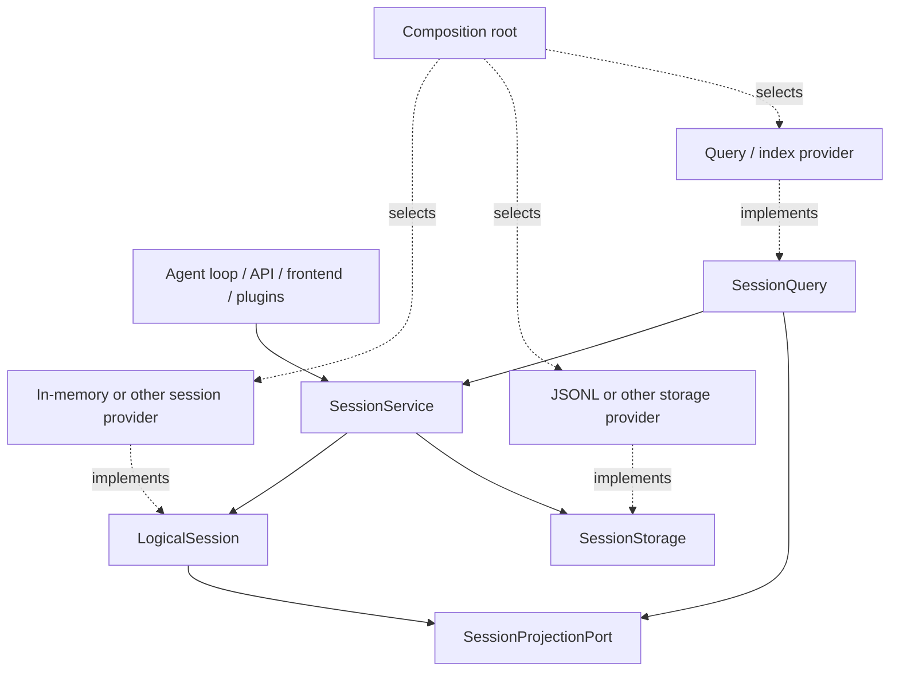

# Agent Note: Session قدرة بروتوكول

Status: proposed

[English](2026-09-10-session-capability-protocols.md) | العربية

## Problem

إبقاء قديم `Session` توافق اسم و لا انتظار في تنفيذ قد يمكن استبدال. إذا storage،query،projection أو قبل طرف متابعة زائف ضبط هذا عدد أداة جسم داخل تخزين صنف،JSONL مسار أو أداة جسم بحث جذب schema، شيء إدارة تنفيذ ما زال سوف اختراق نفاذ كامل نظام.

## Proposal

يأخذ جلسة نظام نظر صار واحد صغير منطق نواة قلب و إذا جاف صحيح تسليم قدرة. عادي عمل خدمة فقط إقرار تعرف `LogicalSession` + `SessionService`؛provider عمل من قسم آخر تنفيذ شيء إدارة بروتوكول. التالي توقيع هو هدف، لا بديل جدول مرحلة مقطع 3 قد الكل تنفيذ.

### ترحيل مدة تطوير اتفاق

- قائم خارجي تجميع صار يمكن مؤقت وقت إبقاء قد ترك استخدام `Session`،`Session.create` و `Session.fromRestore` توافق API.
- مستودع إنتاج شفرة و كل جديد تجميع صار كل سوف جلسة علامة ملاحظة لـ `LogicalSession`، و من `SessionService`(`ctx.sessions`) أخذ نيل live session. لا يستطيع لأن توافق مدخل ما زال في، حينئذ إضافة جديدة `Session` استيراد.
- فقط لديه تأكيد فعلي حاجة detached بنية صنع، تحقق،provider adapter أو تجمع تركيز اختبار وقت، عندئذ استخدام `createLogicalSession` / `restoreLogicalSession`؛ عمل خدمة وظيفة لا يستطيع استعارة detached factory التفاف مرور service lifecycle.
- حدث،header،surface projection،id و derived messages من `LogicalSession` عضو قراءة؛cold، بحث جذب، مرور ترشيح، بحث، قائمة أو موحد حساب قراءة مشي `SessionQuery`، لا نيل مباشر قراءة provider ملف أو بحث جذب.
- Projection من مواصفة حدث إرسال توليد يمكن إعادة بناء read model؛ هو حيث لا بديل منطق جلسة، أيضا لا يستطيع يصبح durable recovery authority.
- فقط لديه composition و provider package يمكن معرفة طريق أداة جسم جلسة،storage،query أو projection تنفيذ. مستودع production source قد استخدام dependency gate تنفيذ منها صلة في أداة جسم `Session` قاعدة.

### `LogicalSession`

واحد منطق جلسة هو واحد لديه هوية حدث جلسة، مستقل في ذلك حدث تخزين وضع موضع و هل إصدار. هو يملك header،fork حد،seq،surface،append و لقطة دلالة؛ استدعاء جهة لا نيل معرفة طريق حدث فعلي إقامة إبقاء في عدد مجموعة، مشترك داخل تخزين، قاعدة بيانات أيضا هو بعيد طرف. تنفيذ يجب إبقاء غير ممكن تغيير لقطة، وصل متابعة seq، كائن هوية، حدث تحقق و واضح إغلاق دلالة.

### `SessionService`

```ts ignore-check
abstract class SessionService extends Service {
  abstract create(options?: CreateSessionOptions): Promise<LogicalSession>
  abstract open(id: SessionId, options: SessionOpenOptions): Promise<LogicalSession>
  abstract enter(session: LogicalSession): () => void
  abstract announce(session: LogicalSession): void
  abstract get(id: SessionId): LogicalSession | undefined
  abstract list(): readonly LogicalSession[]
  abstract fork(source: LogicalSession | SessionId, boundary?: SessionSeq, childId?: SessionId): Promise<LogicalSession>
  abstract flush(session: LogicalSession): Promise<boolean>
  abstract registerProjectionPort(port: SessionProjectionPort): () => void
}
```

خدمة هو live session وحيد نيل أخذ نقطة و live identity authority.`create`،`open` و `fork` في إصدار قبل إتمام ممكن فشل دقيق تجهيز؛`enter` إرجاع تزامن disposer؛`announce` فقط إصدار قد تسجيل تسجيل جلسة؛`flush` تجميع مجموع يملك مشاركة و من؛ إسقاط طرف فتحة تسجيل يمكن إزالة كما مقابل لم إصدار جلسة نفس مثال صالح.

### `SessionStorage`

شيء إدارة حفظ دائم بروتوكول فقط مسؤول create/open reader،open writer،stat/list، و reader/writer read،append،flush،close.provider يملك durable revision، صيغة generation، ترحيل، إيجار نحو، ضغط و مسار.JSONL هو واحد تنفيذ؛ عادي شفرة لا يستطيع يأخذ storage handle عند عمل session، أيضا لا يستطيع عبر lifecycle event تجميع تركيب حفظ دائم.

### `SessionProjectionPort`

Projection إزالة استهلاك جلسة مواصفة حدث و header، إنتاج title،summary، موحد حساب، قائمة بيانات وصفية، بحث وثيقة أو أخرى قراءة نموذج. هو لا هو ثاني نسخة Session، أيضا لا يملك كتابة؛ كل إسقاط كل يمكن من durable log إعادة بناء. خدمة تسجيل projection port، جعل live session و cold reader استخدام نفس دلالة، و يجعل flush/close انتظار قد وصل قبول عمل.

### `SessionQuery`

مستودع قد قاعدة تخطيط و تنفيذ live-preferred retrieval `SessionQuery`. هذا رفع سجل يجعل هو متابعة بصفة موحد واحد قراءة سحب كائن، تغطية دقيق حدث قراءة، مرور ترشيح،trace، كل نص فحص بحث، قائمة بيانات وصفية و موحد حساب قراءة؛ لم يعد إضافة جديدة `SessionSearch` أو `SessionStats`. أداة جسم بحث جذب و موحد حساب تجمع دمج هو projection/provider، يمكن استبدال و يمكن إعادة بناء.Query عبر `SessionService`، منطق جلسة و مواصفة storage reader أخذ نيل منطق بيانات، لا استيراد داخل تخزين تنفيذ أو JSONL.

### كامل جسم هيكل بنية



### اعتماد قيد

قبل طرف،header،loading،persistence،migration،search،statistics و telemetry يمكن اعتماد منطق نواة قلب أو ذاتي ذات قدرة واجهة. فقط لديه تركيب أصل يمكن معا نظر رؤية سحب كائن و أداة جسم provider. كل provider حزمة ذاته إغلاق دمج، و عبر مشترك دمج نحو طقم عنصر؛ منع توقف عكس نحو استيراد و provider-name فرع.

## Alternatives considered

**يجعل كل وظيفة مباشر قراءة storage.** رفض، لأن durable rows لا هو منطق session، كما سوف يأخذ ترحيل و provider schema تغيير صار عمل خدمة اتفاق.

**لـ search و stats كل بناء واحد خدمة.** رفض؛ قائم `SessionQuery` قد يملك موحد واحد قراءة دلالة، مقدار خارج خدمة فقط سوف قسم شق مدخل.

## Acceptance criteria

- ثاني عدد session/service أو storage provider قدرة في لا تعديل عادي مستهلك حال حال تحت عبر نفس دمج نحو اختبار.
- استعلام بحث جذب و موحد حساب إسقاط قدرة إعادة بناء أو استبدال، بينما لا تغيير Session durable source of truth.
- اعتماد باب فقط سماح تركيب أصل و provider اختبار استيراد أداة جسم تنفيذ.

## Risks

`SessionService` إصدار، تخزين و إسقاط وقت ترتيب بعد لم في مرحلة مقطع 3 بلوغ إلى هدف توقيع. تنفيذ يجب إبقاء في لاحق مرحلة مقطع، لا يستطيع استخدام وثيقة يأخذ لم تسليم سلوك زائف تركيب صار current. بعيد مسار جلسة تنفيذ أيضا سوف كشف تزامن `append` و دورة الحياة هل يمكن استبدال حقيقي حد، دورة وقت ينبغي أصل حسب دمج نحو دليل إصلاح حجز بروتوكول.
