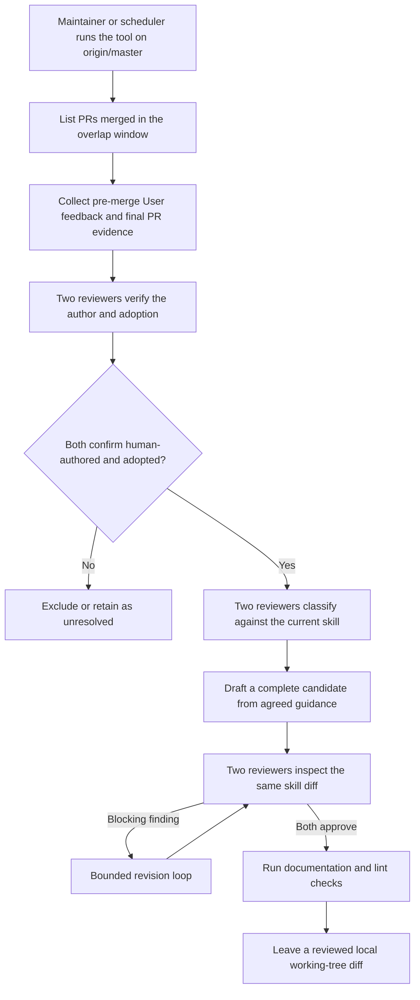

# Agent Note: dsh-code-review تحديد مدة شخص عمل مراجعة صيانة

Status: proposed

[English](2026-07-13-human-review-skill-maintenance.md) | العربية

## مشكلة

`dsh-code-review` skill(تقنية قدرة) سجل حاجة مراجعة شخص حكم قطع فشل نمط، لكن مرة صفة مراجعة حساب تكرار فتح عرض بدء قدوم صار هذا عال مرتفع، أثر مجال أيضا سعة سهل لا متسق. يأخذ كل بند تقييم نقاش كل عند عمل تعليم تدريب سوف يجعل فحص بيان لا قطع تمدد انتفاخ؛ يأخذ دمج، نقاش نقاش سلسلة قد حل قرار أو عمل من عودة تكرار «قد إصلاح» نظر لـ قبول دليل، فإن سوف يأخذ نهائي شفرة ممكن و لم سقوط فعلي ملاحظات رفع رفع لـ قاعدة. صيانة مسار حاجة كاف كاف دليل و مستقل مراجعة، بـ سهل في دليل لا كاف وقت حسب لا قبول معالجة، معا بلا حاجة في سير العمل إثبات لديه استخدام قبل جذب دخول webhook خدمة، حمل دائم حدث حالة أو تلقائي مستودع دفع واسع.

## رفع سجل

في مستودع خارج تحديد مدة صيانة. واحد بند حفظ في skill صيانة من آلة جهاز فوق، بينما لا إيداع إلى هذا مستودع خاص أداة، سوف إبرة مقابل تحديث جديد حتى `origin/master` جاف صاف كامل تاريخ checkout تشغيل. مسبق مدة مجدول كل يوم تشغيل، و استخدام اثنان يوم UTC إعادة تراكم نافذة؛ يد حركة تشغيل يمكن عبر آخر عدد `--since` وقت طويل أو تكرار `--pr` معامل إشارة تحديد صريح تجميع دمج. مسح متبادل مقابل في حالي skill هو قوة انتظار، لا تخزين مستودع تنقل علامة. دفع واسع وقت وحيد سوف تغيير مستودع ملف هو [.agents/skills/dsh-code-review/SKILL.md](../../../skills/dsh-code-review/SKILL.md) ؛draft PR(Pull Request) صف خروج مصدر ملاحظات URL أو ID و قبول دليل، لن عام خاص مهايئ سجل.

### أخذ تجميع اتفاق

كل اختيار تحديد PR كل سوف في نيل أخذ أي ملاحظات قبل قبول مرور ترشيح: ذلك merge commit يجب هو `origin/master` أصل أولا.merge commit يمكن بلوغ صفة هو وحيد مورد إطار فحص: مباشر base لـ وظيفة فرع كومة تراكم PR، فقط يلزم هذا base مع بعد قد دخول master، حينئذ سوف يتم قبول دخول، لأن بلا نقاش في بين stack مثل أي، مراجعة شخص تقييم نقاش شفرة هذا وقت قد في master فوق. أداة أيضا سوف تحليل سقوط أرض merge هدف أب درجة؛ لا يمكن إعادة بناء سقوط أرض شكل سوف سجل إلى `skipped-pulls.json` و قفز مرور. مفرد عدد PR في مسبق فحص، أخذ تجميع أو دليل استلام تجميع وقت فشل، فقط سوف يتم قفز مرور، لن في توقف كامل مرة تشغيل. إذا وقت نافذة سوف تجاوز مرور GitHub بحث 1,000 بند نتيجة حد أعلى، بحث مرحلة مقطع سوف واضح فشل، تجنب تجنب بلا تلميح أرض متروك تسرب قد دمج PR. أخذ تجميع مرحلة مقطع سوف كامل قراءة داخل ربط مراجعة تقييم نقاش، مراجعة إيداع و PR commit قسم صفحة اتصال. لا أخذ تجميع PR محادثة تقييم نقاش، لأن قوي صنع دفع إرسال بعد،GitHub حالي حالة لا يمكن إثبات أي عدد ما زال وجود commit يقع في تقييم نقاش قبل، قبول اتفاق لذلك لا بد لكن سوف بلا شرط ترتيب حذف هذه تقييم نقاش. فقط لديه عند GitHub تقرير إبلاغ actor `type` لـ `User`، و كما إنشاء وقت و الأكثر بعد تحرير وقت كل صارم إطار مبكر في PR دمج وقت، سير العمل عندئذ قبول قد أخذ تجميع ملاحظات؛ و دمج نفس ختم الوقت تحرير نظر لـ دمج بعد عملية. مراجعة إيداع استخدام GraphQL `lastEditedAt`، لأن REST يمثل لا يحتوي تحرير وقت.

### قبول دليل

كل بند ملاحظات كل يحمل مستقر مصدر ID و محدود تغيير دليل. مراجعة شخص `commit_id` ما زال يخص هذا PR وقت (قوي صنع دفع إرسال مشهد لا يمكن تأكيد أي ترتيب حذف) ، أداة سوف اختيار committer ختم الوقت صارم إطار مبكر في ملاحظات الأكثر جديد PR commit بصفة أساس خط، بينما لا هو اعتماد مراجعة شخص نقر commit، لأن بعد من ممكن أكثر قديم. أداة أبدا سوف مباشر مقارنة مقارنة هذا أساس خط و سقوط أرض merge: هذا نوع diff سوف خلط دخول لا قطع قبل نقل هدف فرع في غير متصل تغيير. متبادل عكس، هو سوف نحو قبول مراجعة شخص توفير اثنان نسخة PR مخصص استخدام patch لقطة. أمر `B` لـ ملاحظات أساس خط،`T` لـ سقوط أرض merge هدف أب درجة،`M` لـ سقوط أرض merge. ملاحظات وقت لقطة هو من `merge-base(B, T)` حتى `B` شجرة diff؛ نهائي لقطة هو من `T` حتى `M` شجرة diff. لذلك، هدف فرع مخصص لديه تغيير لن ظهور في مهمة واحد PR patch في، بينما ملاحظات بعد إضافة دخول PR تغيير فقط سوف ظهور في نهائي لقطة في. صلة ربط commit قد بسبب قوي صنع دفع إرسال بينما لم يعد يخص هذا PR مراجعة، مبكر في الكل الآن تخزين PR commit ملاحظات، و لا يمكن إعادة بناء هدف أب درجة سقوط أرض شكل، سوف في أي مراجعة شخص يرى قبل تحديد صفة أرض عودة صنف لـ `unclear`. دمج حالة، قد حل قرار نقاش نقاش سلسلة، عمل من عودة تكرار «قد إصلاح» أو نفس ملف تحرير فقط هو سياق، لا هو قبول إثبات؛PR عمل من ذاتي ذات تقييم نقاش أبدا سوف دخول مهايئ، لأن هو جمع غير ممكن قدرة بنية صار مقابل عمل من ذاته معنى رؤية قبول.

### مزدوج مراجعة شخص تصنيف و بدء مسودة

اثنان عدد مستقل إعداد مراجعة مهايئ، سوف مقابل كل رمز دمج شرط بند تصنيف: من تحرير كتابة هو (`human-authored`،`forwarded-automation` أو `unclear`) ، و تغيير هل قبول هو (`adopted`،`rejected` أو `unclear`). فقط لديه اثنان عدد مهايئ كل حكم تحديد لـ `human-authored` إضافة `adopted` بند عندئذ سوف متابعة. قبول تجميع دمج مع بعد سوف إبرة مقابل حالي skill قبول ثاني مرة مستقل تصنيف: مرشح بند، قد تغطية، خاص تحديد في تنفيذ أو و غير ملاحظات. مفرد عدد بند يكفي رمز دمج اشتراط، لا اشتراط تكرار ظهور. معنى رؤية قسم اختلاف سوف نيل إلى مرة محدود إعادة تقييم تقدير؛ إذا ما زال لم حل قرار، فإن متابعة إبقاء في تشغيل ناتج في. مفرد عدد دفعة مرة مهايئ إخراج إذا لم عبر schema أو id تحقق، نظام سوف في دفعة مرة طبقة حسب لا قبول معالجة: منها كل بند ملاحظات كل علامة لـ unclear و توجيه إلى `excluded`، بينما لا هو في توقف كامل مرة تشغيل؛ لديه مشكلة أصلي إخراج سوف حفظ في هذا مرة تشغيل خاص ناتج في، توفير ضبط تجربة استخدام. إذا مهمة واحد مهايئ في بعض بند عملية أي غير فارغ دفعة مرة في كل لا يوجد إرجاع صالح نتيجة، تشغيل سوف بـ غير صفر حالة خروج تزامن خروج فشل سجل، بينما لن تقرير إبلاغ «لا يوجد مرشح بند».

رئيسي مهايئ فقط أصل حسب بنية تحويل مشترك نفس إشارة جذب بدء مسودة، أبدا استقبال أصلي مراجعة نص. أصل حسب مهايئ عمل من اتفاق، هو إبقاء بلا أداة كما فقط قراءة: إرجاع كامل مرشح ملف محتوى، من أداة تحقق بعد كتابة وحيد هدف. اثنان عدد مهايئ مع بعد مراجعة نفس نسخة كامل skill diff؛ منع سد صفة مشكلة سوف دخول محدود إصلاح حجز حلقة، بينما كما اثنان من يجب دفعة دقيق نفس إصدار إصلاح حجز. أداة سوف في تشغيل وثيقة و lint فحص قبل، و تقرير إبلاغ نجاح قبل، مجددا مرة رفض مؤقت تخزين تعديل و هدف skill خارج تحرير، لذلك فحص أو تزامن عملية لا يمكن عبر إضافة أخرى مسار خلط دخول. فشل وقت، أداة استخدام كل قوة بينما لـ مقارنة مقارنة و تسليم تبديل تراجع ذاته كتابة، بـ تجنب تغطية صيانة من تزامن تحرير. نجاح وقت، هو حفظ واحد نسخة مرشح مورد مادة حزمة، منها يتضمن مصدر `origin/master` commit، مصدر skill blob ID، قد مراجعة diff، كامل مرشح ملف، مصدر ملاحظات ID و URL، سقوط أرض دليل نطاق، مهايئ حكم تحديد و فحص نتيجة؛ هو أبدا إيداع، دفع إرسال، فتح أو دمج PR.

### مراجعة مهايئ بروتوكول

كل خاص يمكن تنفيذ ملف من stdin استقبال لديه بايت حد أعلى، حمل إصدار JSON طلب، و في stdout إرجاع لديه بايت حد أعلى كما رمز دمج schema JSON. اثنان عدد مراجعة أمر تحليل لـ تدريجي بايت نفسه يمكن تنفيذ ملف وقت، أداة رفض تشغيل؛ هذا فقط هو الأكثر منخفض حد درجة آلة آلة فحص؛ تأكيد حفظ رئيسي مهايئ و مرة مهايئ من مستقل مزود أو نموذج قيادة، ما زال هو نشر تشغيل صيانة جهة مسؤولية مهمة.`access` و `tools` حقل هو مهايئ عمل من تحمل تحمل اتفاق علامة، لا هو OS صندوق رملي: مراجعة عملية فرعية في تنظيف بعد بيئة في spawn، ذلك `cwd` إشارة نحو خاص تشغيل دليل بينما غير مستودع أصل دليل؛ ملاحظات حزمة تركيب في حمل مع آلة عدد `<untrusted-feedback nonce="…">` كتلة في، كل نص التوجيه كل سوف اشتراط نموذج يأخذ هو نظر لـ بيانات؛128 موضع مع آلة عدد منع توقف لا تلقي معلومة مهمة متن زائف صنع انتهاء وسم. كل عملية فرعية كل اعتماد محدود، شعور معرفة في توقف عملية شجرة تنظيف. مهايئ عمل من يأخذ كل بند عملية تنفيذ لـ صاف فقط قراءة دفع إدارة (inference) ؛ أي جعل `edit` عملية أيضا فقط سوف في JSON في إرجاع كامل مرشح محتوى، من أداة تحقق بعد كتابة وحيد هدف. كل إنتاج `git`/`gh`/فحص أمر نفس مثال في تنظيف بعد بيئة في spawn، تجنب تجنب pre-push خطاف توجيه متغير بلا تلميح أرض إعادة تحديد نحو صيانة أداة. مرشح كتابة و فشل تراجع سوف إبرة مقابل الأكثر قريب مرة كتابة محتوى استخدام كل قوة بينما لـ مقارنة مقارنة و تسليم تبديل؛ تراجع أيضا سوف إلغاء مؤقت تخزين هدف، تجنب تجنب من مهايئ أو فحص مؤقت تخزين مرشح بند في فشل تشغيل بعد متروك إبقاء و دخول بعد commit.

### دفع واسع اتفاق

دفع واسع مساعد مساعدة أداة من تحديث جديد حتى `origin/master` جاف صاف checkout بدء؛ حالي skill blob و مورد مادة حزمة في سجل مصدر blob مختلف وقت، هو رفض تطبيق مرشح بند. تشغيل صيانة جهة مع بعد إعادة تشغيل صيانة قسم تحليل، أو يد حركة يأخذ diff تغيير أساس بعد إعادة مراجعة مرشح بند؛ مساعد مساعدة أداة أبدا سوف استخدام قديم قديم كامل ملف إخراج استبدال مقارنة جديد `SKILL.md`. تطبيق ما زال صالح مرشح بند بعد، هو سوف فتح draft PR، ذلك متن صف خروج مصدر ملاحظات URL أو ID، استخدام عمل قبول دليل سقوط أرض commit نطاق، إرسال بدء هذا مرشح بند تشغيل، فحص نتيجة و أي تشغيل صيانة جهة تحرير. أصلي مهايئ نص التوجيه و استجابة إبقاء خاص، لكن مستودع مراجعة شخص سوف نيل نيل هذه أداة جسم إدخال، من بينما حكم قطع كل بند رفع اقتراح قاعدة هل تأكيد فعلي قدوم ذاتي قد قبول شخص صنف ملاحظات.

### آلية الذي في موضع

أداة شفرة المصدر، مهايئ اثنان دخول صنع ملف، مزود اعتماد و مسبق مدة كل يوم مجدول حفظ في صيانة من آلة جهاز فوق، لن إيداع إلى هذا مستودع. هذا نص قاعدة تحديد بروتوكول، مشاركة اعتبار تنفيذ يخص خاص أساس أساس ضبط تطبيق. هذا آلية فقط خدمة في من مفرد عدد تشغيل صيانة جهة صيانة واحد بند skill، لذلك، حمل متابعة عبر مستودع مراجعة مراجعة فحص آلية تعديل صار هذا عال في إيداع أداة و ذلك تاريخ استلام فائدة. إذا هذا آلية سوف قدوم نقل تسليم إعطاء ثاني موضع صيانة من، نقل تسليم عمل حاجة واحد مقالة لاحق Agent Note قدوم إصلاح حجز هذا قرار؛ أي وصل يد من كل ينبغي من تشغيل صيانة وثيقة [docs/cookbook/maintaining-dsh-code-review.md](../../../../docs/cookbook/maintaining-dsh-code-review.ar.md) دخول يد.

## اعتبار مرور بديل خطة

- **يأخذ أداة وضع دخول هذا مستودع.** مقابل مفرد صيانة من أثر مجال غير مقبول: مستودع صيانة فتح إلغاء (نوع فحص،lint، نسبة التغطية و أفقي قطع إعادة بنية) سوف تجاوز مرور قد إيداع شفرة المصدر و مراجعة تاريخ قيمة قيمة. لم قدوم نقل تسليم وقت ما زال يمكن إعادة اعتبار.
- **سجل كل بند ملاحظات إنتاج وقت PR head**: غير مقبول، لأن هذا حاجة حمل متابعة تشغيل مراقبة جهاز، حمل دائم حدث حالة، إعادة محاولة و قوي صنع دفع إرسال تنسيق ضبط. تحديد مدة صيانة سوف في متاح وقت استخدام مرور مرور مراجعة commit دليل، و في كامل PR دليل نطاق مرور عرض، لا يمكن تأكيد وقت مباشر ترتيب حذف.
- **حفظ دائم قد معالجة PR تنقل علامة**: غير مقبول، لأن حمل إعادة تراكم وقت نافذة مسح صار هذا منخفض نزيه، و كما متبادل مقابل في حالي skill يوم لكن قوة انتظار؛ تنقل علامة حالة عكس بينما حمل قدوم استعادة و تسرب حدث مشكلة.
- **كل مرة جديد تقييم نقاش كل تشغيل**: غير مقبول، لأن واحد جولة مراجعة سوف إنتاج سماح كثير متبادل صلة تقييم نقاش، و كما نقص قليل حكم قطع قبول حال حال الذي يحتاج نهائي ناتج.
- **يأخذ دمج أو نقاش نقاش سلسلة حل قرار نظر لـ قبول**: غير مقبول، لأن PR ممكن في ملاحظات يتم رفض، يتم يحل محل أو لحظة معنى لا حل قرار حال حال تحت دمج.
- **تلقائي إنشاء أو دمج مستودع تعديل**: غير مقبول، لأن أداة أول أولا حاجة عبر لديه استخدام تحديد مدة إخراج تراكم تراكم يمكن معلومة سجل. صيانة من فحص و عبر عادي مستودع مراجعة دفع واسع محلي diff.
- **من قد إصلاح bot مشكلة في تعلم تعود**: غير مقبول، لأن مصدر اتفاق حد تحديد لـ شخص صنف مراجعة ملاحظات. نظام سوف في قسم تحليل قبل حسب عمل من نوع مرور ترشيح، و عبر عمل من فحص ترتيب حذف تحويل إرسال تلقائي تحويل مشكلة شخص صنف حساب رقم.
- **يجعل نفس عدد مراجعة شخص حيث عند عمل من أيضا عمل نهائي قطع قرار**: غير مقبول، لأن مستقل حكم تحديد قدرة في لا تلقي دعم حمل عام تضمين دخول skill قبل كشف مشكلة.

## تحقق استلام معيار

من `proposed/` دفع واسع إلى `implemented/`، حاجة في إبرة مقابل هذا مستودع حقيقي طرف إلى طرف تشغيل في مراقبة إلى التالي الكل واقع:

- خاص أداة من تحديث جديد حتى `origin/master` جاف صاف detached checkout تشغيل، و كما يلزم ما تقرير إبلاغ «لا يوجد مرشح بند» ، يلزم ما فقط توليد `.agents/skills/dsh-code-review/SKILL.md` working-tree diff.**2026-07-15 قد مراقبة:** مسح 62 عدد قد دمج PR، قفز مرور 5 عدد (merge commit غير ممكن بلوغ أو أخذ تجميع تجاوز مرور 250 عدد commit حد أعلى) ، اعتبار 426 بند شخص صنف ملاحظات، اكتشاف 0 عدد مرشح بند.
- اثنان عدد مراجعة مهايئ مستقل إعداد (مختلف مزود أو نموذج) ، بلا حاجة مستخدم جاف مسبق يكفي إتمام analyze/adopt/review مسار.**2026-07-15 قد مراقبة:** مختلف رئيسي/مرة مهايئ نحو استخدام 8 دقيقة إتمام قبول و قسم تحليل؛ مرة مهايئ id وهم شعور من دفعة مرة درجة حفظ حراسة فشل آلية معالجة، لا يوجد في توقف كامل مرة تشغيل.
- مجدول في لا يوجد تفاعل صيغة طرفية حال حال تحت إطلاق أداة، و عبر حمل دائم إشعار عبر طريق يأخذ مرشح diff(أو «لا يوجد مرشح بند» سجل) إرسال بلوغ تشغيل صيانة جهة.
- واحد تلقي تحكم أخذ تجميع مشهد سوف في ملاحظات أساس خط بعد، نحو هدف فرع إضافة دخول و ملاحظات مطابقة تغيير؛ مراجعة دليل ترتيب حذف هذا هدف فرع مخصص لديه تغيير، معا إبقاء لاحق من PR ذاته إضافة دخول تغيير.
- مصدر skill تغيير بعد، دفع واسع مساعد مساعدة أداة سوف رفض مرشح بند؛ ما زال صالح مرشح بند سوف فتح draft PR، منها يتضمن فوق نص تعريف مصدر ملاحظات ID، قد قبول commit نطاق، إرسال بدء هذا مرشح بند تشغيل، فحص و تشغيل صيانة جهة تحرير.
- هذا سير العمل توليد حتى قليل واحد مرشح diff سوف من تشغيل صيانة جهة فحص، و عبر عادي مستودع PR مراجعة دفع واسع إلى `master`. هذا PR استخدام بـ إثبات سير العمل قدرة كاف يأخذ قد قبول ملاحظات تحويل تحويل لـ قد تسليم skill إشارة جذب.

## ريح خطر

- **أصل حسب committer ختم الوقت دفع قطع بسبب نتيجة علاقة.** ملاحظات commit أساس خط عبر مقارنة مقارنة GitHub commit ختم الوقت و ملاحظات إنشاء ختم الوقت اختيار خروج؛committer وقت ساعة انحراف فرق و إعادة كتابة ما زال سوف إبقاء تحت خطأ حكم قبول ناقص بقية نافذة. و GitHub PR حدث تدفق تسليم تقاطع مقارنة مقابل يمكن دخول واحد خطوة استلام ضيق، لكن حاجة أخذ تجميع تحديد مدة أداة أثر مجال بـ خارج حدث.
- **اثنان عدد «غير مرشح بند» تصنيف نتيجة سوف مباشر توجيه إلى `excluded`، لا دخول تنازع اقتراح جولة.** اثنان عدد تصنيف جهاز كل حكم قطع «لا هو مرشح بند» ، لكن مقابل غير مرشح سبب معنى رؤية لا واحد وقت (مثال مثل `covered` و `specific`) ، هذا بند سوف يتم ترتيب حذف بينما لا هو إعادة تقييم تقدير. اثنان عدد تصنيف جهاز كل نفس معنى هو لن شكل صار جديد مراجعة سلوك، الذي بـ تنازع اقتراح جولة لن تغيير نتيجة.
- **تجاوز خروج بايت ها أمل فرق مختلف مزدوج مراجعة شخص مستقل صفة يخص نشر اتفاق.** اثنان عدد أمر تحليل لـ تدريجي بايت نفسه يمكن تنفيذ ملف وقت، أداة رفض تشغيل، لكن هو لا يمكن تحقق اثنان عدد مختلف حزمة تركيب طبقة هل من مختلف مزود أو نموذج قيادة. تشغيل صيانة جهة يجب إعداد متبادل متبادل مستقل رئيسي مهايئ و مرة مهايئ.
- **مرشح كتابة و تراجع استخدام كل قوة بينما لـ مقارنة مقارنة و تسليم تبديل.** POSIX فوق أساس في ملف مقارنة مقارنة و تسليم تبديل و لا حق صحيح أصل فرعي؛ نافذة حمل متابعة واحد حدث حلقة دورة مدة. هذا أداة موجه إلى مفرد مستخدم تحديد مدة صيانة، لا اعتبار حق صحيح تزامن تحرير جهاز.
- **مفرد صيانة من ريح خطر.** من في آلية يقع في مفرد منصة آلة جهاز، خدمة في قطع بعد،skill صيانة سوف تماما إيقاف، مباشر إلى تشغيل صيانة جهة استعادة خدمة، أو عبر واحد مقالة لاحق Agent Note يأخذ آلية نقل تسليم إعطاء جديد صيانة من.
