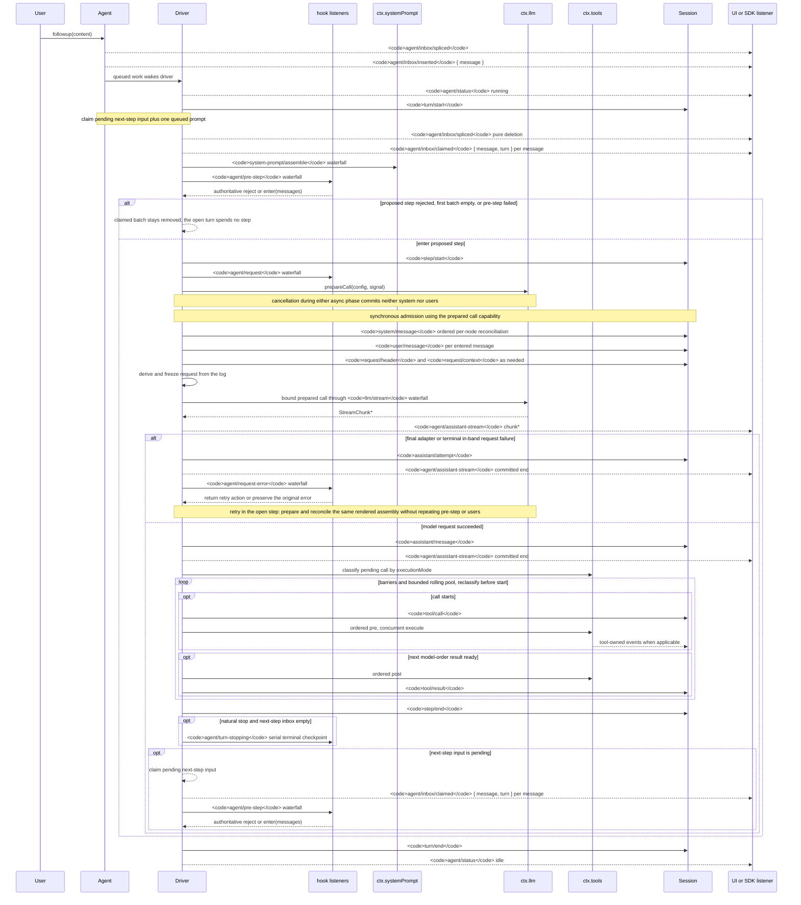

<!-- النصُّ الإنجليزي مولَّد من scripts/gen-doc-graphs.ts؛ وهذا الملف العربي يُصان يدويًا ويُقرن به عبر سجل الاقتران الثنائي اللغة.
     عند التحديث، شغّل `pnpm run gen-doc-graphs` أولًا لتحديث النص الإنجليزي، ثم حدّث هذا الملف وشغّل `pnpm run verify-translation-pairing --write docs/agent-lifecycle.md` لإعادة تسجيل الاقتران. -->

# دورة حياة جولة الوكيل وخطوته

[English](agent-lifecycle.md) | العربية

رسمُ التسلسل هذا هو الرفيقُ المرئي لـ[architecture.md](architecture.ar.md#turn-flow). وهو يُبقي حقائقَ إعادة التشغيل الدائمة على `session/event`، ويُبقي التحكمَ والحالةَ الحيين على `agent/*`.

يسجّل حدثُ `assistant/message` كلَّ نداء مزوّد ناجح، بما فيه النداءاتُ بلا محتوى والنداءاتُ المنتهية بـ`max-tokens`، ويضمّن المجرى الموقوت المضغوط بعينه. ويبقى المحتوى الفارغ خارج التاريخ المشتق. أما المحاولةُ الفاشلة أو المعادة أو الملغاة أو التي انتهت بخطأ بث وبلغت الاستقرارَ بلا رسالة سطح فتسجّل مجراها بوصفه `assistant/attempt`. وإطاراتُ قطع `agent/assistant-stream` الحية عابرة؛ وتقرأ إعادةُ التشغيل أيَّ الاستقرارين الدائمين، ولا يُبقي فقدُ العملية القاسي قبل الاستقرار مجرى محاولة دائمًا.

تستعمل `dsh-compaction-basic` حدثَ `agent/pre-step` للضغط قبل اشتقاق الطلب، وتستعمل `agent/request-error` لطفح السياق المعياري وحده. وحالما يتأهل أيُّ المُطلِقين، يعمل تشذيبُ نتائج الأدوات الاختياري قبل انتقاء الملخص. ويعمل التعافي داخل الخطوة المفتوحة ولا يعيد المحاولةَ إلا حين يقدّم التشذيبُ أو التلخيصُ جيلَ استبدال السطح؛ وإلا بقي خطأُ الطلب الأصلي هو المرجع. وتُعدّ كلُّ إعادة محاولة نداءَها وتوفّق التجميعَ المعروض المحفوظ قبل اشتقاق الطلب، بلا إعادة التجميع ولا الخطوةِ التمهيدية ولا قبولِ رسائل المستخدم.

وقرارُ `agent/pre-step` المعاد هو المرجع؛ ويحفظ المستمعون الذين يغلّفون `next()` الرسائلَ التالية و`startsRequestSeries` ما لم يكن الاستبدالُ مقصودًا. ويمرّ التوجيهُ والسياقُ المحقون عبر الشلال نفسِه بعد أن تأخذ عمليةُ ادعاء لاحقة دفعتَهما في الخطوة التالية.

وعلى مستخدمي SDK الذين يحتاجون إلى بيانات نص قابلة لإعادة التشغيل أن يستهلكوا `session/event`؛ أما `agent/*` فهي واجهةُ التنسيق الحية للطابور والحالة، ولاعتراض المطالبة، وبناءِ الطلب، والتوجيه، والمتابعة، والأخطاء.

وضعُ الصيانة: رسمُ تسلسل Mermaid مؤلَّف يدويًا؛ وتوقيعاتُ الأحداث الدقيقة في دليل Cordis المولَّد.
