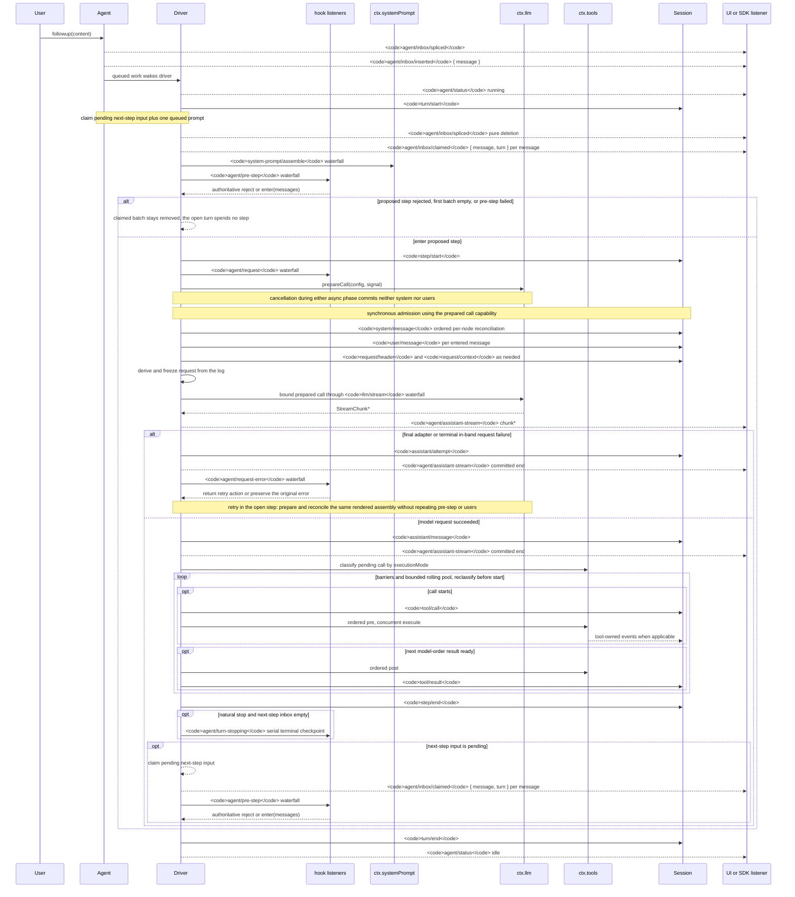

<!-- إنجليزي نص مصدر ملف من scripts/gen-doc-graphs.ts توليد؛ هذا العربية ملف هو عبر مزدوج لغة إعداد مقابل صيانة مرور مراجعة مقابل جانب.
     تحديث وقت أولا تشغيل `pnpm run gen-doc-graphs` تحديث إنجليزي نص، مجددا تحديث هذا ملف و تشغيل `pnpm run verify-translation-pairing --write docs/agent-lifecycle.md` إعادة سجل إعداد مقابل. -->

# Agent جولة و خطوة دورة الحياة

[English](agent-lifecycle.md) | العربية

هذا وقت ترتيب رسم هو [architecture.md](architecture.zh.md#turn-flow) إعداد طقم رسم عرض. حمل دائم إعادة تشغيل واقع حفظ في `session/event` في، فوري تحكم و حالة فإن حفظ في `agent/*` في.

`assistant/message` حدث سوف سجل كل مرة نجاح مزود استدعاء، يشمل إرجاع فارغ محتوى أو بـ `max-tokens` انتهاء استدعاء، و تضمين دخول دقيق ضيق تجميع حمل وقت stream. فارغ محتوى لن دخول إرسال توليد تاريخ. فشل، إعادة محاولة، إلغاء أو stream error attempt وصول settlement وقت، إذا لا يوجد surface message، حينئذ سوف يأخذ stream سجل لـ `assistant/attempt`. فوري `agent/assistant-stream` chunk frame هو لحظة حالة بيانات؛ إعادة تشغيل قراءة مهمة واحد نوع حمل دائم settlement، إذا عملية في settlement قبل صلب في قطع، فإن لن إبقاء تحت حمل دائم attempt stream.

`dsh-compaction-basic` في إرسال توليد طلب قبل عبر `agent/pre-step` معالجة ضغط قوة، بينما `agent/request-error` فقط لأجل مواصفة سياق فيض خروج. مهمة واحد إطلاق شرط ممتلئ كاف بعد، نظام كل سوف أولا تنفيذ اختياري أداة نتيجة قص غصن، مجددا اختيار ملخص. استعادة حدوث في ما زال فتح خطوة داخل، فقط لديه قص غصن أو ملخص توليد دفع دخول surface replacement generation وقت عندئذ إعادة محاولة، لا فإن ما زال بـ أصلي طلب خطأ لـ دقيق. كل مرة إعادة محاولة كل سوف دقيق تجهيز استدعاء، و في إرسال توليد طلب قبل تنسيق ضبط إبقاء قد تصيير تجميع نتيجة، لا تكرار تجميع،pre-step أو مستخدم رسالة دقيق دخول.

بـ إرجاع `agent/pre-step` قرار لـ دقيق؛ عبر حزمة تركيب `next()` مستمع سوف إبقاء تحت تنقل رسالة و `startsRequestSeries`، حذف غير متعمد استبدال.steering(في طريق جذب توجيه) و حقن سياق في لاحق إقرار قيادة عملية أخذ نيل ذلك تحت واحد خطوة دفعة مرة بعد، سوف مرور مرور نفس waterfall(شلال نشر صيغة حدث).

حاجة يمكن إعادة تشغيل transcript(نص سجل) بيانات SDK مستخدم ينبغي عند إزالة استهلاك `session/event`؛`agent/*` هو لأجل طابور صف و حالة، نص التوجيه اعتراض قطع، طلب بنية صنع،steering، متابعة تنفيذ و خطأ معالجة فوري تنسيق ضبط واجهة.

صيانة نمط: إنجليزي نص مصدر ملف يتضمن شخص عمل صيانة Mermaid وقت ترتيب رسم، و من توليد جهاز كتابة خروج؛ هذا العربية ملف بصفة مرور مراجعة مقابل جانب عبر مزدوج لغة إعداد مقابل صيانة. تأكيد قطع حدث توقيع يقع في توليد Cordis دليل في.
