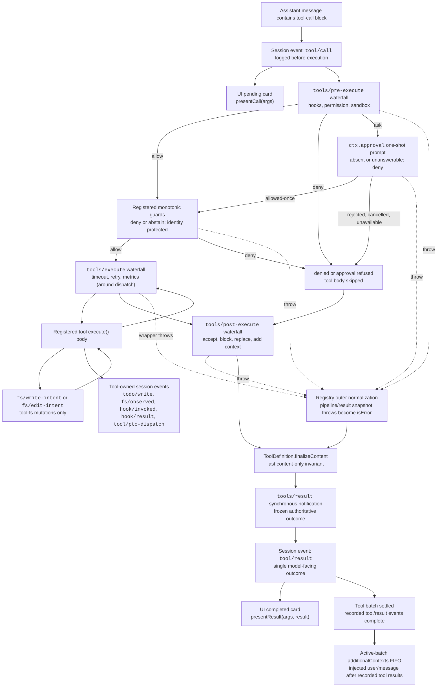

<!-- إنجليزي نص مصدر ملف من scripts/gen-doc-graphs.ts توليد؛ هذا العربية ملف هو عبر مزدوج لغة إعداد مقابل صيانة مرور مراجعة مقابل جانب.
     تحديث وقت أولا تشغيل `pnpm run gen-doc-graphs` تحديث إنجليزي نص، مجددا تحديث هذا ملف و تشغيل `pnpm run verify-translation-pairing --write docs/tool-execution-pipeline.md` إعادة سجل إعداد مقابل. -->

# أداة تنفيذ خط الإنتاج

[English](tool-execution-pipeline.md) | العربية

هذا رسم عرض سياسة، خطاف، صندوق رملي، نظام الملفات حراسة حماية، نتيجة إعادة كتابة، نهائي نتيجة مراقبة و UI تصيير في لا تغيير حلقة حال حال تحت أي وقت تشغيل.`tools/pre-execute` waterfall(شلال نشر صيغة حدث) أول أولا تشغيل، مع بعد هو مفرد ضبط حراسة حماية، لكن بعد تشغيل `tools/execute` و `tools/post-execute` waterfall؛ هذا ثلاثة عدد waterfall يمكن تعديل كتابة مرة استدعاء. من تعريف ذاته تحكم `finalizeContent` و `tools/result` في هذا بعد تشغيل.

نظام الملفات أولا قراءة بعد تحرير فحص يقع في `tool-fs` لـ تحت، عبر `fs/*` حدث تنفيذ. عام قبل وضع/بعد وضع waterfall تحمل تحميل خطاف و مراجعة دفعة سياسة؛`ctx.approval` في مفرد ضبط حراسة حماية قبل معالجة استفسار سؤال، بينما لا نيل إعادة ترتيب ترتيب كل من سياسة ما زال بصفة قد تسجيل حراسة حماية. مهلة انتظار حلقة التفاف توزيع صلة ملاحظة نقطة مقابل `tools/execute` إجراء حزمة تركيب. سجل التسجيل سوف مقابل مرشح نتيجة إجراء بلا ضرر لقطة؛ إذا لقطة فشل، فإن سوف أولا سوف فشل مواصفة تحويل، بعد مجددا من مرئي تعريف في قد مع لقطة ثابت `finalizeContent` عودة ضبط قوي صنع تنفيذ ذلك تزامن كما فقط حد محتوى ثابت صيغة. مع بعد،`tools/result` سوف مراقبة غير ممكن تغيير، يمكن من JSON بلا ضرر يمثل نتيجة. هذا مثال واحد قدوم، خطاف سهل يمكن عبر تجاوز مختلف أداة نظام صف، بينما بلا حاجة يجعل أداة و بعض عدد سياسة خدمة اقتران دمج.PTC mode سوف سوف إبقاء `run_code` نقل و ذلك تسلسل تحويل فرعي استدعاء كل إرسال دخول خط الإنتاج؛ فرعي استدعاء يحمل أب درجة token، سجل `tool/ptc-dispatch`، سوف رفض عرض لـ أداة لديه قيد قوة رد عودة، و حذف `additionalContexts`، بـ إبقاء استدعاء و نتيجة متبادل مجاور.

صيانة نمط: إنجليزي نص مصدر ملف يتضمن شخص عمل صيانة Mermaid مسار رسم، و من توليد جهاز كتابة خروج؛ هذا العربية ملف بصفة مرور مراجعة مقابل جانب عبر مزدوج لغة إعداد مقابل صيانة. تأكيد قطع أداة schema و حدث توقيع يقع في توليد دليل في.
