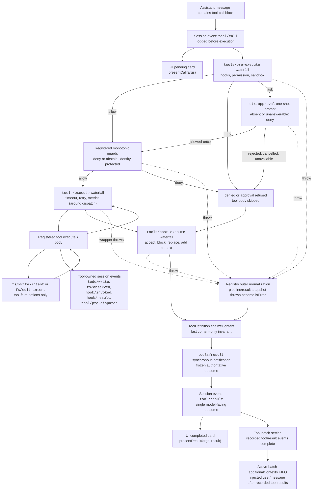

<!-- النصُّ الإنجليزي مولَّد من scripts/gen-doc-graphs.ts؛ وهذا الملف العربي يُصان يدويًا ويُقرن به عبر سجل الاقتران الثنائي اللغة.
     عند التحديث، شغّل `pnpm run gen-doc-graphs` أولًا لتحديث النص الإنجليزي، ثم حدّث هذا الملف وشغّل `pnpm run verify-translation-pairing --write docs/tool-execution-pipeline.md` لإعادة تسجيل الاقتران. -->

# مسار تنفيذ الأدوات

[English](tool-execution-pipeline.md) | العربية

يعرض هذا الرسمُ أين تعمل السياسةُ والخطّافاتُ والعزلُ وحرّاسُ نظام الملفات وإعادةُ كتابة النتائج ومراقبةُ الحصيلة النهائية والعرضُ في الواجهة بلا تغيير الحلقة. ويعمل شلالُ `tools/pre-execute` أولًا، ثم الحرّاسُ التصاعديون، ثم شلالا `tools/execute` و`tools/post-execute`؛ وللشلالات الثلاثة أن تحوّل نداءً. ويعمل بعدها `finalizeContent` الذي يملكه التعريفُ و`tools/result`.

تبقى فحوصُ «اقرأ قبل التحرير» في نظام الملفات تحت `tool-fs` على أحداث `fs/*`. وتستضيف شلالاتُ ما قبل التنفيذ وما بعده العامة الخطّافاتِ وسياسةَ الموافقة؛ ويحسم `ctx.approval` الأسئلةَ قبل الحرّاس التصاعديين، وتبقى سياسةُ المالك التي يجب ألّا يُعاد ترتيبُها حارسًا مسجَّلًا. وتغلّف الشؤونُ المحيطة بالتوزيع، كالمهل، شلالَ `tools/execute`. ويلتقط السجلُّ النتيجةَ المرشحة بلا فقد ويوحّد فشلَ الالتقاط قبل أن يفرض ردُّ نداء `finalizeContent` الملتقَط في التعريف المرئي ثابتتَه المتزامنة المقتصرة على المحتوى. ثم يراقب `tools/result` الحصيلةَ غيرَ القابلة للتغيير السليمةَ في JSON. وهذا يتيح للخطّافات أن تمتد على عائلات أدوات بلا ربط الأدوات بخدمة سياسة واحدة. ويرسل وضعُ PTC نقلَ `run_code` المحجوز ونداءاتِه الفرعية المسلسَلة عبر المسار كليهما؛ وتحمل النداءاتُ الفرعية رمزَ الأب، وتسجّل `tool/ptc-dispatch`، وتعيد المنعَ رفضَ ارتباط، وتُغفل `additionalContexts` حفظًا لتجاور النداء ونتيجته.

وضعُ الصيانة: رسمُ تدفق Mermaid مؤلَّف يدويًا؛ وschemas الأدوات وتوقيعاتُ الأحداث الدقيقة في الأدلة المولَّدة.
