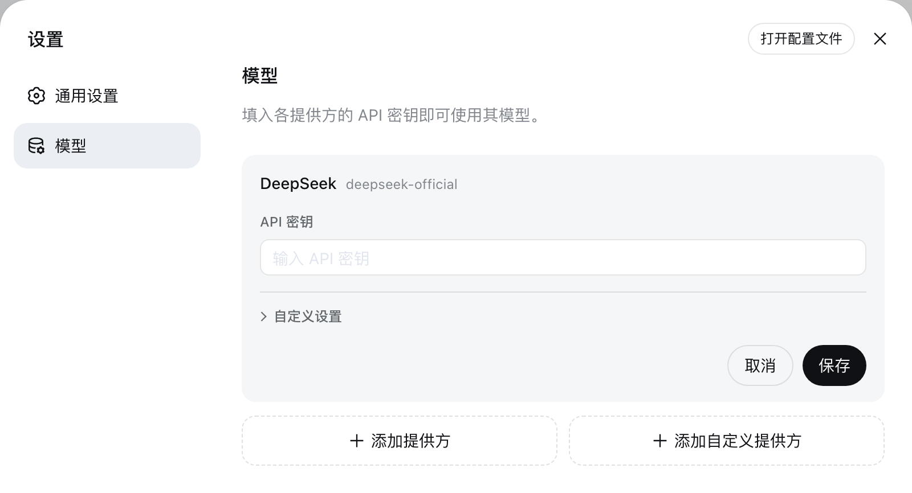

# إعداد نموذج

[English](providers.md) | العربية

هذا إشارة جنوب زائف تحديد أنت قد حسب وفق[أصل README](../../../README.ar.md#run) بدء Web UI. نموذج تغيير سوف في تحت مرة طلب وقت توليد فاعلية، لا حاجة إعادة بدء خادم.

## إعداد DeepSeek

فتح**ضبط → نموذج**.DeepSeek بطاقة توفير واحد API مفتاح حقل؛ إدخال مفتاح و حفظ.



مفتاح هو فقط كتابة. حفظ بعد، صفحة فقط سوف استلام إلى انفصال حساس وصف رمز، دائم بعيد لن استلام إلى واضح نص مفتاح. مفتاح تخزين في `$DSH_HOME/.credentials.yaml` في،settings فقط إبقاء هو اعتماد مرجع.

## إضافة داخل وضع مزود

اختيار**إضافة مزود**، اختيار أخذ dsh ذاتي حمل مزود؛ قائمة عرض هو مزود id، مثال مثل `anthropic`،`openai`،Kimi مقابل `moonshotai`،GLM مقابل `zai`. إدخال ذلك API مفتاح و حفظ. قد تثبيت دليل سوف توفير طرف نقطة، بروتوكول و نموذج قائمة.

عبر OAuth تسجيل تسجيل مزود (مثال مثل Codex) مؤقت لا دعم حمل.

## إضافة ذاتي تعريف مزود

مقابل في عام شركة شبكة صلة، ذاتي بناء خادم أو قد تثبيت دليل في لا وجود مزود، اختيار**إضافة ذاتي تعريف مزود**. توفير صغير كتابة Provider ID، أساس أساس URL،API بروتوكول، اعتماد و حتى قليل واحد نموذج.**API بروتوكول**يجب اختيار شبكة صلة فعلي استخدام ذلك واحد نوع، جدول مفرد توفير ثلاثة نوع:`openai-completions` مقابل OpenAI Chat Completions،`openai-responses` مقابل OpenAI Responses API،`anthropic-messages` مقابل Anthropic Messages API. واحد مزود فقط استخدام واحد نوع بروتوكول، شبكة صلة معا توفير اثنان نوع وقت حاجة بناء اثنان عدد مزود.


Provider ID هو دائم دائم، لأن طلب، قد حفظ جلسة، نموذج قيمة افتراضية و اعتماد مرجع كل سوف استخدام هو. مثل يحتاج إعادة تسمية مزود، طلب إضافة جديد مزود و حذف قديم مزود. عرض اسم، أساس أساس URL، بروتوكول، اعتماد و نموذج ما زال يمكن تحرير.

### استكشاف قياس نموذج

في**نموذج دليل**في اختيار**نيل أخذ متاح نموذج**، يكفي استفسار سؤال طرف نقطة هو توفير أي بعض نموذج. طلب استخدام جدول مفرد حالي API عنوان، بروتوكول و مفتاح، قد حفظ مزود فإن استخدام قد تخزين مفتاح؛ استجابة سوف فتح واحد يمكن بحث اختيار إطار، بحث، ربط اختيار تفكير يلزم نموذج، مجددا نقطة**إضافة الذي اختيار**. حفظ أو إنشاء مزود قبل لن تخزين أي محتوى.

استكشاف قياس قراءة هو معتاد رؤية شبكة صلة عام قائمة صيغة، لكن و غير كل طرف نقطة كل استخدام هذه صيغة عمل جواب، الذي بـ هو فقط هو سهل فائدة يد مقطع بينما غير حفظ إثبات: استكشاف قياس فشل أو قائمة لـ فارغ وقت، يد حركة إضافة نموذج ID يكفي، فاعلية نتيجة تماما واحد مثال. داخل وضع مزود واحد قاعدة من قد تثبيت دليل عمل جواب، أي جعل ذلك API عنوان إشارة نحو شبكة صلة أيضا هو مثل هذا، يلزم عرض شبكة صلة فعلي توفير نموذج، طلب عبر ذاتي تعريف مزود استكشاف قياس.

## اختيار نموذج

قد إعداد مزود سوف ظهور في نموذج اختيار جهاز في. اختيار نموذج أيضا سوف سوف ذلك ضبط لـ جلسة جديدة قيمة افتراضية. قد إرسال مرور طلب جلسة سوف إبقاء ذاته سجل في سجل نموذج.

إذا قد حفظ قيمة افتراضية إشارة نحو قد حذف مزود، إدخال إطار سوف عرض**اختيار نموذج**، و في اختيار أخرى نموذج قبل منع توقف إدخال.

## دخول مرحلة إعداد

تلقائي توليد[إضافة إعداد دليل](../../config-catalog.ar.md) صف خروج كل إضافة كل تلقي دعم حمل حقل و قيمة افتراضية؛[`dsh-llm-pi-ai`](../../config-catalog.ar.md#deepseek-aidsh-llm-pi-ai) حينئذ هو هذا صفحة الذي إعداد ذلك عدد مزود مقطع سقوط.[`dsh-llm-pi-ai`](../../../packages/llm/llm-pi-ai/README.ar.md) و [`dsh-llm-deepseek`](../../../packages/llm/llm-deepseek/README.ar.md) مشاركة اعتبار وثيقة مسؤول مباشر `settings.yaml` إعداد، دليل تحليل، دفع إدارة تحكم، اعتماد و مهايئ خطأ.

::: tip أخرى ضبط
نموذج صفحة توفير API مفتاح، عرض اسم،API عنوان،API بروتوكول، و كل نموذج ID، عرض اسم، سياق نافذة، الأكثر كبير إخراج token عدد و إدخال نوع. دفع إدارة انتظار درجة، طلب توافق صفة فتح صلة، طلب رأس، مهلة و إعادة محاولة سياسة في `$DSH_HOME/settings.yaml` في ضبط، أيضا حينئذ هو نموذج صفحة كتابة نفس نسخة وثيقة. يمكن مباشر تحرير هو؛ متصفح و خادم في نفس منصة آلة جهاز وقت، أيضا يمكن نقر ضبط صفحة قمة جزء**فتح ملف إعداد**فتح هو. مهايئ سوف في تحت مرة طلب وقت إعادة قراءة، بلا حاجة إعادة بدء أي شرق غرب. تحت وجه كل صغير عقدة وسيط تعريف كثير عدد شبكة صلة سوف استخدام إلى حقل.
:::

### صورة إدخال

في**ضبط → نموذج**في تحرير مزود، فتح**ذاتي تعريف ضبط**و توسيع هذا نموذج**نموذج خيار**.**إدخال نوع**وحيد احتلال سعة كمية حقل تحت جهة واحد سطر. مقابل في دعم حمل صورة نموذج، ربط اختيار**صورة**و حفظ. لا يوجد وراثة صورة قدرة جديد ذاتي تعريف نموذج افتراضي ربط اختيار**نص**. حتى قليل إبقاء واحد نوع إدخال نوع؛ فقط صورة نموذج يحتاج أولا ربط اختيار صورة، مجددا إلغاء نص.

تكرار اختيار إطار سوف pi-ai نموذج اختيار حفظ لـ `input`، سوف مباشر وصل DeepSeek مهايئ اختيار حفظ لـ `inputModalities`. أيضا يمكن في `$DSH_HOME/settings.yaml` في تحرير نموذج؛ مثال مثل، التالي ذاتي تعريف pi-ai مزود إعلان واحد صاف نص نموذج و واحد نظر شعور نموذج:

```yaml
llm-pi-ai:
  providers:
    my-gateway:
      apiKeyEnv: GATEWAY_API_KEY
      api: openai-completions
      baseURL: https://gateway.example/v1
      models:
        - id: legacy-chat
        - id: vision-preview
          input: [text, image]
```

Pi-ai `input` قبول `text` و `image`، كما فقط أثر في هذا نموذج. صريح غير فارغ اختيار أولوية. حذف أو لـ فارغ `input` أولا وراثة قد تثبيت دليل إدخال نوع، مجددا رجوع إلى توجيه `defaultInput`، بعد من افتراضي لـ `[text]`. تكرار اختيار إطار سوف عرض هذه وراثة قيمة، فقط فتح نموذج سطر لن حفظ تغطية قيمة.

DeepSeek سوف حذف `inputModalities` نظر لـ صاف نص، و رفض فارغ قائمة. إلغاء صورة أيضا سوف إزالة هذا نموذج `imagePixelBudget` و `imageMaxBytes`، لأن DeepSeek رفض صاف نص نموذج فوق صورة حد. بـ بعد إعادة تفعيل صورة كما حاجة ذاتي تعريف حد وقت، يحتاج مجددا مرة ضبط هذه حد.

تعديل تكرار اختيار إطار بعد مثل يحتاج استعادة وراثة، يمكن في `settings.yaml` في إزالة نموذج `input` أو `inputModalities` حقل.**استعادة افتراضي نموذج**سوف إزالة كامل نموذج دليل تغطية، يشمل أخرى نموذج تحرير، لذلك فقط في حاجة استعادة كامل دليل وقت استخدام.

إذا أنت يد حركة تسجيل دخول نموذج كل كل قبول صورة، يمكن في توجيه فوق ضبط مرة رجوع قيمة، لا لا بد تدريجي عدد نموذج كتابة:

```yaml
llm-pi-ai:
  providers:
    vision-gateway:
      apiKeyEnv: GATEWAY_API_KEY
      api: openai-completions
      baseURL: https://vision.example/v1
      defaultInput: [text, image]
      models:
        - id: first-model
        - id: second-model
```

`defaultInput` هو رجوع قيمة بينما لا هو تغطية قيمة، افتراضي لـ `[text]`: في داخل وضع مزود فوق، هو فقط لـ ذلك دليل لم وصف نموذج عمل جواب، لذلك أبدا سوف يأخذ دليل في هذا حينئذ أداة تجهيز صورة قدرة نموذج هذا قدرة ذهاب إسقاط. يلزم استلام ضيق هذا صنف نموذج، طلب استخدام هو ذاتي ذات `input`. داخل وضع مزود لا يوجد صريح `models` قائمة وقت، كتابة في `modelOverrides` تحت، بـ نموذج id لـ مفتاح:

```yaml
llm-pi-ai:
  providers:
    anthropic:
      modelOverrides:
        claude-sonnet-4-5:
          input: [text]
```

في pi-ai إعداد في، حذف نموذج ذاته `input` خارج، كل قائمة كل حتى قليل يلزم كتابة واحد بند نموذج حالة؛ نموذج ذاته فارغ قائمة و حذف هو نفس معنى. لم معرفة نموذج حالة في أي موضع كتابة كل سوف يتم رفض.

هذا اثنان عدد حقل كل هو مقابل أنت طرف نقطة تأكيد، بينما لا هو مقابل هو فحص. إعلان طرف نقطة و لا توفير صورة قدرة نموذج لن في هذا داخل يتم اعتراض تحت، تعديل من مزود رفض هذا طلب.

### دفع إدارة انتظار درجة

مقابل في إعلان دفع إدارة انتظار درجة نموذج، نموذج اختيار جهاز سوف توفير**دفع إدارة انتظار درجة**قائمة مفرد. داخل وضع مزود نموذج من قد تثبيت دليل وراثة ذلك انتظار درجة. يد حركة تسجيل دخول نموذج لا إعلان أي انتظار درجة، لذلك نموذج قائمة مفرد داخل لن ظهور دفع إدارة انتظار درجة بند، من طرف نقطة ذاته قيمة افتراضية قرار نموذج هل تفكير اعتبار. طلب في `$DSH_HOME/settings.yaml` في استخدام `reasoningEfforts` إعلان انتظار درجة:

```yaml
llm-pi-ai:
  providers:
    my-gateway:
      apiKeyEnv: GATEWAY_API_KEY
      api: openai-completions
      baseURL: https://gateway.example/v1
      reasoning: high
      models:
        - id: my-reasoner
          reasoningEfforts:
            off:
            high: high
            max: max
```

كل مفتاح كل هو قائمة مفرد توفير واحد انتظار درجة، ذلك قيمة هو في بروتوكول فوق بـ `reasoning_effort` إرسال كتابة قاعدة، لذلك `max: xhigh` يمكن لـ ذاتي لديه واحد طقم مفردات شبكة صلة إعادة تسمية بعض عدد انتظار درجة. فقط لديه `off` يمكن إبقاء فارغ، لأن مقابل كثير عدد طرف نقطة قدوم قول، لا تفكير اعتبار حينئذ هو لا نقل هذا معامل. توجيه `reasoning` هو جلسة بعد لم اختيار انتظار درجة وقت اعتماد انتظار درجة؛ في اختيار جهاز في اختيار تحديد بعض عدد انتظار درجة بعد، هو سوف و نموذج واحد بدء حفظ لـ جلسة جديدة قيمة افتراضية.

إبقاء فارغ `off` ماذا كل لا إرسال، هذا فقط قدرة يجعل «حسب طلب عندئذ تفكير اعتبار» نموذج توقف تحت قدوم؛ إعطاء `off` واحد قيمة، فإن سوف يأخذ هذا قيمة بصفة `reasoning_effort` إرسال. مقابل في «لا واضح إغلاق حينئذ سوف تفكير اعتبار» نموذج——مثال مثل OpenAI توافق شبكة صلة بعد وجه DeepSeek V4——حاجة `compat.thinkingFormat: deepseek`: هو يجعل `off` إرسال `thinking: {type: disabled}`، أخرى كل انتظار درجة فإن في effort خارج مجددا إرسال `thinking: {type: enabled}`:

```yaml
      models:
        - id: deepseek-v4-pro
          compat:
            thinkingFormat: deepseek
          reasoningEfforts:
            off:
            high: high
            max: max
```

شبكة صلة و لا توفير دفع إدارة قدرة داخل وضع مزود نموذج، يمكن في `modelOverrides` تحت استخدام `reasoningEfforts: false` ذهاب إسقاط ذلك انتظار درجة؛ بعد مجددا لـ هو اختيار انتظار درجة سوف يتم رفض و تقرير `UNSUPPORTED_REASONING_EFFORT`.DeepSeek ذاته توجيه لا حاجة بـ فوق أي إعداد: ذلك نموذج قد توفير `off`،`low`،`high` و `max`،`llm-deepseek.reasoningEffort` ضبط اختيار جهاز بدء بداية قيمة افتراضية:

```yaml
llm-deepseek:
  reasoningEffort: max
```

### طلب توافق صفة

شبكة صلة ممكن يحتفظ متاح مفتاح، عنوان أيضا عبر نيل إلى، لكن ما زال رفض كل واحد طلب.pi-ai اعتماد حسب طرف نقطة URL قرار طلب شكل حالة——توجيه النظام من أي عدد زاوية لون تحمل تحميل، إخراج حد أعلى كتابة في أي عدد حقل، تفكير اعتبار درجة آخر مثل أي نقل——بينما مقابل في هو لا يمكن تعرف آخر عنوان، سوف عند عمل OpenAI ذاته قدوم مقابل انتظار. كثير عدد OpenAI توافق شبكة صلة حتى قليل سوف رفض OpenAI الذي قبول بعض واحد مثال شرق غرب.

منها اثنان مثال احتلال قطعا كبير كثير عدد. إعلان دفع إدارة قدرة نموذج، ذلك توجيه النظام سوف بـ `role: "developer"` إرسال خروج، جدا كثير شبكة صلة مباشر رفض؛ إخراج حد أعلى فإن كتابة عمل `max_completion_tokens`، فقط إقرار `max_tokens` خدمة طرف سوف رفض. جدول مفرد داخل لا يوجد هذا اثنان عدد حقل؛ طلب في `$DSH_HOME/settings.yaml` توجيه فوق أكثر صحيح:

```yaml
llm-pi-ai:
  providers:
    my-gateway:
      apiKeyEnv: GATEWAY_API_KEY
      api: openai-completions
      baseURL: https://gateway.example/v1
      compat:
        supportsDeveloperRole: false
        maxTokensField: max_tokens
      models:
        - id: my-model
```

توجيه `compat` هو ذلك نموذج قيمة افتراضية، نموذج ذاته فإن تدريجي حقل فوز خروج، لذلك أكثر صحيح بعض واحد نموذج بلا حاجة إعادة وصف كامل بند توجيه:

```yaml
      models:
        - id: my-model
        - id: my-reasoner
          compat:
            thinkingFormat: deepseek
```

اثنان من كل لم ضبط حقل، امتداد استخدام قد تثبيت catalog لـ هذا نموذج سجل قيمة؛catalog أيضا لم وصف، سقوط إلى pi-ai فحص قياس. كل هو كتابة تحت فتح صلة كل يلزم إعطاء قيمة: خطر رقم بعد إبقاء فارغ مفتاح (`supportsDeveloperRole:`) سوف يتم رفض بينما لا هو يتم تجاهل اختصار، لأن فارغ قيمة سوف مسح إسقاط catalog معروف معلومة، لكن أيضا لا يوجد إعطاء خروج أي بديل. أي بروتوكول كل لا قبول اسم حرف نفس مثال سوف يتم رفض، تقرير خطأ سوف صف خروج متاح ذلك بعض.

كل فتح صلة ملكية في إعلان هو ذلك بعض بروتوكول، لذلك في بعض عدد `api` فوق دمج قاعدة فتح صلة، في آخر عدد فوق ممكن يتم رفض——تقرير خطأ سوف نقطة اسم هذا بروتوكول فعلي توفير أي بعض. و فوق وجه `input` واحد مثال، فتح صلة قديم وصف هو صلة في أنت طرف نقطة واحد تأكيد، بينما لا هو مقابل هو فحص: ضبط واحد شبكة صلة ذلك فعلي و لا حاجة فتح صلة، فقط هو إرسال خروج واحد مختلف طلب بينما قد.

الكل فتح صلة، كل منها قبول أخذ قيمة، و قبول هو جمع بروتوكول، كل صف في[توليد `dsh-llm-pi-ai` إعداد مشاركة اعتبار](../../config-catalog.ar.md#deepseek-aidsh-llm-pi-ai) `PiAiCompatProfile` لـ تحت——هذا مشاركة اعتبار إرسال توليد ذاتي شفرة المصدر، لذلك لن سقوط بعد في مهايئ فعلي قبول محتوى.

## ترتيب خطأ

- **`MISSING_CREDENTIAL`**: عبر نموذج صفحة تخزين مزود مفتاح، أو توفير يتم مرجع بيئة متغير.
- **`UNKNOWN_MODEL`**: اختيار قد إعداد نموذج، أو نحو ذاتي تعريف مزود إضافة ناقص نموذج.
- **نيل أخذ متاح نموذج إرجاع 401**: فحص مفتاح. نموذج اكتشاف سوف استدعاء OpenAI توافق `GET /models` طرف نقطة؛ مقابل في لا توفير هذا طرف نقطة خدمة، طلب يد حركة إدخال نموذج.
- **نيل أخذ متاح نموذج تلميح حيث لا يوجد `data` عدد مجموعة أيضا لا يوجد `models` كائن**: طرف نقطة إرجاع قائمة صيغة لا في استكشاف قياس قراءة نطاق داخل. طلب يد حركة إدخال نموذج.
- **مفتاح و عنوان كل صحيح تأكيد، شبكة صلة لكن رفض كل واحد طلب**: هو طلب شكل حالة و OpenAI مختلف. أولا في توجيه فوق ضبط `compat.supportsDeveloperRole: false` و `compat.maxTokensField: max_tokens`.
- **فقط لديه دفع إدارة نموذج فشل**:pi-ai يأخذ هو جمع توجيه النظام بـ `developer` زاوية لون إرسال خروج، بينما شبكة صلة رفض هذا زاوية لون. ضبط `compat.supportsDeveloperRole: false`.
- **يد حركة تسجيل دخول نموذج لا يوجد دفع إدارة انتظار درجة قائمة مفرد**: هذا نموذج لا يوجد إعلان أي انتظار درجة. في `settings.yaml` في إعطاء هذا نموذج إضافة فوق `reasoningEfforts`.
- **`off` لا يمكن يجعل DeepSeek نموذج إيقاف تفكير اعتبار**: إبقاء فارغ `off` لا إرسال أي دفع إدارة حقل، افتراضي تفكير اعتبار طرف نقطة حينئذ متابعة تفكير اعتبار. طلب في نموذج أو توجيه فوق ضبط `compat.thinkingFormat: deepseek`.
- **بعض عدد compat فتح صلة بسبب لا يوجد قيمة بينما يتم رفض**: خطر رقم بعد ماذا كل لا كتابة. إعطاء هو واحد قيمة، أو حذف إسقاط هذا مفتاح بـ امتداد استخدام قد تثبيت catalog قيمة.
- **صورة في إرسال قبل يتم رفض**: هذا نموذج لم إعلان صورة نموذج حالة. طلب إعطاء ذاتي تعريف مزود نموذج إضافة فوق `input: [text, image]`؛ في DeepSeek ذاته توجيه فوق، طلب من إعداد دليل في اختيار دعم حمل صورة بند (افتراضي لـ `deepseek-flash`) ، و تأكيد شبكة صلة توفير هذا نموذج كما دعم حمل صورة إدخال.
- **مزود رفض حمل صورة طلب**: هذا نموذج إعلان ذلك طرف نقطة فعلي و لا توفير صورة قدرة. طلب من منح إعطاء هو صورة قدرة ذلك عدد قائمة في إزالة `image`——ممكن هو نموذج `input`، أيضا ممكن هو توجيه `defaultInput`——لكن بعد فتح بدء جلسة جديدة: مرفق إضافة صورة سوف إبقاء في جلسة سجل داخل، لذلك في جلسة مغادرة فتح هو قبل، نفس عدد طلب سوف لا قطع تكرار.
